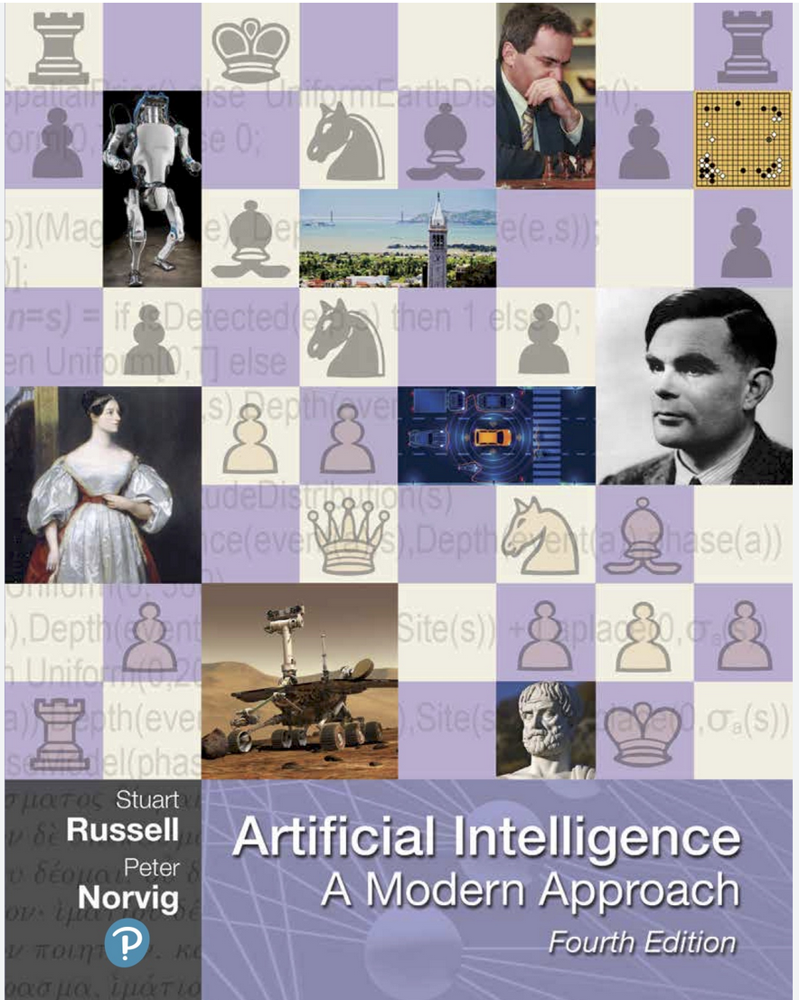
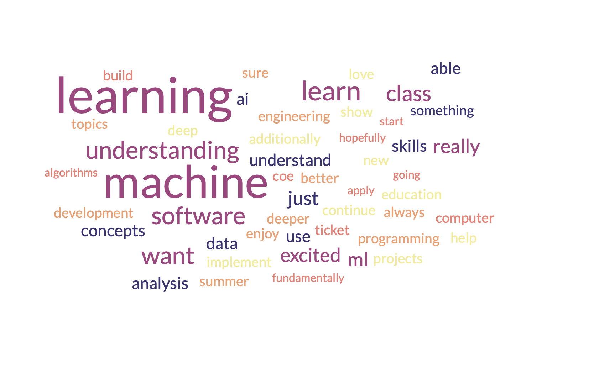

Class Introduction
==================

| **Welcome to:**
|
| COE 379L: Software Design For Responsible Intelligent Systems, Spring 2024
| Department of Aerospace Engineering and Engineering Mechanics
| The University of Texas at Austin

**Instructors:**

* Joe Stubbs, jstubbs@tacc.utexas.edu, POB 6.436; ACB 2.246 (on Pickle Research Campus) 
* Anagha Jamthe, ajamthe@tacc.utexas.edu

**Time:** Tues/Thur 2:00pm - 3:30pm

**Location:** ASE 2.134 A (in person)

**Teaching Assistant:** Rohan Potru

**Important Links:**

* Canvas: https://utexas.instructure.com/courses/1380211
* Class Repo: https://coe-379l-sp24.readthedocs.io/
* Slack: https://tacc-learn.slack.com/   #coe-379l-sp24 (channel)

From the Syllabus 
~~~~~~~~~~~~~~~~~

**Catalog Description:**

Covers design, implementation, operation and assurance of intelligent software systems based on data intensive 
computing and machine learning techniques. Course materials and assignments will 
utilize real-world datasets from engineering disciplines.

**Prerequisites:**

Computational Engineering 332 with a grade of at least C-.

**Knowledge, Skills, and Abilities Students Should Have Before Entering This Course:**

This course assumes knowledge of the Python programming language (data structures, conditionals, 
loops, and functions), software design, distributed systems, and asynchronous programming (concurrent 
programming, tasks queues, microservice architectures, etc). We also assume knowledge of Multivariate 
Calculus and Linear Algebra as well as a basic, working knowledge of the Linux command line. We 
will not introduce/cover basic programming skills or debugging. Ultimately, each student is expected 
to be able to write and debug working Python programs and to have experience designing larger systems 
as a composition of smaller components. This is not an introductory programming class nor an introductory 
design class; we will not have time to help students debug their programs.

**Knowledge, Skills, and Abilities Students Gain from this Course (Learning Outcomes):**

The objective of this course is to introduce students to scalable data analysis and machine learning 
techniques for designing, implementing, validating and operating responsible intelligent systems. 
The course covers algorithms, techniques and tools for applying data analytics and machine 
learning to real-world problems. Through a series of projects spanning the course of the semester, 
students design and implement responsible, intelligent computational systems. The course strikes 
a balance between foundational and state-of-the-art techniques.

**Class Format**

The class will be delivered in-person or following the guidance of the University of Texas. Class 
meetings will consist of lectures/demonstrations and hands-on labs. Students are expected to attend 
every lecture and actively participate in the hands-on labs during the class. In some cases, 
the hands-on portions will provide partial solutions to project assignments. Lecture materials 
with worked examples will be posted to the class website right before the class meeting. 
Additionally, there will be a class Slack channel for discussing ideas about the course with 
your fellow students.

**Attendance**

Regular attendance is expected but absences will not count against the student’s grade. We expect 
students to give us a week's notice in advance of their absence if known ahead of time.

**Computer:**

The entire course will be computer based. The instructor will provide remote servers for students to 
work on. Students are expected to have access to a 
personal / lab computer with a web browser and a terminal and SSH/SCP client.
**On Thursday we will assign each of you a student VM.**

**Text:**
No textbook will be used for this course. However, we will provide materials for all lectures on the 
class website, and we will often supplement them with additional reading materials available online. 

**Office Hours:**

Office hours will be for 1 hour immediately following the class and/or by appointment. We plan to 
use Slack for general communications and to help with the materials. https://tacc-learn.slack.com/

**Project Assignments**

Four multi-week projects assigned throughout the semester will cover the topics presented in the course. 
On the first two projects, each student must work alone. On the last two projects, students will be 
allowed to work alone or with one other student; however, each student group must write up and submit 
their own solution, including code their own programs and write their own analysis. Students are not 
allowed to submit duplicates of other students’ work on any of the projects.

**Details about the Projects**

The first three projects will be centered around a dataset. You will be given a dataset and asked 
to use the techniques from class to analyze it, build one or more models using the data and assess 
the model(s) you build. You may also be asked to package your model as an inference server. 
You will host the code you develop for the projects in a git repository. In addition to the code, 
you will also be asked to provide a written description of the work. There will be two classification 
projects and one regression project. 

The last project will be open ended. You will be free to design an idea for a project that is of 
interest to you, building upon any of the previous projects. You may incorporate any of the techniques
or ideas presented in lecture, and you may also choose to study and incorporate outside ideas, such as 
ideas from published papers or a new ML technology. You will initially "pitch" your project by 
writing up a short project proposal. The final project will include a final report (max of 10 pages)
and a video presentation (less than 10 minutes) in addition to any "products" to be developed, as 
described in the proposal. 

We will provide more details about each of the projects as the assignment date approaches. 

**Grading**

The grade for the course will be based on the project grades, as follows:

* Project 1 - 20% (Individual project)
* Project 2 - 20% (Individual project)
* Project 3 - 25% (Individual or groups of two project)
* Project 4 - 35% (Individual or groups of two project)

**Other Administrative Matters**

DISABILITY & ACCESS (D&A)
The university is committed to creating an accessible and inclusive learning environment consistent 
with university policy and federal and state law. Please let me know if you experience any 
barriers to learning so I can work with you to ensure you have equal opportunity to participate 
fully in this course. If you are a student with a disability, or think you may have a disability, 
and need accommodations please contact Disability & Access (D&A). Please refer to the D&A website 
for more information: http://diversity.utexas.edu/disability/. If you are already registered with 
D&A, please deliver your Accommodation Letter to me as early as possible in the semester so we 
can discuss your approved accommodations and needs in this course.

Special Notes:
The University of Texas at Austin provides upon request appropriate academic adjustments for 
qualified students with disabilities. For more information, contact the Office of the Dean of 
Students at 471-6259, 471-4641 TDD or the Cockrell School of Engineering Director of Students with 
Disabilities at 471-4321.

Evaluation:
Note that the Measurement and Evaluation Center forms for the Cockrell School of Engineering will 
be used during the last week of class to evaluate the course and the instructor. They will be 
conducted in an electronic format for Spring 2024. You may also want to note any other methods of 
evaluation you plan to employ.

**Artificial Intelligence**

The creation of artificial intelligence tools for widespread use is an exciting innovation. These 
tools have both appropriate and inappropriate uses in classwork. The use of artificial intelligence 
tools (such as ChatGPT) in this class shall be permitted on a limited basis. You will be informed 
as to the assignments for which AI may be utilized. We ask that you do not use AI writing tools on 
any assignment and that you do not use AI tools to write code for you. Learning to write is an 
important skill in life. Whenever AI tools are used, they should be used with caution and proper 
citation, as the use of AI should be properly attributed. Using AI tools without my permission 
or authorization, or failing to properly cite AI even where permitted, shall constitute a violation of 
UT Austin’s Institutional Rules on academic integrity.

Software Design for Responsible Intelligent Systems 
~~~~~~~~~~~~~~~~~~~~~~~~~~~~~~~~~~~~~~~~~~~~~~~~~~~~

In COE 332, we cover software system design concepts for systems that can perform non-trivial data analysis, 
but we barely scratch the surface of the subject of data analysis itself. 

In this course, we are going to cover techniques and technologies for building applications utilizing 
data analysis and machine learning, specifically.  

We will focus more on applications of machine learning, applying the techniques to real datasets, and less 
on the theoretical basis for the algorithms. However, we 
will introduce the ideas involved with most of the algorithms we cover, so that you can get a feel 
for the flavor. 

As with COE 332, we will emphasize applications written in the Python programming language. We will make use 
of a number of open source libraries, including numpy, pandas, matplotlib, seanbourn, scikitlearn, tensorflow 
and keras. 

We'll assume you know the topics we covered in COE 332, for example:

* Python programming and best practices with respect to code organization within a repo. 
* How to commit and work with code in a git repository. 
* How to install a package; how to build a Docker image with a package installed. 
* How to read the documentation for a package and use it in your code. 
* The basics of HTTP, Docker, flask (for building web APIs) 

What is Artificial Intelligence and Machine Learning?
-----------------------------------------------------

Some people consider the birth of the term "artificial intelligence" to be a summer workshop
held at Dartmouth college in 1956, the "Dartmouth Summer Research Project on Artificial Intelligence". 
Others say the origins date back to as early as 1940, with efforts at places such as MIT and CMU. 

Many definitions have been given; for example, the proposal for the 1956 Dartmouth Workshop states: 

   *The study is to proceed on the basis of the conjecture that every aspect of learning or any other 
   feature of intelligence can in principle be so precisely described that a machine can be made to simulate it.*

If we look back even just a couple of decades, we see that the field of Artifical Intelligence had already 
grown into a huge field and encompassed techniques from logic, probability, perception, reasoning, and learning.

Many consider Artificial Intelligence: A Modern Approach by Stuart Russell of UC Berkeley and Peter Norvig,
Director of Research at Google, to be the definitive book on AI. It's topics include: 

* Search Algorithms 
* Intelligent Agents 
* Logical Agents and First Order Logic, 
* Knowledge Representation (ontologies)
* Automated Planning 
* Uncertainty, Probabilistic Reasoning, and Probabilistic Programming
* Multi-agent Decision Making 
* **Machine Learning**
* **Deep Learning**
* Robotics 

    Cover of the textbook Artificial Intelligence: A Modern Approach [1]; considered by many to be the definitive resource. The first edition was published in 1995.

Recent as the last decade or so Machine Learning and Deep Learning as subfields within AI have taken off.
Some say ML is the dominant subfield of AI.

What is Machine Learning?
-------------------------

Machine Learning (ML) is the subfield of AI that develops algorithms to analyze and infer patterns in *data*.

Here, **data** is the key word. Instead of using logic, or a search technique, or a formal knowledge
representation, ML looks for patterns in exsiting data sets and attempts to apply those patterns to 
future data. 

Why is Machine Learning having so much success *now*? Two primary reasons: 

1. There is an abundance of data, thanks to the internet, automation and IoT devices. 
2. Computing power has continued to increase so that algorithms that were not tractable a decade ago 
   can now complete in a relatively short amount of time. 

And as a result, we are seeing applications of ML to virtually all fields. In this class we will explore 
datasets and applications from fields including: 

* Computational Biology and health informatics (e.g., predicting diabetes)
* Structural/Civil Engineering (e.g., classifying damage to buildings)
* Traditional IT (e.g., spam email classification)

And many more. 

With Power Comes Responsibility 
-------------------------------

While this is undeniably an exciting time for the field, the power to create models that accurately 
predict outcomes in various fields comes with significant responsibilities. In this class, we will 
try to highlight some of the important aspects of these responsibilities. We will ask questions such as 

1. How do use data in a responsible way? Do we just throw a bunch of ML algorithms at the data 
   and see what gives us the result we are looking for?
2. As we train our models, how do we ensure our results are reproducible? 
3. How do we build trust in our models? How do we develop confidence in our models? Is accuracy the only important 
   measure (hint: no)
4. How do you update an existing model once you a version is running? 
5. What about bias in models? If models reflect patterns in data, and data have bias, won't our models 
   have bias too? 

We'll look at many of these topics throughout the semester. 

Class Schedule 
--------------

**Class Schedule (approximate, subject to change)**

* Week 1: Syllabus, Introduction to the course; TACC accounts, Class VM, Jupyter notebooks
* Week 2: Introduction to data analysis, Numpy, Pandas, Matplotlib, Seaborn, 
* Week 3: Introduction to machine learning, Linear Regression, 
* Week 4: Assign Project 1 Finish Linear Regression, Linear Classification, 
* Week 5: Finish Linear Classification, Data cleaning and preprocessing (Type conversion, categorical data, null/missing values, outlier detection) 
* Week 6: K-nearest neighbor, over/underfitting, hyperparameters and tuning, cross-validation 
* Week 7: Assign Project 2 Additional classifiers (Logistic Regression, Decision Trees, Random Forest, Naive Bayes)
* Week 8: Other Measures of Model Quality and correctness (accuracy, recall precision, F-score, Testing in ML applications), Containerized Inference Servers

* Spring Break 

* Week 9: Introduction to Neural Networks, Neural Network concepts (activation functions, Loss functions, Back propagation), Classification with Neural Networks Assign Project 3 
* Week 10: Convolution Neural Networks (CNN) I (Architecture, improvements over ANN), Image Pre-processing (sizing, gray scale/image reduction, augmentation) 
* Week 11: CNN II, 
* Week 12: Assign Project 4 Recurrent Neural Networks, Attention and Transformers, Hugging Face Transformers library
* Week 13: MLOps
* Week 14: Special Topics

Final projects will be due during the `Final Exam day for our class <https://registrar.utexas.edu/schedules/242/finals>`_; **Friday May, 3rd**

**Before We Leave Class**

1. Make sure you have an **active** TACC account and MFA pairing. You can check the status of your account be 
logging into the TACC User portal: https://portal.tacc.utexas.edu/

* Go to the Account Profile (https://tacc.utexas.edu/portal/account) 
* If you need help with your account you can submit a ticket: https://tacc.utexas.edu/portal/tickets

2. Send an email to myself and Anagha (jstubbs AND ajamthe AT tacc DOT utexas DOT edu). 
   Include your tacc account and that you are enrolled in COE 379L.

.. code-block:: bash 

    To: jstubbs, ajamthe @ tacc.utexas.edu
    Subject: COE 379L TACC Account
    Body: 
    Please include the following: 
      1) Name
      2). TACC username 
      3). EID 
      4). What do you want to get out of this class?

We will have VMs created for person enrolled. 

**Future Classes**

Bring your laptop computer to class for each lecture. Next time, we will make sure everyone can connect to their 
student VM. 

Student Responses: Goals for the Course 
~~~~~~~~~~~~~~~~~~~~~~~~~~~~~~~~~~~~~~~

We got some great responses from you all about your goals for the course. Here are a few 
quotes: 

*"I would love to get a deeper understanding on how machine learning can automate a lot of the 
tedious tasks seen in our daily lives. Additionally, my work this past summer has let me 
get a baseline for how to make a machine learning and classification model, so having a 
formal education and introduction to this field would be really helpful!"*

*"...what's most important to me is to learn something new, challenge myself, 
and maybe become a better person because of it."*

*"I always hear the word machine learning tossed around, 
but I want to know more about what it really is and what its applications are."*

Here is a word cloud of the responses (using term frequencies, a concept we will learn 
more about in the context of NLP!)

    Word cloud of the student responses 

References and Additional Resources
~~~~~~~~~~~~~~~~~~~~~~~~~~~~~~~~~~~
1. Russell, Stuart J., Peter. Norvig. Artificial Intelligence: A Modern Approach (4th edition). Pearson 2020, ISBN 9780134610993 .
  

