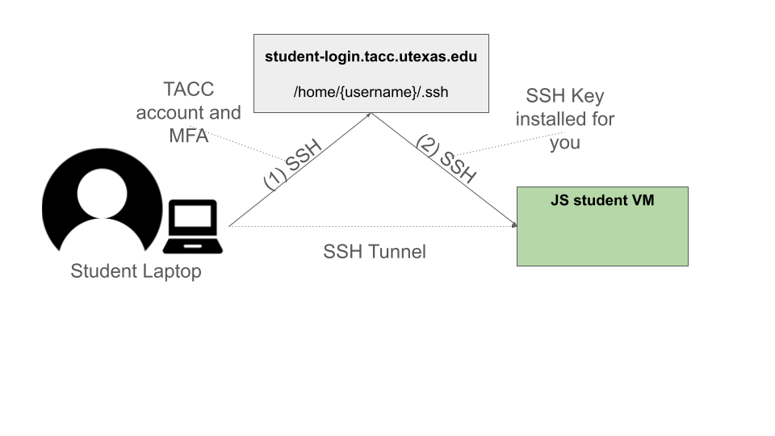
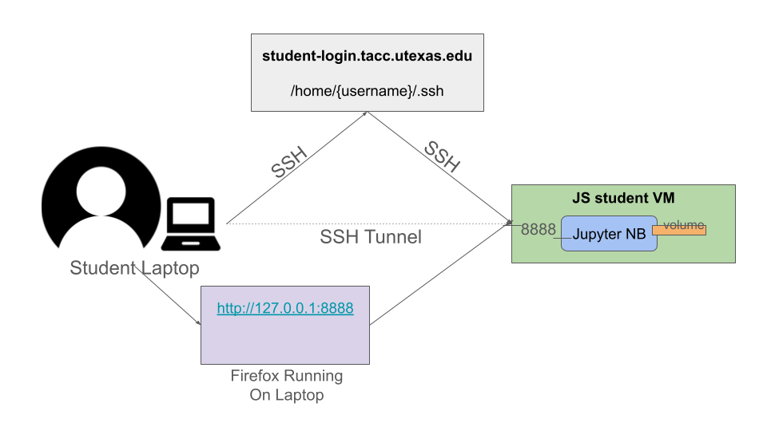
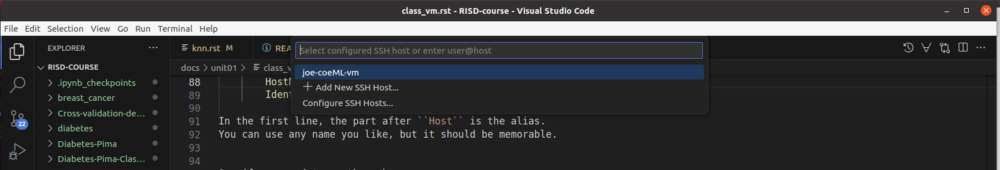
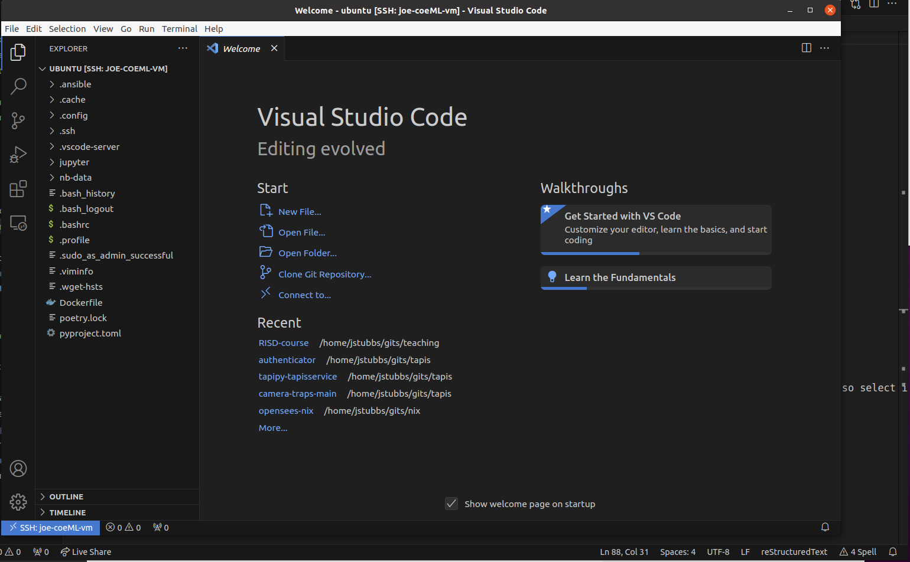

Using Your Class Virtual Machine 
=================================

Every student in the class will have their own virtual machine (VM) to do work. We highly recommend 
that you use your class VM to work on the in-class exercises and take-home projects. The VMs have the Linux OS 
and and some other software installed for you that will make getting started easier. Also, 
we (the teaching staff) have access to all of the VMs and can help you in case something goes very wrong. 

SSH Access To Your VM
----------------------

For security purposes, the student VMs will be behind a firewall and will not be directly accessible to the 
public internet. 
To access your VM via SSH, you will need to first SSH to the login VM. This year, the login VM will be 
located at: 

          | student-login.tacc.utexas.edu 

    SSH to student VM in two steps

Running Code on the VM
-----------------------

There will be two kinds of code writing that we will do in this class: 1) exploratory coding, where we will 
be investigating data sets, looking for patterns, and trying out new algorithms and methods; and 2) software 
engineering where we will develop entire applications. Correspondingly, we suggest using Jupyter notebooks 
for case 1) and an interactive development environmnet (IDE) for case two. Specifically, we will use the 
VSCode IDE. 

In this module, we will show you how to connect to your VM in two ways:

1. Jupyter Notebooks using SSH tunnels. 
2. VSCode IDE using the Remote-SSH plugin. 

Jupyter Notebooks via SSH Tunnels 
----------------------------------

Jupyter notebooks are a popular computational environment for "interactive" computing, and we'll make extensive 
use of them during the course. In order to use Jupyter notebook running on your VM, we'll create an SSH tunnel 
between your laptop and the VM connecting a local port on your laptop to the port on the VM where Jupyter is 
running. This SSH tunnel will be encrypted, meaning that our communication will be safe from eavesdroppers. 

Here are the steps to take to set up your Jupyter notebook.

1. First, start jupyter notebook container on the default port (8888). We'll use a docker container for this step, 
although that isn't strictly required. Consider mounting a local directory on the VM into the container so that the 
work you do in the notebook server is persisted after the container exits. 

.. code-block:: bash

    # start the container in the background
    docker run --rm --name nb -p 8888:8888 -v $(pwd)/nb-data:/code -d --entrypoint=sleep jstubbs/coe379l infinity

    # exec into it
    docker exec -it nb bash

    # from within the container, start jupyter,
    # must all root and all interfaces
    root@75bc4c445f13: jupyter-notebook --ip 0.0.0.0  --allow-root

2. Create an SSH tunnel to the port. In this case, we use a "Jump Host" (the ``-J`` flag) to first SSH to the 
  student-login VM.

.. code-block:: bash 

  ssh -J <tacc_username>@student-login.tacc.utexas.edu -L 8888:129.114.xx.yy:8888 ubuntu@joe-vm
 
Be sure to change the the values in the IP address and the name/alias of your VM.  Note that the general form of 
the SSH tunnel command is:

.. code-block:: bash 

    ssh -L local_port:destination_server_ip:remote_port <..other options..> <username>@<destination_server>

In this case, the local port on the local client is being forwarded to the port of the destination remote server.
Note also that while you are using "http" (and not "https"), the connection is still encrypted to the remote server --
it is using the SSH tunnel which is encrypted. 

    SSH Tunnel to student VM for Connecting to Jupyter Notebook

VSCode IDE via Remote-SSH Plugin 
--------------------------------

**We'll cover these instructions later in the semester**

In class we will also connect to code installed 
on the VM using VSCode and the Remote-SSH plugin.

The easiest way I have found to do this is to 
create an SSH config file with an entry for your VM, 
and then use that alias in VSCode.

For more details and alternatives, see the documentation for Remote SSH [1]. 

1. Install VSCode and SSH client on your machine, if not already installed.

2. Install the Remote-SSH client.

3. On your local laptop, edit the file ~/.ssh/config to contain the following:

.. code-block:: bash 

    Host login-proxy
        HostName student-login.tacc.utexas.edu
        User tacc_username
        ...Other options...

    Host joe-coeML-vm
        User ubuntu
        HostName 129.114.xx.xx
        ProxyCommand ssh -o 'ForwardAgent yes' student-login.tacc.utexas.edu 'ssh-add && nc %h %p'

Here we have added two entries, one for the login proxy and one for the actual student VM. Each entry instructs 
SSH about how to connect to that host. Once entered, SSH'ing to a host in the config is as easy as using the alias:

.. code-block:: bash 

    $ ssh joe-coeML-vm

Notes:
  * In the first line, the part after ``Host`` is the alias.
    You can use any name you like, but it should be memorable.
  * The string after ``User`` should be the remote account to connect with.
  * The part after ``HostName`` (i.e., the ``129.114.xx.xx``) should  be the actual IP address of the server.

4. Now, in a VSCode window, open the Command Pallette (Ctrl+Shift+P) and type 
"remote-ssh: Connect to host", and then:

4a) You should see the alias appear (in my case ``joe-coeML-vm``) -- if not, there could be an issue with your configs -- so select it.

    Remote SSH drop down with aliases from the ssh config file

4b) The first time, you will be prompted to select the OS type (choose Linux)

4c) Once you select the OS type, a new VSCode window will open up and connect to the machine. 

.. figure:: ./images/VSCode-remote-ssh-2.png
    :width: 1000px
    :align: center
    :alt: New VSCode window with Remote SSH

    New VSCode window with Remote SSH    

Choose the ``Open Folder...`` option and select the ``/home/ubuntu`` directory to see the 
complete listing.

    Remote listing of files on the VM

References and Additional Resources
-----------------------------------
[1] Documentation for Remote SSH plugin for VSCode. https://code.visualstudio.com/docs/remote/ssh
