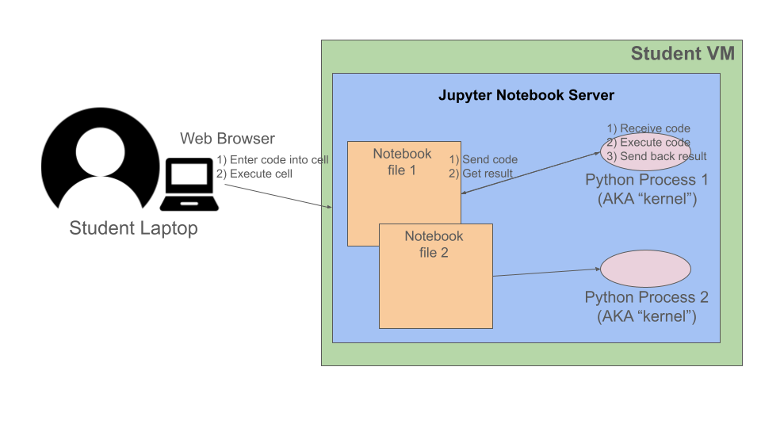
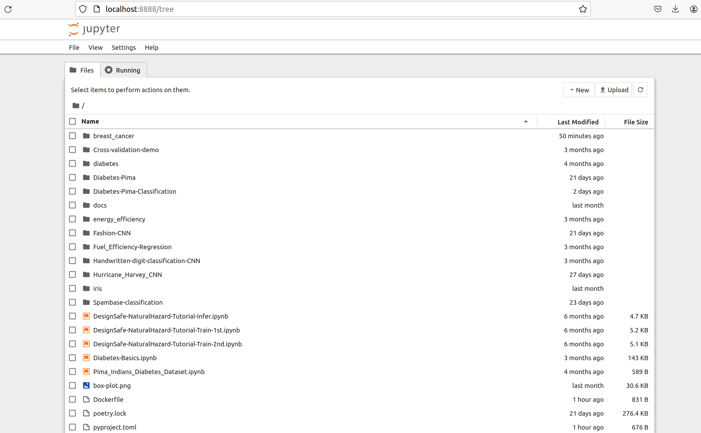
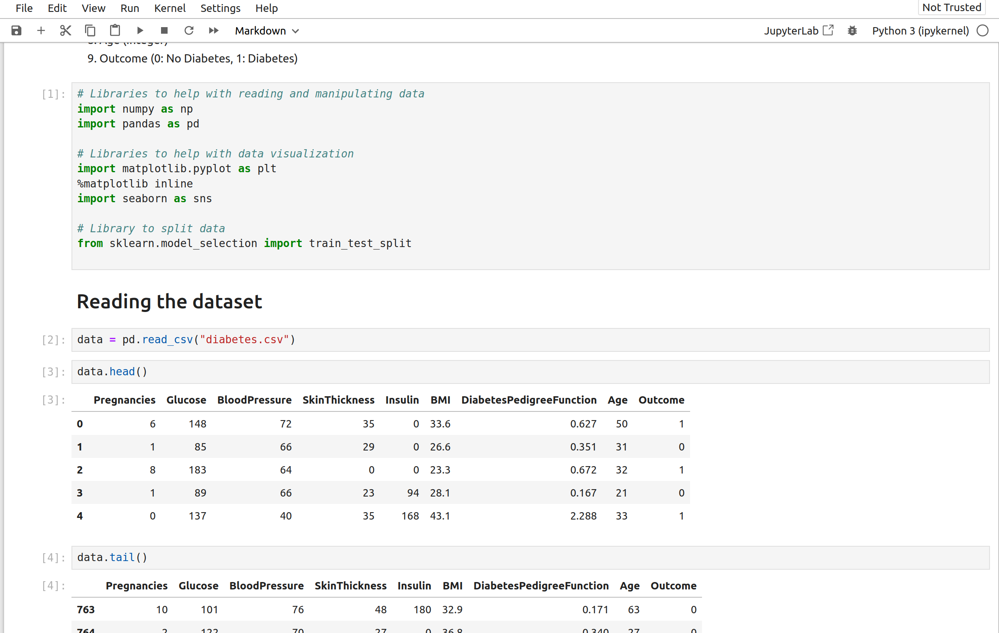

Using Your Class Virtual Machine 
=================================

Every student in the class will have their own virtual machine (VM) to do work. We highly recommend 
that you use your class VM to work on the in-class exercises and take-home projects. The VMs have the Linux OS 
and and some other software installed for you that will make getting started easier. Also, 
we (the teaching staff) have access to all of the VMs and can help you in case something goes very wrong. 

SSH Access To Your VM
----------------------

For security purposes, the student VMs will be behind a firewall and will not be directly accessible to the 
public internet. 
To access your VM via SSH, you will need to first SSH to the login VM. This year, the login VM will be 
located at: **student-login.tacc.utexas.edu**

.. figure:: ./images/ssh-to-vm.png
    :width: 1000px
    :align: center
    :alt: SSH to student VM in two steps 

    SSH to student VM in two steps

Steps to SSH to Student VM:

1. First, SSH to the login VM (student-login.tacc.utexas.edu) using your TACC username, password and MFA token. 
2. From student-login.tacc.utexas.edu, ssh as user ``ubuntu`` to your student VM (``ssh ubuntu@129.114.xx.yy``).
   You shouldn't need to specify any password or credentials -- SSH should use the key file on student-login 
and connect automatically. 

If you use Linux or OSX on your laptop, it might be helpful to add an entry in your $HOME/.ssh/config 
file (see the section below on connecting with VSCode).

Running Code on the VM
-----------------------

There will be two kinds of code writing that we will do in this class: 1) exploratory coding, where we will 
be investigating data sets, looking for patterns, and trying out new algorithms and methods; and 2) software 
engineering where we will develop entire applications. Correspondingly, we suggest using Jupyter notebooks 
for case 1) and an interactive development environmnet (IDE) for case two. Specifically, we will use the 
VSCode IDE. 

In this module, we will show you how to connect to your VM in two ways:

1. Jupyter Notebooks using SSH tunnels. 
2. VSCode IDE using the Remote-SSH plugin. 

Using the Class Docker Container
--------------------------------

We have created a Docker image available on the public Docker Hub (hub.docker.com)

.. note:: 
 The class image is ``jstubbs/coe379l``. 
 Use either the default (latest) tag or the ``:sp24`` tag. 

The docker image contains all of the libraries that we will need for the course, including 
``numpy`` and ``jupyter``. 

You can see a list of all of the packages installed in the 
`poetry.lock <https://github.com/joestubbs/coe379L-sp24/blob/master/poetry.lock>`_ file on the 
`class repo <https://github.com/joestubbs/coe379L-sp24>`_. 
(and by the way, if you don't know about Python Poetry, `check it out <https://python-poetry.org/>`_!)

Jupyter Notebooks via SSH Tunnels 
----------------------------------

Jupyter notebooks are a popular computational environment for "interactive" computing, and we'll make extensive 
use of them during the course. In order to use Jupyter notebook running on your VM, we'll create an SSH tunnel 
between your laptop and the VM connecting a local port on your laptop to the port on the VM where Jupyter is 
running. This SSH tunnel will be encrypted, meaning that our communication will be safe from eavesdroppers. 

Here are the steps to take to set up your Jupyter notebook.

1. **On the Student VM** First, start jupyter notebook container on the default port (8888). We'll use a docker container for this step, 
although that isn't strictly required. Consider mounting a local directory on the VM into the container so that the 
work you do in the notebook server is persisted after the container exits. 

.. code-block:: bash

    # start the container in the background
    docker run --rm --name nb -p 8888:8888 -v $(pwd)/nb-data:/code -d --entrypoint=sleep jstubbs/coe379l infinity

    # exec into it
    docker exec -it nb bash

    # from within the container, start jupyter,
    # must all root and all interfaces
    root@75bc4c445f13: jupyter-notebook --ip 0.0.0.0  --allow-root

Tangent: Docker Review 
~~~~~~~~~~~~~~~~~~~~~~
Let's take a closer look at that command:

.. code-block:: bash

    docker run \
      --rm \ 
      --name nb \
      -p 8888:8888 \ 
      -v $(pwd)/nb-data:/code \ 
      -d --entrypoint=sleep \ 
      jstubbs/coe379l \ 
      infinity

What do each of these parts of the command do? (Need a docker refresher? Check out the 
COE 332 lecture notes that 
`introduce containers <https://coe-332-sp23.readthedocs.io/en/latest/unit05/containers_1.html#>`_. )

Similarly, let's break down the second command

.. code-block:: bash

  docker exec \ 
    -it \ 
    nb \
    bash 

What does each part do? 

2. **On Your Laptop** Create an SSH tunnel to the port. In this case, we use a "Jump Host" (the ``-J`` flag) to first SSH to the 
  student-login VM.

.. code-block:: bash 

  ssh -J <tacc_username>@student-login.tacc.utexas.edu -L 8888:129.114.xx.yy:8888 ubuntu@129.114.xx.yy
 
Be sure to change the the values in the IP address and the name/alias of your VM.  Note that the general form of 
the SSH tunnel command is:

.. code-block:: bash 

    ssh -L local_port:destination_server_ip:remote_port <..other options..> <username>@<destination_server>

In this case, the local port on the local client is being forwarded to the port of the destination remote server.
Note also that while you are using "http" (and not "https"), the connection is still encrypted to the remote server --
it is using the SSH tunnel which is encrypted. 

.. figure:: ./images/ssh-tunnel-jupyter.png
    :width: 1000px
    :align: center
    :alt: 

    SSH Tunnel to student VM for Connecting to Jupyter Notebook

VSCode IDE via Remote-SSH Plugin 
--------------------------------

**We'll cover these instructions later in the semester**

In class we will also connect to code installed 
on the VM using VSCode and the Remote-SSH plugin.

The easiest way I have found to do this is to 
create an SSH config file with an entry for your VM, 
and then use that alias in VSCode.

For more details and alternatives, see the documentation for Remote SSH [1]. 

1. Install VSCode and SSH client on your machine, if not already installed.

2. Install the Remote-SSH client. Go to Extensions (Ctrl+Shift+X), type "Remote-SSH" and click ``Install``

3. On your local laptop, edit the file ~/.ssh/config to contain the following:

.. code-block:: bash 

    Host login-proxy
        HostName student-login.tacc.utexas.edu
        User tacc_username
        ...Other options...

    Host joe-coeML-vm
        User ubuntu
        HostName 129.114.xx.xx
        ProxyCommand ssh -o 'ForwardAgent yes' student-login.tacc.utexas.edu 'ssh-add && nc %h %p'

Here we have added two entries, one for the login proxy and one for the actual student VM. Each entry instructs 
SSH about how to connect to that host. Once entered, SSH'ing to a host in the config is as easy as using the alias:

.. code-block:: bash 

    $ ssh joe-coeML-vm

Notes:
  * In the first line, the part after ``Host`` is the alias.
    You can use any name you like, but it should be memorable.
  * The string after ``User`` should be the remote account to connect with.
  * The part after ``HostName`` (i.e., the ``129.114.xx.xx``) should  be the actual IP address of the server.

4. Now, in a VSCode window, open the Command Pallette (Ctrl+Shift+P) and type 
"remote-ssh: Connect to host", and then:

4a) You should see the alias appear (in my case ``joe-coeML-vm``) -- if not, there could be an issue with your configs -- so select it.

.. figure:: ./images/VSCode-remote-ssh-1.png
    :width: 1000px
    :align: center
    :alt: Remote SSH drop down with aliases from the ssh config file

    Remote SSH drop down with aliases from the ssh config file

4b) The first time, you will be prompted to select the OS type (choose Linux)

4c) Once you select the OS type, a new VSCode window will open up and connect to the machine. 

.. figure:: ./images/VSCode-remote-ssh-2.png
    :width: 1000px
    :align: center
    :alt: New VSCode window with Remote SSH

    New VSCode window with Remote SSH    

Choose the ``Open Folder...`` option and select the ``/home/ubuntu`` directory to see the 
complete listing.

.. figure:: ./images/VSCode-remote-ssh-3.png
    :width: 1000px
    :align: center
    :alt: Remote listing of files on the VM

    Remote listing of files on the VM

Using Jupyter Notebooks
-----------------------

How many students have used Jupyter notebooks before? 

In this class, we'll use Jupyter notebooks for all of the exploratory data analysis and visualization, 
as well as a good deal of the machine learning model developement. 

You can think of Jupyter as an enhanced python REPL (Read, Evaluate, Print Loop) like the 
Python or iPython shell (in fact, the Jupyter project grew out of the iPython project).

Jupyter Architecture
~~~~~~~~~~~~~~~~~~~~~

What is a Python REPL? In a nutshell, it looks pretty much like this: 

.. code-block:: python

    while True:
        code = input(">>> ")
        exec(code)

It's a simple event loop where each iteration through the loop the user inputs some code and the REPL 
program executes the code and prints the "result" before returning to the top of the loop to collect the 
next line of input code. 

Jupyter notebooks are actually pretty similar. 

Jupyter notebooks are actually *servers* running in the normal request-reply pattern. The request 
is the bit of code (Python, markdown, etc.) that you write in the cells. The replies are the results 
of executing the bit of code in a Python process. 

    The basic architecture of Jupyter Notebook server.

The process that the code runs within is called a *kernel*. A given Jupyter notebook server can contain 
different versions of the Python interpreter (e.g., 3.10, 3.11, 3.12, etc) to be run as a kernel. 

Opening a new or existing notebook file causes a new kernel to be started. This is similar to running 
a new Python or iPython shell. Keep in mind that libraries must be imported each time a kernel is started 
or restarted, just like with a Python/iPython shell. 

Jupyter Interface 
~~~~~~~~~~~~~~~~~

In class, we'll explore the Jupyter Notebook Server interface. This is an image of the home screen. 

    Jupyter notebook server home screen with file listings

Here is what a typical notebook file looks like when it is open. 

    An open notebook file with code cells doing imports and code execution. Output is shows directly below the code cells.

Use SHIFT+enter to execute code in a cell (i.e., send it to the backend kernel and execute it).

Let's try opening a new notebook file, choosing the Python 3 kernel, entering some simple code 
and testing it out. 

References and Additional Resources
-----------------------------------
1. Documentation for Remote SSH plugin for VSCode. https://code.visualstudio.com/docs/remote/ssh
