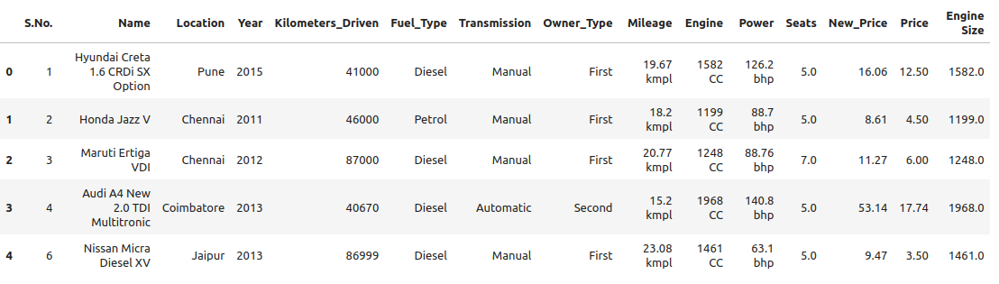
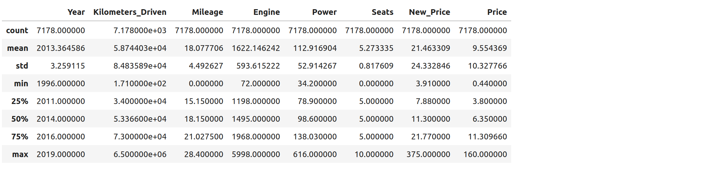
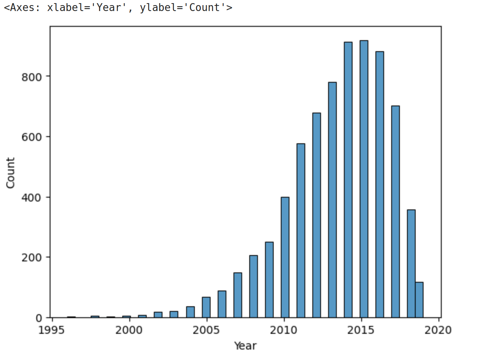
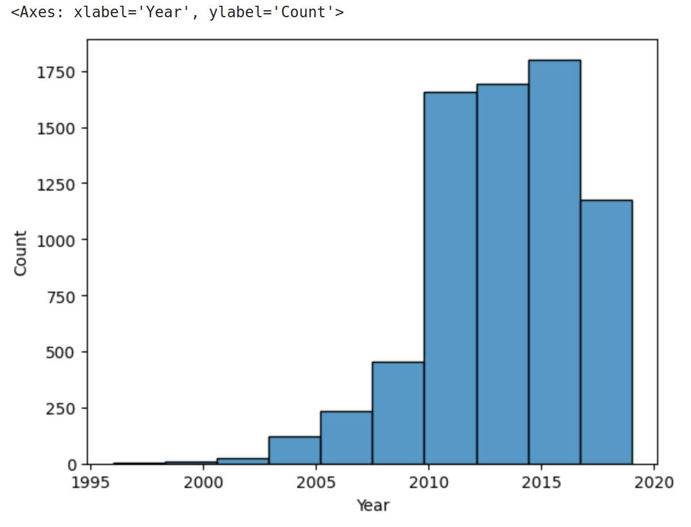
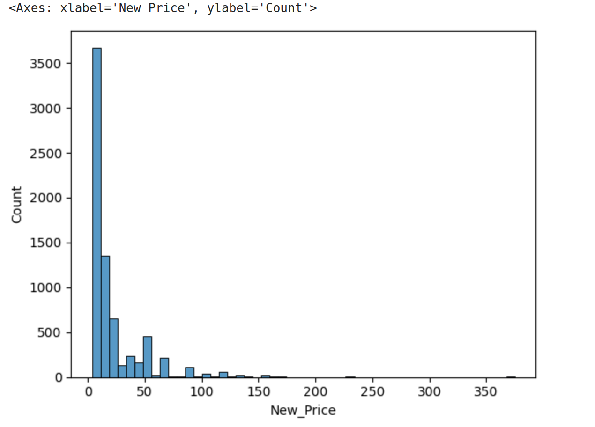
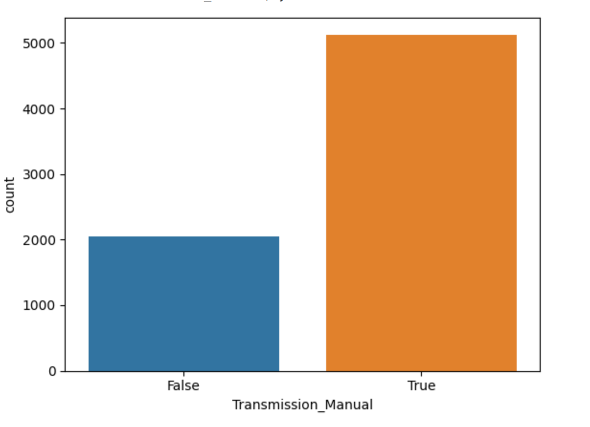
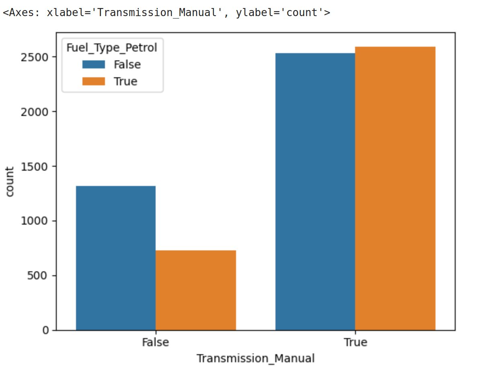
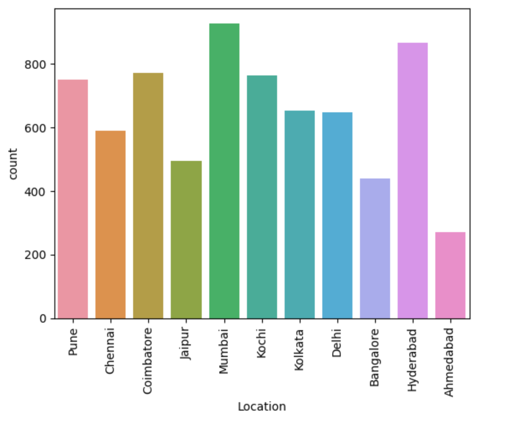
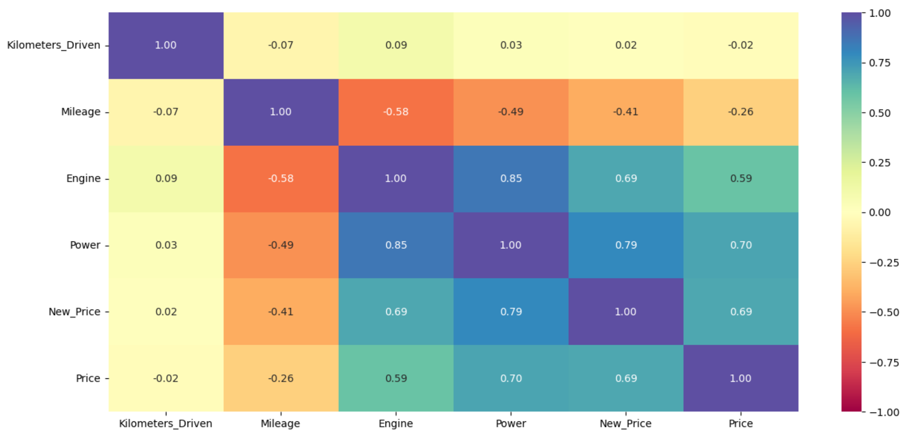

Introduction to Exploratory Data Analysis and Pre-Processing
=============================================================

As we will emphasize throughout the semester, having a basic familiarity and 
understanding of the dataset you are working with will be important for making 
decisions about what and how to analyze it, and the success of machine learning algorithms
will depend in large part on having prepared the data to ensure it has certain qualities. 

In this unit, we introduce an initial set of data analysis and pre-processing 
techniques. This is just a starting point -- we will introduce additional topics 
throughout the semester. 

By the end of this module, students should be able to:

1. Investigate the shape and types of the variables (i.e., columns) contained within the 
   dataset. 
2. Perform type conversion for strings/objects of numerical data using ``apply`` combined with 
   other methods.
3. Understand categorical and ordinal data and how to perform type conversion of
   categorical data to integers using one-hot encoding. 
4. Perform basic duplicate and missing value detection and treatment. 
5. Compute basic statistical properties of data, including mean, median, max and min. 
6. Apply simple univariate and multivariate analysis of the feature columents including 
   visualization techniques using matplotlib and/or seaborn libraries. 

Step 0: Inspect the File
~~~~~~~~~~~~~~~~~~~~~~~~
Before you write even a line of Python, it is good to just manually inspect the file. 
We can answer questions like the following without writing a line of code: 

* How big is the file? 
* Is it really text?
* What do the first few lines look like? 

For example: 

.. code-block:: bash 

   # how big is the file? 
   $ ls -lh used_cars_data.csv 
   -rw-rw-r-- 1 jstubbs jstubbs 839K Jan 22 19:32 used_cars_data.csv
   # it's a 839K file.. not too big

   # is it really text? 
   $ file used_cars_data.csv 
   used_cars_data.csv: CSV text
   # yes! 
   # other answers we could have gotten:
     # Python script, ASCII text executable (Python scripe)
     # ELF 64-bit LSB shared object, x86-64, version 1 (SYSV), dynamically linked (binary file)
   
   # what do the first few lines look like? 
   $ head used_cars_data.csv 
   S.No.,Name,Location,Year,Kilometers_Driven,Fuel_Type,Transmission,Owner_Type,Mileage,Engine,Power,Seats,New_Price,Price,Engine Size
   1,Hyundai Creta 1.6 CRDi SX Option,Pune,2015,41000,Diesel,Manual,First,19.67 kmpl,1582 CC,126.2 bhp,5.0,16.06,12.5,1582.0
   2,Honda Jazz V,Chennai,2011,46000,Petrol,Manual,First,18.2 kmpl,1199 CC,88.7 bhp,5.0,8.61,4.5,1199.0
   3,Maruti Ertiga VDI,Chennai,2012,87000,Diesel,Manual,First,20.77 kmpl,1248 CC,88.76 bhp,7.0,11.27,6.0,1248.0
   4,Audi A4 New 2.0 TDI Multitronic,Coimbatore,2013,40670,Diesel,Automatic,Second,15.2 kmpl,1968 CC,140.8 bhp,5.0,53.14,17.74,1968.0
   6,Nissan Micra Diesel XV,Jaipur,2013,86999,Diesel,Manual,First,23.08 kmpl,1461 CC,63.1 bhp,5.0,9.47,3.5,1461.0
   7,Toyota Innova Crysta 2.8 GX AT 8S,Mumbai,2016,36000,Diesel,Automatic,First,11.36 kmpl,2755 CC,171.5 bhp,8.0,21.0,17.5,2755.0
   8,Volkswagen Vento Diesel Comfortline,Pune,2013,64430,Diesel,Manual,First,20.54 kmpl,1598 CC,103.6 bhp,5.0,13.23,5.2,1598.0
   9,Tata Indica Vista Quadrajet LS,Chennai,2012,65932,Diesel,Manual,Second,22.3 kmpl,1248 CC,74 bhp,5.0,7.63,1.95,1248.0
   10,Maruti Ciaz Zeta,Kochi,2018,25692,Petrol,Manual,First,21.56 kmpl,1462 CC,103.25 bhp,5.0,10.65,9.95,1462.0

Now that we know we are really dealing with text and that there appears to be a row of header labels 
on the first line, let's proceed to using Python. 

Data Shape and Types 
~~~~~~~~~~~~~~~~~~~~
It's important to begin any data exploration by understanding the shape (number of rows and columns)
as well as the types (strings, integers, floats, etc) of the values in the dataset. 

Let's read the used cars dataset from the class repo into a DataFrame and work through some of the 
first examples. 

.. code-block:: python3 

  # import the library and create the DataFrame 
  >>> import pandas as pd 
  >>> cars = pd.read_csv('used_cars_data.csv')

  # use head to make sure dataset was actually loaded 
  >>> cars.head() 

We begin by calling ``head()`` to print the first five rows. We also use ``shape`` to get the 
number of rows and columns 

.. code-block:: python3 

  >>> cars.shape
  (7179, 15)

We see from the output of ``shape`` that there are 7,179 rows and 15 columns. The output of 
``head()`` gives us an idea of the columns. 

We'll use ``info()`` to get the column types that were inferred: 

.. code-block:: python3 

   >>> cars.info()
   <class 'pandas.core.frame.DataFrame'>
   RangeIndex: 7179 entries, 0 to 7178
   Data columns (total 15 columns):
   #   Column             Non-Null Count  Dtype  
   ---  ------             --------------  -----  
   0   S.No.              7179 non-null   int64  
   1   Name               7179 non-null   object 
   2   Location           7179 non-null   object 
   3   Year               7179 non-null   int64  
   4   Kilometers_Driven  7179 non-null   int64  
   5   Fuel_Type          7179 non-null   object 
   6   Transmission       7179 non-null   object 
   7   Owner_Type         7179 non-null   object 
   8   Mileage            7177 non-null   object 
   9   Engine             7133 non-null   object 
   10  Power              7005 non-null   object 
   11  Seats              7126 non-null   float64
   12  New_Price          7179 non-null   float64
   13  Price              5953 non-null   float64
   14  Engine Size        7133 non-null   float64
   dtypes: float64(4), int64(3), object(8)
   memory usage: 841.4+ KB

We see a mix of ints, floats and objects (e.g., strings). The column names all look 
like legitimate header names, though some could be a little mysterious (e.g., "S.No."). 

We see that many of the columns have 7,179 non-null values, but Mileage, Engine, Power, 
Seats and Price all have fewer. Since the entire DataFrame has 7,179 rows, these columns 
must have missing values. That will be important soon. 

A Basic Understanding of the Data
^^^^^^^^^^^^^^^^^^^^^^^^^^^^^^^^^^
At this point, we want to step back and see if we have a basic understanding of what is 
going on with this dataset. If we were given a complete description of the data, this
wouldn't be difficult.  

Often times though, our information about a dataset may be partial and imperfect. For example, 
it may have been sent to us by 
the "sales department" or the "data group", and they may or may not have given us a complete 
explanation of all of the details. Or, we may have found the dataset on the internet, perhaps 
associated with a published paper, a blog post, or a git repository. 

Sometimes, we have to do some of our own investigating to figure out what is going on with 
particular data elements or columns. 

So let's think about this dataset. Any one have a thought as to what is going on here? 

This is a dataset about used cars -- their current price as well as the price when they were new, 
and a number of other features, such as the name of the car, the year it was made, the fuel and 
transition type, etc.  

Dropping Irrelevant Columns 
^^^^^^^^^^^^^^^^^^^^^^^^^^^
Let's think about whether we need all of the columns. It's always best to remove 
"irrelevant" columns whenever possible. What constitute's an "irrelevant" column? 

What do you think? 

It depends on the dataset and the question(s) being asked of it! There are plenty of interesting 
questions we could ask and (try to) answer with this dataset. 

Today, we're interested in understanding how the current (used) price is related to 
other features in the dataset. 

This "S.No." column looks suspicious. It looks like it might be just an integer index (i.e., the row 
number). That's virtually never useful because we can always get the row index using functions. 

But first, let's confirm that it really is just the row index. How might we check that? 

First, let's just look at the values by printing the column. (Remember: how do we print the 
column of a DataFrame?)

.. code-block:: python3 

   >>> cars['S.No.']
   0          0
   1          1
   2          2
   3          3
   4          4
         ... 
   7174    7174
   7175    7175
   7176    7176
   7177    7177
   7178    7178
   Name: S.No., Length: 7179, dtype: int64

The output above tells us that the first five rows (rows 0 through 4) and the last five rows all 
have value for "S.No." matching the row index. That's pretty good evidence. 

If we need more evidence here are some other checks: 

.. code-block:: python3 

  >>> len(cars['S.No.'].unique())
  7179 # the same number as the total number of values, so all values are unique 

  # compare with a numpy array 
  >>> import numpy as np 
  >>> n = numpy.arange(start=0, stop=7179, step=1)
  >>> cars['S.No.'].sum() == n.sum()
  True # the same sum, same length, and all unique, so we know they are identical! 

Let's drop this column. We'll use the ``drop()`` method of the DataFrame, which allows us 
to remove rows or columns using lables. We do need to specify the axis we want to delete from 
(``axis=0`` for rows, ``axis=1`` for columns), and we want to set ``inplace=True`` so that 
it changes the existing DataFrame instead of creating a new one. 

.. code-block:: python3 

  >>> cars.drop(['S.No.'], axis=1, inplace=True)

  # it's always good to confirm
  >>> cars.shape
  (7523, 13)

You can read more about ``drop()`` from the documentation [1]. 

Type Conversions
~~~~~~~~~~~~~~~~
While most datasets will have a mix of different types of data, including strings and numerics, 
virtually all of the algorithms we use in class require numeric data. Thus, before we start any 
machine learning, we'll want to convert all of the columns to numbers. Broadly, there are two 
cases:

* Numeric columns that are strings 
* Categorical columns that require an "embedding" to some space of numbers. 

Numeric Columns with Strings
^^^^^^^^^^^^^^^^^^^^^^^^^^^^
Let's start with the case where we have numeric data that is represented as a string. This 
could be because the numbers were just happened to be encoded as strings, e.g., ``"2.14 "`` 
(and beware of spaces on either side of the number) or because the numbers contain other 
characters, such as units, e.g., ``"2.14 kg"``. 

Recall that the ``info()`` function returned the type information for each column: 

.. code-block:: python3 

   >>> cars.info()
   <class 'pandas.core.frame.DataFrame'>
   RangeIndex: 7179 entries, 0 to 7178
   Data columns (total 14 columns):
   #   Column             Non-Null Count  Dtype  
   ---  ------             --------------  -----  
   0   Name               7179 non-null   object 
   1   Location           7179 non-null   object 
   2   Year               7179 non-null   int64  
   3   Kilometers_Driven  7179 non-null   int64  
   4   Fuel_Type          7179 non-null   object 
   5   Transmission       7179 non-null   object 
   6   Owner_Type         7179 non-null   object 
   7   Mileage            7177 non-null   object 
   8   Engine             7133 non-null   object 
   9   Power              7005 non-null   object 
   10  Seats              7126 non-null   float64
   11  New_Price          7179 non-null   float64
   12  Price              5953 non-null   float64
   13  Engine Size        7133 non-null   float64
   dtypes: float64(4), int64(2), object(8)
   memory usage: 785.3+ KB

We can see that several columns are type ``object`` even though they have some numeric data.
These include the ``Mileage``, ``Engine`` and ``Power`` columns.
If we look at some values, we see that the rows appear to contain numbers with units. 
Let's fix those. 

We need to strip off the units characters and leave only the numeric value. At that point we can 
cast the value to a float. 

We need to take some care when attempting to modify all the values in a column. Remember, we've only 
looked at the first few values. There could be unexpected values later in the dataset. 

.. warning:: 

   Like in other software engineering, data processing should be done defensively. That is, 
   assume that any kind of value could appear in any part of the dataset until you have proven 
   otherwise. 

We'll use the ``endswith()`` string function to check the rows that end with a specific unit string.
Recall from the previous module the ``astype()`` function, for casting to a specific python type.  

For example, we can produce a DataFrame of rows whose ``Mileage`` column ends with the string "kmpl" 
as follows:

.. code-block:: python3 

   >>> cars[cars["Mileage"].astype(str).str.endswith("kmpl")])

Then, we can check the length of that DataFrame and compare it to the whole DataFrame: 

.. code-block:: python3 

   >>> len(cars[cars["Mileage"].astype(str).str.endswith("kmpl")]))
   7177

We see there are 7,177 rows ending in "kmpl" though there are 7,179 total rows. What might explain that? 
(Hint: look at the output of ``info()`` again).

Yes, from the ``info()`` output, we know there are only 7,177 non-null rows in the Mileage column. So this means,
every non-null row ends with "kmpl". 

**In-Class Exercise.** Let's repeat similar steps for ``Engine`` and ``Power``. 
What are the expected units? How do we check that the rows all end in the units?

Now that we know the units to remove, we need to actually modify the DataFrame to remove them. 
The key to this is the pandas ``apply()`` function, which takes another function to apply to all 
the rows in a DataFrame. 

The function we pass to ``apply()`` needs to accept a single argument, which is the value in the DataFrame 
to change, and it needs to return a single value as well (the updated value).

We can make use of the Python ``removesuffix()`` function from the string library, but we need to wrap it 
to have this form.

.. code-block:: python3 

   def remove_units(s): 
   """
   Remove the units from a string, s, returning a new string.
   """
   return s.removesuffix("CC")

With this function defined, we can use it with ``apply()``, but as with the complex conditional we looked at 
last time, we'll need to cast the pandas series to string values first. Here is the code: 

.. code-block:: python3 

   >>> cars['Engine'].astype(str).apply(remove_units)

The code above returns the resulting Series object after applying the function (``remove_units()``) 
to each value. We want to do two additional things: 

1. Cast each value to a float, since it will be a valid float after stripping the units. 
2. Set the final result to the original column, ``Engine``. 

We can do this by applying one more ``astype`` and setting the result, like so: 

.. code-block:: python3 

   >>> cars['Engine'] = cars['Engine'].astype(str).apply(remove_units).astype(float)

After executing the above code, we can then check that the ``Engine`` column was indeed converted:

.. code-block:: python3
   :emphasize-lines: 15

   >>> cars.info()
   <class 'pandas.core.frame.DataFrame'>
   RangeIndex: 7179 entries, 0 to 7178
   Data columns (total 14 columns):
   #   Column             Non-Null Count  Dtype  
   ---  ------             --------------  -----  
   0   Name               7179 non-null   object 
   1   Location           7179 non-null   object 
   2   Year               7179 non-null   int64  
   3   Kilometers_Driven  7179 non-null   int64  
   4   Fuel_Type          7179 non-null   object 
   5   Transmission       7179 non-null   object 
   6   Owner_Type         7179 non-null   object 
   7   Mileage            7177 non-null   object 
   8   Engine             7133 non-null   float64
   9   Power              7005 non-null   object 
   10  Seats              7126 non-null   float64
   11  New_Price          7179 non-null   float64
   12  Price              5953 non-null   float64
   13  Engine Size        7133 non-null   float64
   dtypes: float64(5), int64(2), object(7)
   memory usage: 785.3+ KB   

We can also check several values of the column to see that indeed the units have been removed: 

.. code-block:: python3 

   >>> cars["Engine"]
   0       1582.0
   1       1199.0
   2       1248.0
   3       1968.0
   4       1461.0
            ...  
   7174    1598.0
   7175    1197.0
   7176    1461.0
   7177    1197.0
   7178    2148.0
   Name: Engine, Length: 7179, dtype: float64   

You might be wondering about those null values. Pandas allows us to cast those null values to floats, 
but be careful -- the same is not true for casting to ints! 

.. warning:: 

   You will not be able to cast the values in a Pandas Series to ``int`` if the column contains 
   missing values. 

**In-class Exercise.** Transform the ``Mileage`` and ``Power`` columns to float types by 
removing the units. 

When you are done, double check that you have floats for all three columns: 

.. code-block:: python3
   :emphasize-lines: 14,15,16

   >>> cars.info()
   <class 'pandas.core.frame.DataFrame'>
   RangeIndex: 7179 entries, 0 to 7178
   Data columns (total 14 columns):
   #   Column             Non-Null Count  Dtype  
   ---  ------             --------------  -----  
   0   Name               7179 non-null   object 
   1   Location           7179 non-null   object 
   2   Year               7179 non-null   int64  
   3   Kilometers_Driven  7179 non-null   int64  
   4   Fuel_Type          7179 non-null   object 
   5   Transmission       7179 non-null   object 
   6   Owner_Type         7179 non-null   object 
   7   Mileage            7177 non-null   float64
   8   Engine             7133 non-null   float64
   9   Power              7005 non-null   float64
   10  Seats              7126 non-null   float64
   11  New_Price          7179 non-null   float64
   12  Price              5953 non-null   float64
   13  Engine Size        7179 non-null   object 
   dtypes: float64(6), int64(2), object(6)
   memory usage: 785.3+ KB

*Solution:* 

.. code-block:: python3

   def remove_units_mileage(s):
      """
      Remove the units from a string, s, returning a new string.
      """
      return s.removesuffix("kmpl")

   def remove_units_power(s):
      """
      Remove the units from a string, s, returning a new string.
      """
      return s.removesuffix("bhp")

   cars['Mileage'] = cars['Mileage'].astype(str).apply(remove_units_mileage).astype(float)
   cars['Power'] = cars['Power'].astype(str).apply(remove_units_power).astype(float)

Categorical Values 
^^^^^^^^^^^^^^^^^^^

Looking at some example values of some of the other columns of type object, we see that the 
first few objects (``Fuel_Type``, ``Transmission``, and ``Owner_Type``) are all non-numeric; 
that is, the string values are do not contain any numbers.

However, it is easy to check the unique values within a column using the ``.unique()`` 
function; for example: 

.. code-block:: python3 

   >>> cars['Fuel_Type'].unique()
   array(['Diesel', 'Petrol', 'Electric'], dtype=object)

For the ``Fuel_Type`` column, we see there are only 3 different values in the entire DataFrame.    
How many values do ``Transmission`` and ``Owner_Type`` take? 

.. code-block:: python3 

   >>> cars['Transmission'].unique()
   array(['Manual', 'Automatic'], dtype=object)

   >>> cars['Owner_Type'].unique()
   array(['First', 'Second', 'Fourth & Above', 'Third'], dtype=object)

These are examples of *categorical* columns: that is, a column that takes only a limited (usually) 
fixed set of values. We can think of categorical columns as being comprised of labels. Some additional
examples: 

* Cat, Dog 
* Green, Yellow, Red 
* Austin, Dallas, Houston 
* Accountant, Software Developer, Finance Manager, Student Advisor, Systems Administrator
* Gold, Silver, Bronze 

In some cases, there is a natural (total) order relation on the values; for example, we 
could say:

.. math:: 

  Gold > Silver > Bronze

These variables are called "ordinal categoricals" or just "ordinal" data.

On the other hand, many categorical columns have no natural order -- for example, "Cat" and "Dog" 
or the position types of employees ("Accountant", "Software Developer", etc.).

.. note:: 

   Even in the case of ordinal categoricals, numeric operations (``+``, ``*``, etc) 
   are not possible. This is another way to distinguish categorical data from 
   numerical data. 

The type of categorical (ordinal or not) dictates which method we will use to convert to numeric data. 
For categorical data that is not ordinal, we will use a method called "One-Hot Encoding". 

One-Hot Encoding
^^^^^^^^^^^^^^^^

The "One-Hot Encoding" terminology comes from digital circuits -- the idea is to encode data using a 
series of bits (1s and 0s) where, for a given value to be encoded, only one bit takes the value 1 
and the rest take the value 0. 

How could we devise such a scheme?

Suppose we have the labels "Cat" and "Dog". One approach would be to simply use two bits, say a "Cat" 
bit and a "Dog" bit. If the "Cat" bit is the left bit and the "Dog" bit is the right one, then we would 
have a mapping:

.. math:: 

   Cat \rightarrow 1 0 

   Dog \rightarrow 0 1 

We could devise a similar scheme for the colors of a traffic light (Green, Yellow, Red) with three bits:

.. math:: 

   Green \rightarrow 1 0 0

   Yellow \rightarrow 0 1 0
   
   Red \rightarrow 0 0 1

This seems like a pretty good approach, but if we look carefully at the 
above schemes, we might notice that we never used the "all 0s" bit value. 

And in fact we could do slightly better: we can actually save 
one bit by noticing that the last label can be represented as the "absence" of all other labels. 

For example, 

.. math:: 

   Cat \rightarrow 1

   Dog \rightarrow 0

where we can think of the above as mapping the "Dog" label to "not Cat".

Similarly, 

.. math:: 

   Green \rightarrow 1 0

   Yellow \rightarrow 0 1
   
   Red \rightarrow 0 0

where we have mapped "Red" to "not Green, not Yellow". 

In general, a One-Hot Encoding scheme needs a total number of bits that is 1 less than the total possible 
values in the data set. We can use this technique to expand a categorical column into :math:`n-1` columns 
of bits (0s and 1s) where :math:`n` is the number of possible values in the column. First, we need to cast 
the column values to the type ``category``, a special pandas type for categorical data, using the 
``astype()`` function. 

Here's how that looks for the ``Fuel_Type`` column. First, we do the cast: 

.. code-block:: python3 

   >>> cars['Fuel_Type'] = cars['Fuel_Type'].astype("category")

Using ``info()`` we see the column was converted: 

.. code-block:: python3 
   :emphasize-lines: 12

   >>> cars.info()

   <class 'pandas.core.frame.DataFrame'>
   RangeIndex: 7179 entries, 0 to 7178
   Data columns (total 14 columns):
   #   Column             Non-Null Count  Dtype   
   ---  ------             --------------  -----   
   0   Name               7179 non-null   object  
   1   Location           7179 non-null   object  
   2   Year               7179 non-null   int64   
   3   Kilometers_Driven  7179 non-null   int64   
   4   Fuel_Type          7179 non-null   category
   5   Transmission       7179 non-null   object  
   6   Owner_Type         7179 non-null   object  
   7   Mileage            7177 non-null   float64 
   8   Engine             7133 non-null   float64 
   9   Power              7005 non-null   float64 
   10  Seats              7126 non-null   float64 
   11  New_Price          7179 non-null   float64 
   12  Price              5953 non-null   float64 
   13  Engine Size        7179 non-null   object  
   dtypes: category(1), float64(6), int64(2), object(5)
   memory usage: 736.4+ KB

We can convert the other two columns in a similar way: 

.. code-block:: python3 

   >>> cars['Transmission'] = cars['Transmission'].astype("category")
   >>> cars['Owner_Type'] = cars['Owner_Type'].astype("category")

Then we use the ``pandas.get_dummies()`` function to convert the categorical columns to a set of 
bit columns. Notes on the ``get_dummies()`` function:

* It lives in the global pandas module space -- reference it as ``pd.get_dummies()``
* It takes a DataFrame as input. 
* It takes a ``columns=[]`` argument, which should be a list of column names to apply the encoding to. 
* It can optionally take a ``drop_first=True`` argument, in which case it will produce ``n-1`` 
  columns for each categorical column, where ``n`` is the number of distinct values in the categorical column.   

.. code-block:: python3 
   :emphasize-lines: 19-24

   >>> cars = pd.get_dummies(cars, columns=["Fuel_Type", "Transmission", "Owner_Type"], drop_first=True)
   >>> cars.info()
   <class 'pandas.core.frame.DataFrame'>
   RangeIndex: 7179 entries, 0 to 7178
   Data columns (total 17 columns):
   #   Column                     Non-Null Count  Dtype  
   ---  ------                     --------------  -----  
   0   Name                       7179 non-null   object 
   1   Location                   7179 non-null   object 
   2   Year                       7179 non-null   int64  
   3   Kilometers_Driven          7179 non-null   int64  
   4   Mileage                    7177 non-null   float64
   5   Engine                     7133 non-null   float64
   6   Power                      7005 non-null   float64
   7   Seats                      7126 non-null   float64
   8   New_Price                  7179 non-null   float64
   9   Price                      5953 non-null   float64
   10  Engine Size                7179 non-null   object 
   11  Fuel_Type_Electric         7179 non-null   bool   
   12  Fuel_Type_Petrol           7179 non-null   bool   
   13  Transmission_Manual        7179 non-null   bool   
   14  Owner_Type_Fourth & Above  7179 non-null   bool   
   15  Owner_Type_Second          7179 non-null   bool   
   16  Owner_Type_Third           7179 non-null   bool   
   dtypes: bool(6), float64(6), int64(2), object(3)
   memory usage: 659.1+ KB

Notice that it automatically removed the categorical columns of type object and replaced each of them 
with :math:`n-1` new ``bool`` columns. It used the values of the object column in the names of the new 
boolean columns. 

.. note::

   When we introduce Scikit-Learn, we'll learn a different function for converting
   categorical data using One-Hot Encoding. 

.. note::

   The use of "dummies" in the function name ``get_dummies`` comes from statistics and related fields
   that refer to the columns of a one-hot encoding as "dummy" variables (or "dummy" columns). 

Duplicate Values 
~~~~~~~~~~~~~~~~
Our DataFrame is starting to look better, with lots of the object columns replaced with boolean and/or numeric 
columns. However, if we inspect the ``Engine`` and ``Engine Size`` columns, we see some similarities: 

.. code-block:: python3 

   >>> cars[["Engine", "Engine Size"]]
         Engine Engine Size
   0 	1582.0 	1582
   1 	1199.0 	1199
   2 	1248.0 	1248
   3 	1968.0 	1968
   4 	1461.0 	1461
   ... 	... 	...
   7174 1598.0 	1598
   7175 1197.0 	1197
   7176 1461.0 	1461
   7177 1197.0 	1197
   7178 2148.0 	2148

In fact, all the values look the same! 
We can also check that all values in each column are the same. How would we do that? 

*Solution.* 

.. code-block:: python3 

   >>> cars[cars['Engine'].astype(float) != cars['Engine Size'].astype(float)]

Or if we want to get rid of the NaN's

.. code-block:: python3 

   >>> cars[ (cars['Engine'].astype(float) != cars['Engine Size'].astype(float)) & cars['Engine'].notna()]

These are duplicate columns, so let's drop one!

.. code-block:: python3 

   >>> cars.drop(["Engine Size"], index=?, inplace=?)

   # check that the column is gone..
   >>> cars.?

Duplicate Rows
^^^^^^^^^^^^^^
We can also check for and remove duplicate rows. In most machine learning applications, it is desirable to remove
duplicate rows because additional versions of the exact same row will not "teach" the algorithm anything 
new. (This will make more sense after we introduce machine learning). 

Pandas makes it very easy to check for and remove duplicate rows. First, the ``duplicated()``
function of a DataFrame returns a Series of booleans where a row in the Series has value ``True`` 
if that corresponding row in the original DataFrame was a duplicate: 

.. code-block:: python3 

   >>> cars.duplicated()
   # returns boolean Series with true if row is a duplicate 
   0       False
   1       False
   2       False
   3       False
   4       False
         ...  

Then, we can chain the ``sum()`` function to add up all ``True`` values in the Series. 

.. code-block:: python3 

   >>> cars.duplicated().sum()
   1 

This tells us there is 1 duplicated row. Let's remove it. We can do that with one call to ``drop_duplicates()``.

Here are some important parameters to ``drop_duplicates``:

* Pass ``inplace=True`` to change the DataFrame itself. 
* Pass ``ignore_index=True`` to ensure the resulting DataFrame is reindexed :math:`0, 1, ..., n`, where *n* 
  is the length of the resulting DataFrame after dropping all duplicate rows. 

.. code-block:: python3 

   >>> cars.drop_duplicates(inplace=True, ignore_index=True)

Missing Values 
~~~~~~~~~~~~~~
Let's return to the issue of missing values. We saw previously that the ``info()`` function that several 
rows had missing values. We could tell this from the columns with non-null totals less than the total 
number of rows in the DataFrame: 

.. code-block:: python3 
   :emphasize-lines: 15-17, 19

   >>> cars.info()
   <class 'pandas.core.frame.DataFrame'>
   RangeIndex: 7179 entries, 0 to 7178
   Data columns (total 13 columns):
   #   Column             Non-Null Count  Dtype   
   ---  ------             --------------  -----   
   0   Name               7179 non-null   object  
   1   Location           7179 non-null   object  
   2   Year               7179 non-null   int64   
   3   Kilometers_Driven  7179 non-null   int64   
   4   Fuel_Type          7179 non-null   category
   5   Transmission       7179 non-null   object  
   6   Owner_Type         7179 non-null   object  
   7   Mileage            7177 non-null   float64 
   8   Engine             7133 non-null   float64 
   9   Power              7005 non-null   float64 
   10  Seats              7126 non-null   float64 
   11  New_Price          7179 non-null   float64 
   12  Price              5953 non-null   float64 
   dtypes: category(1), float64(6), int64(2), object(4)
   memory usage: 680.3+ KB   

Another way to check for nulls is to use the ``isnull()`` method together with ``sum()``:

.. code-block:: python3 

   >>> cars.isnull().sum()
   Name                    0
   Location                0
   Year                    0
   Kilometers_Driven       0
   Fuel_Type               0
   Transmission            0
   Owner_Type              0
   Mileage                 2
   Engine                 46
   Power                 174
   Seats                  53
   New_Price               0
   Price                1226

Strategies for Missing Values 
^^^^^^^^^^^^^^^^^^^^^^^^^^^^^
There are many ways to deal with missing values, referred to as *imputation* (to *impute* something 
means to represent it, and, in the context of data science, to *impute* a missing value is to fill it 
in using some method). We will cover just the basics here.

**Removing Rows with Missing Data.** The simplest approach is to just remove rows with missing 
data from the dataset. However, from a machine learning perspective, this approach discards 
potentially valuable data. Usually, we will want to avoid this strategy. 

**Univariate Imputation.** In this approach, we use only information about the column (or "variable")
to fill in the missing values. Some examples include: 

1. Fill in all missing values with a statistical mean
2. Fill in all missing values with a statistical median
3. Fill in all missing values with the most frequent value 
4. Fill in all missing values with some other constant value

**Multivariate Imputation.** With multivariate imputation, the algorithm uses all columns in the dataset 
to determine how to fill in the missing values. 

For example: 

1. Fill in the missing value with the average of the $k$ nearest values, for some definition of "nearest"
   (requires providing a metric on the data elements -- we'll discuss this more in Unit 2). 
2. Iterative Imputation -- this method involves iteratively defining a function to predict the missing values 
   based on values in other rows and columns.

Replacing Missing Values with Pandas 
^^^^^^^^^^^^^^^^^^^^^^^^^^^^^^^^^^^^^
Today, we'll use a simple approach of filling the missing values with the mean to demonstrate the concept. 
We'll utilize the ``fillna()`` function. This function works on a Series or DataFrame and takes the 
following arguments: 

* The value to use to fill in the missing values with. 
* An optional ``inplace=True`` argument.

You can read more about the function in the documentation [2]. 

For example, here is how we can modify the ``Mileage`` column to fill in all missing values with the mean. 

.. code-block:: python3 

   >>> cars['Mileage'].fillna(cars['Mileage'].mean(), inplace=True)

**In-class Exercise.** Fill in the missing values for the ``Power``, ``Engine`` and ``Seats`` columns. 
Use the median for ``Power``, use mean for ``Engine`` and use a constant value of ``4`` for ``Seats``. 
When you are done, confirm you have no missing values in the DataFrame except for ``Price``. 

.. code-block:: python3 
   
   >>> cars.isnull().sum()
   Name                    0
   Location                0
   Year                    0
   Kilometers_Driven       0
   Fuel_Type               0
   Transmission            0
   Owner_Type              0
   Mileage                 0
   Engine                  0
   Power                   0
   Seats                   0
   New_Price               0
   Price                1225

*Solution.* 

.. code-block:: python 

   # use median for Power:
   cars['Power'].fillna(cars['Power'].median(), inplace=True)
   # use mean for Engine: 
   cars['Engine'].fillna(cars['Engine'].mean(), inplace=True)

   # use a constant 4 for Seats 
   cars['Seats'].fillna(4, inplace=True)

Pandas ``groupby`` and A Basic Multivariate Imputation
^^^^^^^^^^^^^^^^^^^^^^^^^^^^^^^^^^^^^^^^^^^^^^^^^^^^^^
The final column containing null values is the ``Price`` column. In some ways, ``Price`` is the most 
important columns in the dataset. Additionally, it contains the largest number of nulls with 1,225. 

For those reasons, we may want to introduce a slightly more sophisticated imputation procedure. 
Instead of replacing all of the missing values with the mean or median of the entire column, we could 
replace the missing values with the mean or median of "similar" values. 

What constitutes "similar"? There are many ways we could try to define it. 

In this case, we'll say that two cars are "similar" if they have the same values for some of the features. 
For example, we could say two cars are similar if they have the same number of seats. 

The ``groupby`` function is a powerful method for grouping together rows in a DataFrame that
have the same value for a column. Its most simplistic form looks like this: 

.. code-block:: python3 

   >>> df.groupby(['<some_column']).*additional_functions()*

For example, we can compute the mean of the ``Price`` of rows that all of have the same number of seats by first 
using ``groupby`` to collect rows by their value for ``Seats``, then selecting the ``Price`` column,  and 
finally, applying the ``mean`` function: 

.. code-block:: python3 

   >>> cars.groupby(['Seats'])['Price'].mean()
   Seats
   0.0     18.000000
   2.0     55.211875
   4.0     16.992074
   5.0      8.539764
   6.0      9.511290
   7.0     14.881418
   8.0      7.458881
   9.0      4.450000
   10.0     4.280000
   Name: Price, dtype: float64

What this output tells us is that, among cars with 0 seats, the mean price is 18, for cars with 2 seats, 
the mean price is 55.2, for 4 seats, the mean price is 16.9, etc. 

**Side Remark.** Can cars have 0 seats? What do those 0s represent?

**In-Class Exercise.** Use ``groupby`` to compute the means of the prices of cars by year.
What do you notice about the year 1996? Why do you think this is? What do you notice about the 
other years? 

We can also use ``groupby`` to group rows by multiple columns -- we simply list additional column names, like so: 

.. code-block:: python3 

   >>> df.groupby(['<column_1, column_2, ...']).*additional_functions()*

This has the effect of first grouping the rows by ``column_1`` values, then, within those groups, 
it further divides them into ``column_2`` values, and so on. 

This is exactly what we want for boolean column created from categorical data using One-Hot Encoding: the 
boolean columns will have no overlap. 

Let's compute mean prices for cars with the same fuel type. 

.. code-block:: python3 

   >>> cars.groupby(['Fuel_Type_Electric', 'Fuel_Type_Petrol'])['Price'].mean()
   Fuel_Type_Electric  Fuel_Type_Petrol
   False               False               12.840605
                       True                 5.701100
   True                False               12.875000
   Name: Price, dtype: float64   

**In-Class Exercise.** Let's fill in the missing values for ``Price`` by setting a missing car's price to 
be the means of car prices for all other cars of the same year. 

**Hint:** There may be a way to this that avoids using ``for`` loops, but I haven't found one. Can you find one? 
Here is a solution sketch that works using one ``for`` loop.

*Sketch of one possible solution:*

Step 1: Create a variable holding the correct means for each year using ``groupby`` and ``mean``.

Step 2: Use ``isull()`` within a DataFrame filter and the ``iterrows()`` method to iterate over 
all null price rows in a ``for`` loop.

Step 3: For each row, update the ``Price`` of the row using the variable holding the correct means you 
computed in Step 1. 

Step 4: Update the ``cars`` DataFrame to the row computed in Step 3 using the appropriate DataFrame 
access method. 

After you complete this exercise, you should see the following:

.. code-block:: python3 
   :emphasize-lines: 11

   >>> cars.isnull().sum()
   Name                         0
   Location                     0
   Year                         0
   Kilometers_Driven            0
   Mileage                      0
   Engine                       0
   Power                        0
   Seats                        0
   New_Price                    0
   Price                        1
   Fuel_Type_Electric           0
   Fuel_Type_Petrol             0
   Transmission_Manual          0
   Owner_Type_Fourth & Above    0
   Owner_Type_Second            0
   Owner_Type_Third             0
   dtype: int64   

Note that there is still 1 row will a null Price. Why is that? 

*Solution:*

.. code-block:: python3 

   year_means = cars.groupby(['Year'])['Price'].mean()

   for i, row in cars[cars['Price'].isnull()].iterrows():
       row['Price'] = year_means[row['Year']]
       cars.iloc[i] = row

   # Only one car has year 1996, and it has a NaN price so mean is NaN. 
   # We can use a filter to get the row index
   cars[cars['Year'] = 1996]
   Out: 6149 
   
   # And then we can use the `at` function to update a single cell manually:
   cars.at[6149, 'Price'] = 1

Univariate Analysis
~~~~~~~~~~~~~~~~~~~
In univariate analysis we explore each column of variable of the dataset independently with the purpose 
of understanding how the values are distributed. It also helps identify potential problems with the data, 
such as impossible values, as well as to identify *outliers*, or values that differ significantly from 
all other values. 

A first step to performing univariate analysis is to compute some basic statistics of the variables. 
Pandas provides a convenient function, ``describe()``, for computing statistical values of all numeric 
types in a DataFrame. 

.. code-block:: python3 

   >>> cars.describe()

The output shows a number of statistics for each column, including:

* count: Total number of values for the column. 
* mean: Average of values for the column. 
* std: The standard deviation of values for the column. This is one way to measure the amount of variation in 
  a variable. The larger the standard deviation, the greater the amount of variation. 
* min: The minimum value of all values for the column. 
* max: The maximum value of all values for the column. 
* 25%, 50%, 75%: The percentile, i.e., the value below which the given percentage of values fall, approximately. 
  For example, the output above indicates that approximately 25% of cars were created during or before the year 2011.

This information helps us to see how the values of a particular column are distributed. We can also use 
graphical tools for this purpose. 

Matplotlib and Seaborn 
^^^^^^^^^^^^^^^^^^^^^^
We recommend two libraries -- ``matplotlib`` and ``seaborn`` -- for generating data visualizations. Roughly 
speaking, you can think of ``matplotlib`` as the lower level library, providing more controls at the expense 
of a more complicated API. On the other hand, ``seaborn`` provides a relatively simple (by comparison to 
``matplotlib``), high-level API for common statistical plots. In fact, ``seaborn`` is built on top of 
``matplotlib``, so it is fair to think of it as a high-level wrapper. It also integrates closely with pandas. 

In this lecture, we'll use a few plots from the ``seaborn`` and one from ``matplotlib``. 

Installing matplotlib and seaborn can be done with pip: 

.. code-block:: console 

   [container/virtualenv]$ pip install matplotlib

   [container/virtualenv]$ pip install seaborn

Both are already installed in the class container. 

Once installed, seaborn is typically imported as follows: 

.. code-block:: python3 

   >>> import seaborn as sns 

The most commonly used matplotlib utilities are under the pyplot module, usually imported like so:

.. code-block:: python3 

   >>> import matplotlib.pyplot as plt 

Histograms 
^^^^^^^^^^

The first plot we'll look at is the *histogram*, provided by the ``histplot`` function. In its simplest 
form, we tell it what data to plot. For example, we can have it plot the ``Year`` Series of the 
cars DataFrame:

.. code-block:: python3 

   >>> sns.histplot(data=cars['Year'] )

As we see, the histogram plots the counts of each value for the dataset. From this single line of code, 
we can already see that the distribution of cars is weighted heavily towards the recent years, with a long 
tail of a small number of cars in years prior to about 2009.

We can also use a different number of bins with ``histplot``. The following code uses 10 bin. 

.. code-block:: python3 

   >>> sns.histplot(data=cars['Year'], bins=10)

If we look at the ``New_Price`` column, the histogram reveals a very skewed distribution with a very 
long tail: 

.. code-block:: python3 

   >>> sns.histplot(data=cars['New_Price'], bins=50)

Count Plots
^^^^^^^^^^^^

Count plots are the second type of useful plot we will introduce. Count plots are used for 
categorical data in the same way that histograms are for numeric data. 

.. code-block:: python3 

   >>> sns.countplot(x=cars['Transmission_Manual'])

We can immediately see that there is an imballanced distribtion of transmission types, with a lot more 
manual transmission cars in the dataset than automatic transmissions. 

We can also pass a value to the ``hue`` parameter, to divide and plot the values of the first 
group by the values of the one specified to ``hue``. 

.. code-block:: python3 

   >>> sns.countplot(x=cars['Transmission_Manual'], hue=cars['Fuel_Type_Petrol'])

We see that roughly half of the manual transmission vehicles are petrol fuel while significantly
less than half (maybe one third or so) of automatics are petrol. 

Many aspects of the generated plot are configurable. We won't cover most of the configurations, 
but we do point out that configurations available on the ``matplotlib.pyplot`` object 
can be used directly on a seaborn plot. For example, rotating the labels for an axis: 

.. code-block:: python3 

   >>> import matplotlib.pyplot as plt
   >>> sns.countplot(x=cars['Location'])
   >>> plt.xticks(rotation=90)
   >>> plt.show()

Note that without rotation, the labels bunch together and become illegible. 

Multivariate Analysis
~~~~~~~~~~~~~~~~~~~~~~
By contrast, multivariate analysis explores the relationships across multiple variables. 
Like univariate analsusi, it also helps identify potential problems with the data, 
such as impossible values, as well as to identify outliers. 

Heat Maps 
^^^^^^^^^
Fow now we'll introduce just one more plot, the heat map, which is a type of *bivariate* analysis
(bivariate meaning two variables). A heat map is an excellent way to visualize the extent to which
pairs of variables are corrolated.

We'll use matplotlib to create a heatmap of the several of the variables in our DataFrame.
This is done using the ``sns.heatmap`` function, supplying a set of columns of a DataFrame. 
We also show a few additional parameters:

* ``annot=True``: Annotate the boxes with numberic corrolation values  
* ``vmin`` and ``vmax``: Adjusts the color range 
* ``fmt``: Adjusts the formatting of numeric values (``.2f`` means 2 decimal places). See the 
  Python string formatting rules for more details [3]. 
* ``cmap``: The scheme used for mapping values to colors. 

.. code-block:: python3 

   # columns to corrolate 
   corr_cols=['Kilometers_Driven','Mileage','Engine','Power','New_Price','Price']
   
   # increate the figure size 
   plt.figure(figsize=(15, 7))
   
   # the actual heat map
   sns.heatmap(
      cars[corr_cols].corr(), annot=True, vmin=-1, vmax=1, fmt=".2f", cmap="Spectral"
   )

   # show the plot 
   plt.show()

Remember that corrolation values closer to 1 mean two variables are more corrolated 
while corrolation values closer to 0 mean two variables are less corrolated (with values 
closer to -1 meaning more negatively or oppositely corrolated). 

What are some observations we can make based on the heat map? 

1. The current price is closely corrolated to the orignal (new) price. 
2. The power of the engine is closely corrolated with both prices, but it is negatively corrolated
   with fuel mileage. 
3. Similarly, the engine size is negatively corrolated with fuel mileage. 
4. Somewhat surprisingly, Kilometers driven is only weakly negatively corrolated with price. 

.. note:: 

   If you are running version 0.12.x of seaborn, you may numeric values along only the 
   top row, due to a bug in seaborn. Updating to 0.13.x fixes the issue. 

References and Additional Resources
~~~~~~~~~~~~~~~~~~~~~~~~~~~~~~~~~~~
1. pandas.DataFrame.drop: Documentation (2.2.0). https://pandas.pydata.org/docs/reference/api/pandas.DataFrame.drop.html
2. pandas.DataFrame.fillna: Documentation (2.2.0). https://pandas.pydata.org/docs/reference/api/pandas.DataFrame.fillna.html
3. Python String Format Specification. https://docs.python.org/3/library/string.html#formatspec