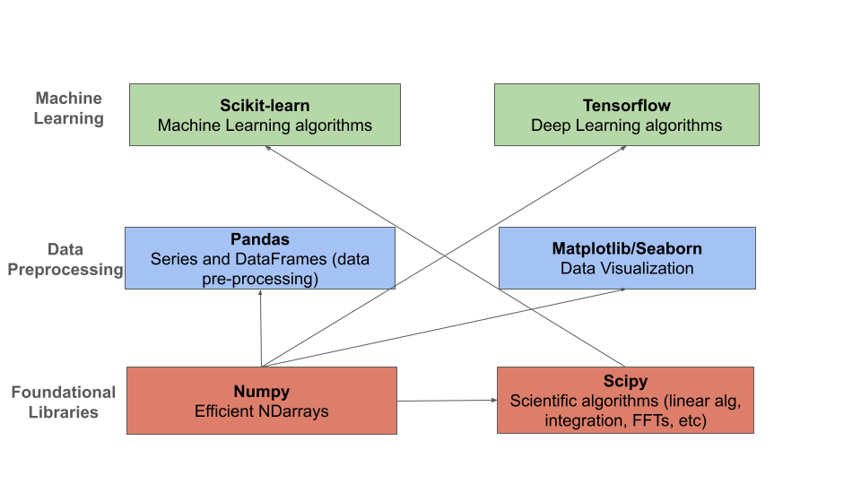

Introduction to Data Analysis and the Numpy Package 
===================================================

We will begin by giving a high-level overview of the kinds of data analysis 
tasks we will be performing and why they are important. We'll also introduce 
the ``numpy`` python package and work through some examples in a Jupyter notebook 
to make sure we 

By the end of this module, students should be able to: 

* Understand what data analysis is and why (at a high level) it is important. 
* Have a basic understanding of the different kinds of tasks we will perform and what libraries 
  we will use for each kind of task. 
* (Numpy) Understand the primary differences between the ``ndarray`` object from ``numpy`` and basic Python 
  lists, and when to use each.
* (Numpy) Utilize ``ndarray`` objects to perform various computations, including linear algebra calculations 
  and statistical operations. 

Data Analysis and Manipulation
------------------------------

In this class, as with problems in the real world, we will be working with *datasets*. When 
we introduce Machine Learning in a couple of weeks, you will see that our algorithms and 
workflows require data -- *high quality* data -- in order to be effective.

Data come in different shapes and sizes:

1. Text data, in different formats and types; for example, JSON, CSV, XML, SQL, etc. 
2. Image data, in different formats and sizes; for example, JPG, PNG, BMP, TIFF, etc. 
3. Audio data, in different formats and sizes; for example, M4A, MP3, MP4, WAV, FLAC, etc. 
4. Video data, in different formats and sizes; for example, MVV, MOV, MPEG4, etc. 

Additionally, sometimes different types of data are combined -- for example, a set of images 
or audio files together with some labels in text format. 

While data naturally appear in all of these formats above, most of the algorithms we will be 
studying work on numerical data; i.e., integer and float types. We will need to prepare the 
data prior to using these algorithms in order for them to be effective. 

Moreover, it is typical for there to be other issues with the data. Some examples include:

1. (Text Data) Null or missing values: with tabular text data, some rows may not contain values for every column
2. (Text Data) Duplicate data: rows or columns could be duplicated. 
3. (Text Data) Irrelevant data: some columns could be irrelevant to the process being modeled. 
4. (Image and Video Data) The samples could be of different dimensions or different resolutions.
5. (Audio, Image and Video Data) Samples could be processed with different codecs and there could be 
   noise and/or distortion on the samples.

A major aspect of the work involved in applying machine learning to real-world applications involves 
*data preprocessing*; that is, analyzing the raw data to understand what you have, and transforming 
it into a format that can be efficiently utilized by the learning algorithms. 

Without taking the necessary steps to prepare the data, the machine learning algorithms will not 
be effective. 

.. note:: 

    "Garbage in, garbage out." *-An astute COE 379L student*

Big Picture: Data Analysis Taks and the Libraries We Will Use 
--------------------------------------------------------------

Data analysis consists of several different kinds of tasks. We will be using 
Python libraries that specialize in each task type. 

* Numpy and Scipy -- These libraries form the foundation of all of the libraries we will use. The 
  ``numpy`` package, wich we will look at first, provides an efficient multi-dimensional array object, 
  useful for performing numeric computations across vectors and matrices. The ``scipy`` pacakge, which 
  depends on the nd-array from ``numpy``, adds a number of scientific algorithms, such as algorithms
  from linear algebra (e.g., matrix calculations), numerical methods (e.g., integration), FFTs, etc.
* Pandas -- The ``pandas`` library provides an efficient Series and DataFrame class for working with 
  column/tabular data. We will make extensive use of Pandas throughout the course for data preprocessing
  tasks. 
* Matplotlib/Seaborn -- These are two visualization libraries, for creating plots of various kinds. 
  We will use these libraries extensively as well, to be able to visualize the datasets we are working 
  with. 
* Scikit-Learn -- This is the library we will use during the first (roughly) half of the semester, for 
  the "classical" machine learning algorithms we will employ. 
* Tensorflow -- This is the library we will use for neural networks and deep learning. 

    The Python libraries we will use and their relationships.

Numpy
-----

In the remainder of this module, we will introduce the Python library ``numpy`` for working with arrays 
of numerical data.

In some ways, ``numpy`` is perhaps the package we will use the least directly, but since all the 
other libraries depend on its ndarray object, it will be useful to have a basic exposure to it. 
We will, on occasion, use ``numpy`` functions directly on our data.   

The Numpy Package
~~~~~~~~~~~~~~~~~

The ``numpy`` package provides a Python library for working with numerical arrays that are orders 
of magnitute faster than ordinary Python lists. The primary data structure provided by numpy is the 
``ndarray``. There are a few main reasons why working with ``ndarrays`` is faster than normal Python 
lists for numerical calculations:

1. Storage in memory: Numpy ``ndarrays`` are stored as continuous memory, unlike Python lists which are
   stored across the heap. Various algorithms can exploit this continuity to achieve significant 
   performance gains. 
2. The performance-critical blocks of ``numpy`` are written in C/C++ and are optimally compiled for 
different CPU architectures.

Installing Numpy
~~~~~~~~~~~~~~~~
The ``numpy`` package is available from the Python Package Index (PyPI) and can be installed on most
platforms using a Python package mananger such as ``pip``:

.. code-block:: console

  [user-vm]$ pip install numpy

Once installed, we can import the ``numpy`` package; it is customary to import the top level package 
as ``np``, i.e., 

.. code-block:: python3
    
    >>> import numpy as np

Using the Class Docker Container
~~~~~~~~~~~~~~~~~~~~~~~~~~~~~~~~

We have created a Docker image available on the public Docker Hub (hub.docker.com)

.. note:: 
 The class image is ``jstubbs/coe379l``. 
 Use either the default (latest) tag or the ``:sp24`` tag. 

The docker image contains all of the libraries that we will need for the course, including 
``numpy`` and ``jupyter``. 

You can see a list of all of the packages installed in the 
`poetry.lock <https://github.com/joestubbs/coe379L-sp24/blob/master/poetry.lock>`_ file on the 
`class repo <https://github.com/joestubbs/coe379L-sp24>`_. 
(and by the way, if you don't know about Python Poetry, `check it out <https://python-poetry.org/>`_!)

Numpy Arrays
~~~~~~~~~~~~
The workhouse of ``numpy`` is the ``ndarray`` class. Arrays are collections of data of the same type.

Creating Arrays from lists
---------------------------
We can create an array in numpy from a list of integers using the ``np.array()`` function, as follows:

.. code-block:: python3 

    >>> m = np.array([1,2,3,4,5])

Numpy arrays have both a size and a shape:

.. code-block:: python3 

    >>> m.size
    5

    >> m.shape
    (5,)

The size returns the total number of elements in the array while the shape returns the size of each 
dimension of the array. The array we defined above was a 1-dimensional array (or a "1-d array"). 
Numpy supports creating arrays of different dimensions. For example, we can create a 2-d or a 3-d 
array by passing additional lists to the ``np.array()`` function:

.. code-block:: python3 

    # 2-d array 
    >>> m2 = np.array([[1,2,3,4,5], [6,7,8,9,10]])
    >>> m2.size
    10
    >>> m2.shape
    (2,5)

    # 3-d array 
    >>> m3 = np.array([ [[1, 2], [3, 4], [5, 6]], [[-1, -2], [-3, -4], [-5, -6]]] )
    >>> m3.size
    12
    >>> m3.shape
    (2, 3, 2)

The shape of ``m2`` is ``(2,5)`` indicating that it has 2 rows of 5 elements each. 
Similarly, the shape of ``m3`` is (2, 3, 2) because it has 2 rows, 
3 columns and 2 "depth" dimensions.

Another way to think of it is this: a 2d-array is an array that has 1d-arrays as its 
elements. Similarly, a 3d-array is an array with 2d-arrays as its elements, etc. 

.. warning:: 

    Take care to note the use of open (``[``) and closed (``]``) brackets. 
    Ultimately, the ``np.array()`` function takes one positional argument, which 
    is the the list (array) of objects (elements, 1d-arrays, 2d-arrays, etc.)

If we get confused, we can always ask numpy for the dimension of an array: 

.. code-block:: python 

    >>> m3.ndim 
    3

Note that each row of an ``ndarray`` must have the same number of elements; the following does not work:

.. code-block:: python 
 
  >>> m = np.array([[1,2,3], [6,7]])

What happens if you try the code above?

Other Functions For Creating Arrays
-----------------------------------

Numpy provides a number of other functions for creating arrays. We mention a few briefly here.

First, we can create an array of 0's of a particular shape:

.. code-block:: python3

    # create an array of zeros; specify the shape of the array:
    >>> m = np.zeros((3,4))

    # m is a 3x4 array full of 0's:
    >>>  m
    array([[0., 0., 0., 0.],
       [0., 0., 0., 0.],
       [0., 0., 0., 0.]])

    # what are the following values?
    >>> m.shape 

    >>> m.size 

    >>> m.ndim 

Similarly, we can create an array of random numbers, though we will need to import the ``random`` 
package from numpy. Here we create an array of random integers over a specific range:

.. code-block:: python3

    >>> from numpy import random 
    # create a 3x4 array of random integers between 0 and 100
    >>> m = random.randint(100, size=(3, 4))
    >>> m
    array([[22, 33, 35, 66],
       [41, 84, 25, 89],
       [23, 99, 94,  3]])

We can also create arrays of floating points. In this case, we pass the size as a set of integers, 
and the values in the array will be between 0 and 1. 

.. code-block:: python3

    # create a 3x4 array of floats between 0 and 1
    >>> random.rand(3, 5)
    array([[0.54639945, 0.50198887, 0.75635589, 0.29956539, 0.02611014],
       [0.08913416, 0.85613525, 0.02844888, 0.84614452, 0.95455804],
       [0.06800074, 0.04932212, 0.02175548, 0.53220075, 0.3348725 ]])

The ``arange()`` function can be used to create numpy arrays
with elements spaced evenly as defined in an interval.
It takes the following parameters:

* start: starting element of array (fefault is 0).
* stop:  end of the interval. 
* step: step size of the internal (default is 1).

.. code-block:: python3

    # create a 1D array between 0 and 10, with a step size of 2
    >>> m = np.arange(start=0, stop=10, step=2)
    >>> m
    array([0, 2, 4, 6, 8])

As you can see the stop is given as 10, so it will not be included in the array.

Indexing and Slicing
~~~~~~~~~~~~~~~~~~~~

Array indexing with ``numpy`` works the same as normal Python lists -- we can index into the array 
using the ``[index]`` notation:

.. code-block:: python3

    >>> m = random.randint(100, size=(3))
    >>> m
    array([78, 37, 41])
    >>> m[0]
    78
    >>> m[2]
    41
    >>> m[3]
    IndexError: index 3 is out of bounds for axis 0 with size 3

Indexing multi-dimensional arrays also works, but now if we provide fewer indexes than the dimension 
of the array, the result is another array. 

For example, 

.. code-block:: python3

    >>> m = random.randint(100, size=(3, 2))
    >>> m
    array([[75, 46],
       [13, 90],
       [34,  2]])
    
    # slice a single value by providing 2 parameters (remember, they are 0-indexed!)
    >>> m[1,1]
    90
    >>> m[2,1]
    34
    >>> m[1,2]
    ?

    # providing fewer than 2 parameters results in a 1-d array:
    >>> m[2]
    array([34,  2])

We can also slice Numpy arrays. Like indexing, slicing works the same as Python lists:

.. code-block:: python3

    >>> m = random.randint(100, size=(3))
    >>> m
    array([78, 37, 41])
    >>> m[1:2]
    array([37])
    >>> m[1:]
    array([37, 41])

With higher-dimensional arrays, one can slice in each dimension, from left to right. 

.. code-block:: python3

    >>> m = random.randint(100, size=(3, 2))
    >>> m
    array([[75, 46],
       [13, 90],
       [34,  2]])
    
    >>> m[0:1, 0:2]
    array([[75, 46]])

    >>> m[1:]
    array([[13, 90],
       [34,  2]])
    
    >>> m[:, 1:]    
    array([[46],
       [90],
       [ 2]])

Array Functions
~~~~~~~~~~~~~~~
Numpy provides a number of functions for computing over the data in an array. We mention just a 
few here; for more details, consult the numpy documentation [1].

.. code-block:: python3 

    >>> m
    array([[75, 46],
       [13, 90],
       [34,  2]])

    # sum all elements in m
    >>> m.sum()
    260

    # average all elements in m 
    >>> m.mean()
    43.333333333333336

    # maximum and minimum elements
    >>> m.max()
    90

    >>> m.min()
    2

**Class Exercise.**

1. Create a numpy array of first 10 odd numbers.
2. What is the output of following python code
   ``np.arange(start = 9, stop = 0, step = -1)``?
   Can you reshape it to a 3X3 matrix? (Hint: use reshape function)
3. What will be the output of following code
   np.arange(20)[10:17] 
4. Given an array ``p = np.arange(20)``, how will you reverse it?
5. Generate two 2X2 numpy arrays with random values up to 10, compute the sum of these 
   two arrays.

References and Additional Resources
~~~~~~~~~~~~~~~~~~~~~~~~~~~~~~~~~~~

1. `Numpy documentation <https://numpy.org/doc/1.26/>`_ -- Numpy v1.26 manual. 