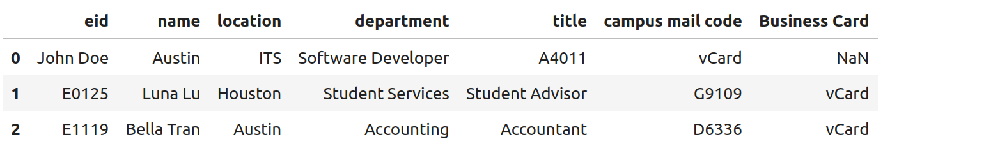

Introduction to Pandas 
======================

In this module, we will introduce the Python library ``pandas`` for working with the datsets 
and manipulating them [1]. After going through this module, students should be able to:

* Install and import the ``pandas`` package into a Python program.
* Understand the primary differences between the pandas ``series`` and ``dataframe``, and when to use each.
* Loading data from an external file into a pandas object. 
* Accessing pandas ``series`` and ``dataframe`` to perform various dataset manipulations.

Installing Pandas
~~~~~~~~~~~~~~~~
The ``pandas`` package is available from the Python Package Index (PyPI) and can be installed on most
platforms using a Python package mananger such as ``pip``:

.. code-block:: console

  [container/virtualenv]$ pip install pandas

Once installed, we can import the ``pandas`` package; it is customary to import the top level package 
as ``pd``, i.e., 

.. code-block:: python3
    
    >>> import pandas as pd

Now, let's take a look at the basic data structures supported by Pandas.

Pandas Series
~~~~~~~~~~~~~

A pandas Series is a one-dimensional array capable of holding data of different types 
(string, float, integer, objects, etc.) as well as axis labels. It can be thought of 
as a single column in a dataset.

We can create ``Series`` objects in different ways; for example, directly from a 
numpy array or python list: 

.. code-block:: python3
    
    >>> a = [1, 5, 8]
    >>> m = pd.Series(a)
    >>> m
    0    1
    1    5
    2    8
    dtype: int64

As you can see from the output, every value in a pandas Series is labeled. If nothing 
is specified when constructing the Series, values are labeled staring from index 0 
(i.e., the first value will have index 0, the second will have index as 1, and so on).

For instance, with the previous example, we can put:

.. code-block:: python3 

    >>> m[2]
    8

This works exactly like Python lists and numpy arrays. 

However, we can customize the label indexes using the ``index`` argument 
while creating series.

.. code-block:: python3

    >>> a = [1, 5, 8]
    >>> m = pd.Series(a, index=["X", "Y","Z"])
    >>> m
    X    1
    Y    5
    Z    8
    dtype: int64

And now we can use these custom lables to index the elements of the series; for example: 

.. code-block:: python3

    >>> m["Y"]
    5

Note that if we specify custom index lables, we shouldn't use the 0-based integer indexing 
to index into our series.

What happens if you try the following: 

.. code-block:: python3

    >>> m[1]
    ?

Custom labels for indexes provide part of the power of pandas; we can use lables 
to attach meaning (or "metadata") to our data columns. 

For example, say we want to create a series of back to school supplies with their cost, 
and we have a supplies list and a cost list as follows:

.. code-block:: python3 

    >>> supplies = ['Spiral_Notebook', 'Gel_Pens', 'Sticky_Notes', 'Laptop_Bag', 'Daily_Planner']
    >>> cost_supplies_dollars = [12.81, 9.99, 5.99, 23.66, 10.99]

We can use these to create a Series as follows: 

.. code-block:: python3 

    >>> supplies_cost = pd.Series(cost_supplies_dollars, index=supplies)
    >>> supplies_cost
    Spiral_Notebook    12.81
    Gel_Pens            9.99
    Sticky_Notes        5.99
    Laptop_Bag         23.66
    Daily_Planner      10.99
    dtype: float64

We see that our series is indexed by the labels we gave for the prices. We can 
now access the prices using the meaningful labels, e.g., 

.. code-block:: python3 

    >>> supplies_cost['Gel_Pens']
    9.99

We can even use these custom index labels in slices, but note that the slice is 
inclusive of both endpoints; for instance, 

.. code-block:: python3 

    >>> supplies_cost["Gel_Pens":"Daily_Planner"]
    Gel_Pens          9.99
    Sticky_Notes      5.99
    Laptop_Bag       23.66
    Daily_Planner    10.99
    dtype: float64

**In-class Exercise:** 

1. Try accessing multiple elements of the supplies_cost series at positions 1,3 and 0.

2. What will be the output of following code?

.. code-block:: python3

    >>> supplies_cost[:'Laptop_Bag']

Pandas DataFrame
~~~~~~~~~~~~~~~~

The ``DataFrame`` is perhaps the most important and useful data structure in pandas. A pandas 
DataFrame is similar to a 2d-array that can hold heterogeneous data and labeled axes. You can 
think of a DataFrame as representing a spreadsheet or a database table with multiple columns. 
Said differently, a DataFrame object is like a dictionary of Series objects. 

Let's look at some examples to make it more clear. 

To begin, suppose we had information on employees at UT Austin. If we were storing this information 
in a spreadsheet, we might have several columns, such as: 

* Name
* EID
* Department 
* Location 

Each employee could be thought of as a row in our spreadsheet with values for each of the columns above. 
For instance, we might have data on the following employees: 

* John Doe, E0124, Austin, ITS
* Luna Lau, E0125, Houston, Student Services
* Bella Tran, E1119, Austin, Accounting 
* Raj Kumar, E2048, Dallas, Finance 

We can model these columns of data using a Pandas dataframe as follows: 

.. code-block:: python3

  >>> employees = pd.DataFrame(
      {
        'eid' :['E0124', 'E0125','E1119','E2048'],
        'name':['John Doe', 'Luna Lu', 'Bella Tran', 'Raj Kumar'],
        'location':['Austin','Houston', 'Austin', 'Dallas'],
        'department':['ITS','Student Services', 'Accounting','Finance']
      }
    )

Notice that in the above example we construct the DataFrame using a Python dictionary of lists, where 
each key in the dictionary represents a column in our dataset, and the corresponding list contains the 
values for that column. 

Indexing Columns 
^^^^^^^^^^^^^^^^^
We now have several access methods for getting at the data in our DataFrame. For example, we can access 
an individual column using the associated key:

.. code-block:: python3

  >>> employees['name']
    0      John Doe
    1       Luna Lu
    2    Bella Tran
    3     Raj Kumar
    Name: name, dtype: object

This is similar to normal Python dictionary access, but notice that the output contains indexes for the employees
(i.e., the rows) as well. 

Indexing Rows
^^^^^^^^^^^^^
We can access individual rows in the data set using the ``iloc`` function, like so:

.. code-block:: python3

  >>> employees.iloc[1]
    eid                      E0125
    name                   Luna Lu
    location               Houston
    department    Student Services
    Name: 1, dtype: object

.. note:: 

    Using ``iloc`` requires the use of brackets (``[]``), not parenthesis (``()``) as with normal function 
    invocation. 

Be aware that one *cannot* index into the DataFrame using an integer (row) index; it will result in an error:

.. code-block:: python3

  >>> employees[1]
    ---------------------------------------------------------------------------
    KeyError                                  Traceback (most recent call last)
    File ~/.cache/pypoetry/virtualenvs/risd-course-KKx7_8Y0-py3.11/lib/python3.11/site-packages/pandas/core/indexes/base.py:3791, in Index.get_loc(self, key)
    3790 try:
    -> 3791     return self._engine.get_loc(casted_key)
    3792 except KeyError as err:
    . . . 

This is the same error one would get if one tried to index a normal Python dictionary using 
an integer index (or any other index that didn't exist in the key set).

Attributes of Rows 
^^^^^^^^^^^^^^^^^^

With a given row, we can access a specific column (attribute) using the ``.<attribute>`` notation. 
For example, 

.. code-block:: python3 

    # get row 1 (i.e., the second row)
    >>> row = employees.iloc[1]

    # get the eid of row 1 
    >>> row.eid 
    'E0125'

You can also use the ``.get(<attribute>)`` method. This is useful when the name of a column is not 
a valid Python identifier (e.g., a column such as "Campus Mail Code")

.. code-block:: python3 

    # get the eid of row 1 
    >>> row.get('eid')
    'E0125'

More On the ``iloc`` and ``loc`` Functions
^^^^^^^^^^^^^^^^^^^^^^^^^^^^^^^^^^^^^^^^^^

We can use ``iloc`` to select multiple rows and even specific columns for each 
row. The syntax in its general form takes two lists of integers representing the rows and 
columns we want to select, like this: 

.. code-block:: python3

    >>> df.iloc[ [<rows to select>], [<colums to select>] ]

For example: 

.. code-block:: python3

    # select rows 0, 1 and 3 and all columns
    >>> employees.iloc[[0,1,3]]
        eid 	    name 	location    department
    0 	E0124 	John Doe 	Austin 	    ITS
    1 	E0125 	Luna Lu 	Houston     Student Services
    3 	E2048 	Raj Kumar 	Dallas      Finance

And: 

.. code-block:: python3 

    # select rows 1 and 2 and columns 0, 1 and 3
    >>> employees.iloc[[1,2], [0,1,3]]
        eid 	name 	    department
    1 	E0125 	Luna Lu     Student Services
    2 	E1119 	Bella Tran  Accounting    

The ``loc`` function works similarly to ``iloc`` except that it uses integer indexes for the rows and 
string labels for the indexes instead of integers. The general format is like this: 

.. code-block:: python3 

    >>> df.loc[ [<rows (as ints>)], [<columns (as strings)>] ]

For example, 

.. code-block:: python3 

    >>> employees.loc[[0,2], ['department', 'eid']]
 	department  eid
    0 	ITS         E0124
    2 	Accounting  E1119

.. note::

    Remember, the ``i`` is for integer; always use integer indexes with ``iloc`` and 
    string label indexes with ``loc``. 

Filtering Rows with Conditionals 
^^^^^^^^^^^^^^^^^^^^^^^^^^^^^^^^^
Another powerful feature of DataFrames is the ability to filter rows using conditional statements. 
We can use a syntax like the following to return a Series object of booleans (i.e., ``True/False`` values) 
where an entry is ``True`` if the associated value from the original DataFrame matches the criterion:

.. code-block:: python3 

    >>> df['<column>'] <conditional>

For example, 

.. code-block:: python3

    >>> employees['location'] == 'Austin'
    0     True
    1    False
    2     True
    3    False
    Name: location, dtype: bool    

A powerful application of this feature is to create a DataFrame of rows matching the criterion. 
The general syntax is as follows: 

.. code-block:: python3

    >>> df[ df['<column>' <conditional>] ]

For example, we can use the equality operator (``==``) to find all employees with a given EID or 
located in a specific city:

.. code-block:: python3 

    # find all employees with eid E1119
    >>> employees[ employees['eid'] == 'E1119']
        eid 	name 	    location 	department
    2 	E1119 	Bella Tran  Austin 	Accounting    

    # find all employees located in Austin 
    >>> employees[ employees['location'] == 'Austin']
     	eid 	name 	    location 	department
    0 	E0124 	John Doe 	Austin 	ITS
    2 	E1119 	Bella Tran 	Austin 	Accounting

Note that this is returning to us an entire DataFrame, i.e., all of the columns associated 
with the rows that match our criterion. 

We can use other operators as well, such as ``>``, ``<``, ``>=``, ``<=``, etc. 
Keep in mind that the meaning of these operations depends on the underlying data type. 

**Exercise.** What does the following return? 

.. code-block:: python3 

    >>> employees[ employees['eid'] > "E0125" ]

The ``astype`` Method and More Complex Conditionals 
^^^^^^^^^^^^^^^^^^^^^^^^^^^^^^^^^^^^^^^^^^^^^^^^^^^^
We mentioned that when we use the general filter syntax, the result is a pandas Series. 
Sometimes, we might want to apply functions as part of conditional expressions when 
filtering rows. 

For example, we might like to know what employees have EIDs that begin with ``"E0"``. To 
do that, we could write a conditional that utilized the string function ``startswith()``,
but we'll need to tell pandas we want to treat the column values as ``str`` type. We 
do that with the ``astype()`` method. Then, we chain it together with the ``str.startswith()``
condition that we want to filter on. 

Here is an example:

.. code-block:: python3 

    >>> employees [ employees['eid'].astype(str).str.startswith("E0") ]
 	eid 	name 	        location 	department
    0 	E0124 	John Doe 	Austin 	        ITS
    1 	E0125 	Luna Lu 	Houston 	Student Services    

Loading Data From External Files 
~~~~~~~~~~~~~~~~~~~~~~~~~~~~~~~~~

We will often be loading data from external files. Pandas makes it easy to create a DataFrame from 
a structured (e.g., sql file) or semi-structure (e.g., CSV) file. Here, we look at loading data from a 
CSV, but there are functions for loading data from many other sources. See the documentation on the ``io``
module for more details [2].

The basics of loading data from an external file are simple -- just use the associated function for the 
type of data you have. For CSV, that function is ``pd.read_csv(</path/to/file.csv>)``. When the function 
is successful, the result will be a Pandas DataFrame. 

DataSets on the Class Repo
^^^^^^^^^^^^^^^^^^^^^^^^^^
To show the ``read_csv()`` function, we'll download a couple of csv files from the class github repository. 
In general, the class github repository is where we will host a number of datasets for the class throughout 
the semester, including the datasets for the first three projects. 

In general, the datasets will be hosted within the ``datasets`` top-level directory, organized by unit. 
You can explore the datasets by navigating to the following URL:

..  note:: 

    Class DataSets URL: https://github.com/joestubbs/coe379L-sp24/tree/master/datasets

As you will see, the ``datasets`` directory is organized into subdirectories for each unit. 

Let's download an employees dataset from the ``unit01`` subdirectory. You can use the "Raw" button 
to get a link to the raw content of any file on GitHub; the domain will be ``https://raw.githubusercontent.com``.

**In-Class Exercise.** Download the ``employees.csv`` file from the class GitHub repository. You can use 
any method you like; for example, use ``wget <URL>`` from the command line. Once you have the file downloaded, 
use the ``read_csv()`` function to load it into a DataFrame.

Exploring the CSV and the DataFrame 
^^^^^^^^^^^^^^^^^^^^^^^^^^^^^^^^^^^^

Let's take a closer look at the CSV file and explore the DataFrame object we created from it. 
If we open the CSV file, one of the first things we notice is the header row:

.. code-block:: bash 

    eid,name,location,department,title,campus mail code,Business Card

Pandas automatically used this row to create labels for our DataFrame. We can see that by printing the 
entire dataframe or using the ``.columns`` attribute:

.. code-block:: python3 

    >>> employees2
 	eid 	name            location    department      title               campus mail code    Business Card
    0 	E0124 	John Doe 	Austin 	    ITS 	     Software Developer A4011 	            vCard
    1 	E0125 	Luna Lu 	Houston     Student Services Student Advisor 	G9109 	            vCard
    2 	E1119 	Bella Tran 	Austin 	    Accounting 	    Accountant 	        D6336 	            vCard
    3 	E2048 	Raj Kumar 	Dallas 	    Finance 	    Finance Manager 	C4315 	            vCard
    4 	E2218 	Sally Sims 	Austin 	    Student Services Software Developer G9109 	            vCard
    5 	E4321 	Alonzo Smith    Austin 	    ITS 	    Systems Administrator A4011 	    vCard    

    >>> employees2.columns
    Index(['eid', 'name', 'location', 'department', 'title', 'campus mail code',
       'Business Card'],
      dtype='object')

Notice also that spaces in the header row are copied character-for-character; in the CSV file, there are no spaces
around the column names, i.e., spaces before or after the ``,``. If there were spaces, the dataframe column 
names would also have spaces. 

Issues To Look Out For 
^^^^^^^^^^^^^^^^^^^^^^
When reading data from semi-structured files into dataframe, there are a number potential gotchas to be 
on the lookout for. We mention a few here. 

**Missing Column Headers.** Open the csv file in a file editor and remove the first line. Save the file with 
a different name. The result is a CSV file without column headers. What happens when you read the 
file into a pandas DataFrame? 

.. code-block:: python3

    >>> employees3 = employees3 = pd.read_csv('employees_no_headers.csv')
 	E0124 	John Doe 	Austin 	ITS 	Software Developer 	A4011 	vCard
    0 	E0125 	Luna Lu 	Houston 	Student Services 	Student Advisor 	G9109 	vCard
    1 	E1119 	Bella Tran 	Austin 	Accounting 	Accountant 	D6336 	vCard    
    . . . 
    >>> employees3.columns 
    Index(['E0124', 'John Doe', 'Austin', 'ITS', 'Software Developer', 'A4011',
       'vCard'],
      dtype='object')

As you can see, the first row was used as the headers! This is obviously **not** what we want. 
Be careful about csv files that do not have column headers. From experience, if you are working 
with such a file, it is perhaps easiest to first edit the file to add a row of headers. 

**Missing Values.** By definition, every row of a DataFrames must have a value for every column. 

For example, the following code gives an error because there are 3 ``eid`` values but 4 values for 
all the other columns. 

.. code-block:: python3 

    >>> employees_bad1 = pd.DataFrame(
      {
        'eid' :['E0124', 'E0125','E1119'],
        'name':['John Doe', 'Luna Lu', 'Bella Tran', 'Raj Kumar'],
        'location':['Austin','Houston', 'Austin', 'Dallas'],
        'department':['ITS','Student Services', 'Accounting','Finance']
      }
    )

    ValueError: All arrays must be of the same length

In this case, the DataFrame simply fails to be created. 

The result is different when trying to load a csv file with a missing value. For example, 
suppose we had a csv file with an EID missing, say in the first row, as depicted below:

.. code-block:: bash 

    # employees_bad.csv 
    eid,name,location,department,title,campus mail code,Business Card
    John Doe,Austin,ITS,Software Developer,A4011,vCard
    E0125,Luna Lu,Houston,Student Services,Student Advisor,G9109,vCard
    E1119,Bella Tran,Austin,Accounting,Accountant,D6336,vCard
    E2048,Raj Kumar,Dallas,Finance,Finance Manager,C4315,vCard
    E2218,Sally Sims,Austin,Student Services,Software Developer,G9109,vCard

Using ``pd.read_csv()`` on this file "works" and produces a DataFrame, though it's not 
what we might expect: 

.. code-block:: python3 

    >>> employees_bad = pd.read_csv('employees_bad.csv')
    >>> employees_bad3.iloc[[0, 1, 2]]

Something interesting (and not in a good way) has happened... the first row has a value 
of ``NaN`` for the ``Business Card`` column and every other is off by one; for example, 
it has a value of ``John Doe`` for the ``eid`` column. 

A Word on Missing Values and the Nan Value 
^^^^^^^^^^^^^^^^^^^^^^^^^^^^^^^^^^^^^^^^^^

The pandas library has multiple ways of representing missing values. We'll discuss dealing with missing 
values more in the next lecture, and we will get practice working with missing values throughout the 
semester. For now, know that the ``Nan`` value showing up in the above DataFrame is the numpy "Nan"
value (i.e., ``np.nan``), and it has some interesting properties. For example, it never "equals" 
any other value when testing with the ``==`` operator. 

**In-Class Exercise.** 

1. Read the *employees_bad.csv* file into a DataFrame, and select the NaN value from the 0th row.

2. Confirm that the NaN value from the 0th row is not ``==`` to the numpy ``nan`` value. 

3. Replace the ``==`` operator in step 2 with the ``is`` operator. What do you find? 

.. warning:: 

    The main takeaway at this time is that dealing with missing values is subtle and tricky. 
    Care is required to make sure your DataFrame and the calculations you do with it aren't 
    corrupted in the presence of missing values. 

See the pandas documentation [3] for more about missing data. 

*Solutions:* 

.. code-block:: python3 

  # import numpy 
  >>> import numpy as np 

  # read the bad csv file 
  >>> employees_bad = pd.read_csv('employees_bad.csv')
  
  # grab the "Business Card" column from the 0 row 
  >>> r1_nan = employees_bad.iloc[[0]].get("Business Card")
  
  # confirm it is not == to np.nan 
  >>> r1_nan == np.nan 
  False 

  # confirm it is not == to np.nan 
  >>> r1_nan is np.nan 
  True 

Functions on DataFrames 
~~~~~~~~~~~~~~~~~~~~~~~

There are a number of important functions that we will use throughout the semester. Here 
are a few important ones to know now: 

* ``head()``: returns first 5 rows of the dataset.
* ``tail()``: returns last 5 rows of the dataset.
* ``shape``: returns the number of rows and columns in the dataset.
* ``info()``: returns the datatype of each column in the dataset
* ``count()``: returns the number of rows of each column in the dataset. 
* ``min``: returns minimun value of numeric column specified 
* ``max``:returns maximum value of numeric column specified 
* ``unique``: return unique values for given column
* ``value_counts``: return counts of each value for a given column

**In-Class Exercise.** 

1. Create a pandas DataFrame of used cars data based on the ``datasets/unit01/used_cars_data.csv`` 
   file in the class repo.

2. Print the first 5 and last 5 rows of the data set. 

3. How many rows and how many columns are in the dataset? 

4. Are any columns missing data? If so, which ones? And how many rows are missing for each? 

References and Additional Resources
~~~~~~~~~~~~~~~~~~~~~~~~~~~~~~~~~~~
1. Pandas Documentation (2.2.0). https://pandas.pydata.org/docs/index.html
2. Input/Output: Pandas Documentation (2.2.0). https://pandas.pydata.org/docs/reference/io.html
3. Working with Missing Data: Pandas Documentation (2.2.0). https://pandas.pydata.org/docs/user_guide/missing_data.html