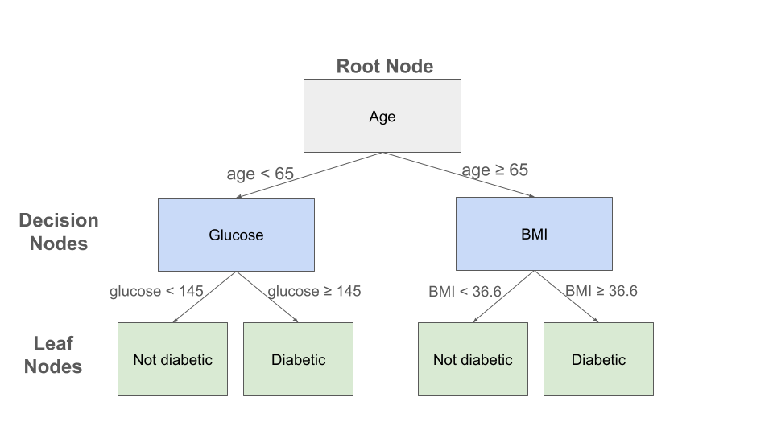
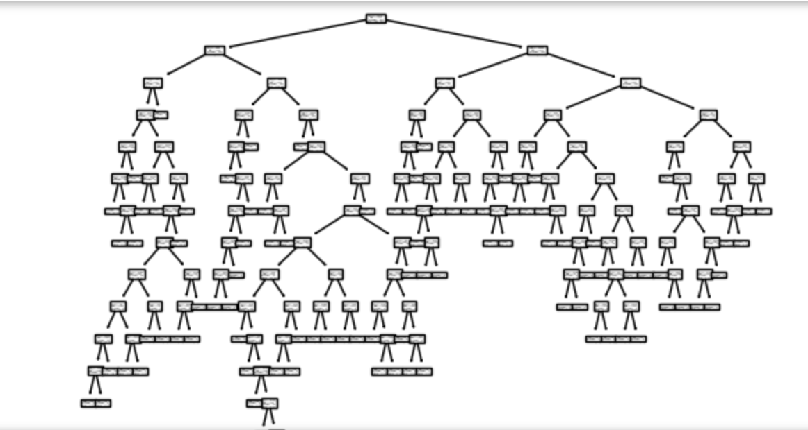
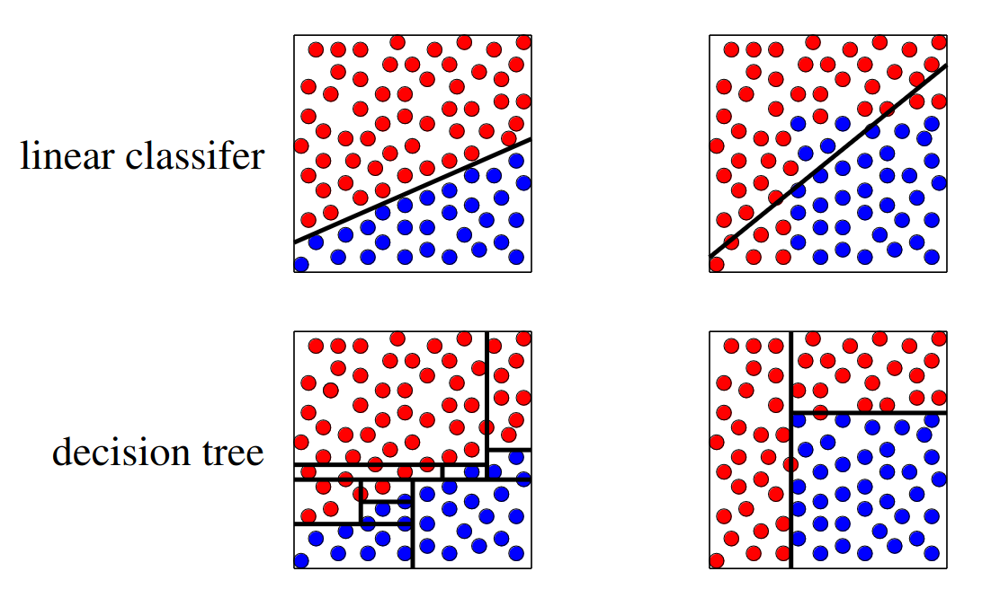

Decision Tree and Random Forrest
================================

In this module we introduce the Decision Tree and Random Forrest classifiers. We discuss 
general guidelines for when to use each. Finally, we show how to implement 
Decision Tree and Random Forrest classifiers using sklearn.

By the end of this module, students should be able to:

1. Describe how the Decision Tree and Random Forrest classifier models work 
   at a high level.
2. Describe when each model is most appropriate to use (and why).
3. Implement each using the sklearn package. 

Decision Tree
-------------
A decision tree uses a tree structure of "decision rules" -- i.e., simple "IF ... THEN" 
statements -- to model a dataset and predict future values. 

When used for classification, decision trees are sometimes called "classification trees". 
We will focus on classification trees here, though many of the same ideas can be used to 
develop decision trees for continuous variable prediction, in which case the decision 
trees are called "regression trees".

A decision tree is comprised of a single root node, a set of "decision" nodes, and a set of 
"leaf" nodes. Conceptually, all elements of the dataset are contained in the root node.
Each internal, non-leaf node in the tree contains a feature in the dataset, and branches 
between a node and its child nodes contain conditional statements involving the feature. The
leaf nodes are labeled with a class from the output (dependent) variable. 

To classify a data element, one starts at the root node and traverses the tree using the
decision rules until arriving at a leaf node. The class of the leaf node is the predicted 
class for the data element. 

    Example decision tree for the Pima Indian Diabetes dataset

A toy example of a decision tree constructed for the Pima Indian diabetes dataset is depicted 
above. Three features (age, glucose level and BMI) are used in the decision nodes. For an 
individual with an age of 70, a glucose of 150 and a BMI of 33, this decision tree would 
predict that the individual is not diabetic. Note that the 150 glucose value for this individual
was not used to determine their prediction in this toy example. 

Note that in general, a decision tree can have many levels of decision nodes, and a given 
"feature" used as part of a decision rule could be comprised of several independent variables. 

Algorithms For Constructing Decision Trees
~~~~~~~~~~~~~~~~~~~~~~~~~~~~~~~~~~~~~~~~~~
How are decision trees constructed? We will not give a complete treatment here but will 
sketch some of the basic ideas used. 

A decision tree is constructed using a recursive algorithm that continuously splits a 
data set into smaller datasets using some rule. These methods usually work "top down", 
meaning they start at the root node with all elements of the dataset, and at each step, 
the algorithm chooses a variable that will allow for an "optimal" splitting. 

There are methods for defining and measuring the "optimal" splitting. One key concept 
that gets used is that of *entropy*. The entropy for a dataset measures the amount 
of uncertainty in the dataset. 

In the case of classification, entropy in the context of decision trees can be thought of 
as measuring the degree of homogeneity of classes for the dependent variable. 

For example, in the Pima Indian diabetes
dataset, with just two classes in the dependent variable ("has diabetes" and "does not have
diabetes"), the entropy of the dataset corresponds to the degree to which the dataset is split 
between these two classes. Entropy is greatest when the dataset is split evenly and is 
minimized when all the elements are in one or the other class, i.e., all the elements are 
"has diabetes" or all are "does not have diabetes".

Thus, one approach is to define error functions in terms of the entropy and attempt to 
minimize it. Intuitively, we can understand that by minimizing entropy as we move down a 
tree to the leave nodes, we can have more confidence in our prediction. 

There are many excellent online resources that provide more details about Decision Tree 
algorithms; see, for example, [1].

Decision Trees: Interpretable Results 
~~~~~~~~~~~~~~~~~~~~~~~~~~~~~~~~~~~~~
One of the main advantages of Decision Tress is their ability to explain how they 
arrive at their classification result. 

Continuing with the diabetes example above, suppose two individuals had the same 
glucose reading of 153, but one was age of 68 and the other was age 53. If younger one 
had a BMI of 32, then the model would predict that they were not diabetic, while it 
would predict that the older one was. 

A natural question could be asked: *given these two individuals with the same glucose 
reading, why did the model predict one to be diabetic and the other not?*

It would be difficult to answer this question with most of the models we have looked at, 
but in the case of decision trees, we have a very specific set of rules that we can 
use to explain the predictions. 

This touches on the idea of *Explainable AI* (sometimes abbreviated "XIA"), an 
active area of research in AI and Machine Learning that attempts to improve our 
ability to understand *how* ML models arrive at their results. This in turn helps
humans to build trust in the models, particularly when deployed in production settings 
and used on novel data. 

Decision Trees in Sklearn
~~~~~~~~~~~~~~~~~~~~~~~~~

The sklearn package provides the ``DecisionTreeClassifier`` class from the 
``sklearn.tree`` module. We will use this class to develop a decision tree model for the 
Pima Indians diabetes dataset. See [3] for details on the ``DecisionTreeClassifier``.

To begin, we need to import libraries, load the data, do some preprocessing and then 
split the data into a train and test set. 
For expediency, we simply copy the code over from the previous notebook. For 
a detailed explanation of the steps below, see the 
`KNN <knn.html#k-nn-in-sklearn>`_ module. 

.. code-block:: python3 

   # Libraries to help with reading and manipulating data
   import numpy as np
   import pandas as pd
   from sklearn.model_selection import train_test_split

   data = pd.read_csv("diabetes.csv")
   # Glucose, BMI, Insulin, Skin Thickness, Blood Pressure contains values which are 0
   data.loc[data.Glucose == 0, 'Glucose'] = data.Glucose.median()
   data.loc[data.BMI == 0, 'BMI'] = data.BMI.median()
   data.loc[data.Insulin == 0, 'Insulin'] = data.Insulin.median()
   data.loc[data.SkinThickness == 0, 'SkinThickness'] = data.SkinThickness.median()
   data.loc[data.BloodPressure == 0, 'BloodPressure'] = data.BloodPressure.median()

   # x are the dependent variables and y is the target variable
   X = data.drop('Outcome',axis=1)
   y = data['Outcome']

   X_train, X_test, y_train, y_test = train_test_split(X, y, test_size=0.3, stratify=y, random_state=1)

We are now ready to instantiate and fit our ``DecisionTreeClassifier``. Several 
parameters may be passed, but in the code below we accept the defaults except for the 
``random_state`` -- this attribute controls the randomness in the training algorithm 
enabling the results to be reproducible. 

.. code-block:: python3 

   >>> from sklearn.tree import DecisionTreeClassifier
   >>> model = DecisionTreeClassifier(random_state=1).fit(X_train, y_train)

We can use ``classification_report`` to get the performance:

.. code-block:: python3 

   from sklearn.metrics import classification_report
   print(f"Performance on TEST\n*******************\n{classification_report(y_test, model.predict(X_test))}")
   print(f"Performance on TRAIN\n********************\n{classification_report(y_train, model.predict(X_train))}")

   Performance on TEST
   *******************
                 precision    recall  f1-score   support

              0       0.78      0.81      0.80       150
              1       0.63      0.58      0.60        81

      accuracy                            0.73       231
      macro avg       0.70      0.70      0.70       231
   weighted avg       0.73      0.73      0.73       231

   Performance on TRAIN
   ********************
                 precision    recall  f1-score   support

              0       1.00      1.00      1.00       350
              1       1.00      1.00      1.00       187

       accuracy                           1.00       537
      macro avg       1.00      1.00      1.00       537
   weighted avg       1.00      1.00      1.00       537

We see that the performance of our decision tree is relatively poor and appears to be 
overfitting to the training data. 

There is also a ``plot_tree()`` from the ``sklearn.tree`` module that we can use to inspect 
the tree:  

.. code-block:: python3 

   from sklearn import tree
   tree.plot_tree(model)

We see that the tree is rather complex and this could in part explain the overfitting. 

Decision Trees: Strengths and Weaknesses 
~~~~~~~~~~~~~~~~~~~~~~~~~~~~~~~~~~~~~~~~
In this section we discuss the strengths and weaknesses of the Decision Tree model at a 
high level. 

Decision Tree Strengths
^^^^^^^^^^^^^^^^^^^^^^^
* *Interpretable results*: A major strength of decision trees is that it is easy to understand 
  *how* the model arrived at the prediction. 
* *Non-linear decision boundaries*: Decision trees are capable of producing non-linear decision 
  boundaries of arbitrary complexity, which may be required to successfully model some problems. 
* *Flexible model requiring minimal data preparation*: Decision trees work well with both 
  categorical and continuous variables and requires minimal data preparation compared to other
  techniques that might require data normalization, blank values to be treated, etc. 
* *Efficient to use*: The computational cost of prediction (often called *inference* for ML models)
  for decision trees is logarithmic in the total number of data points used to train the tree, 
  making them efficient to use. 

    Comparison of decision boundary for example decision tree and linear classifier. Citation: [1]

Decision Tree Weaknesses
^^^^^^^^^^^^^^^^^^^^^^^^
* *Relatively poor predictors*: In general, decision trees tend to perform worse than other 
  (even classical) models. The following additional weaknesses help to explain why. 
* *Prone to overfitting*: The ability to create arbitrarily complex decision boundaries can also 
  be seen as a weakness in that decision trees can be prone to overfitting for this reason. 
* *Sensitive to data fluctuations*: Similarly, decision trees tend to be sensitive to even small 
  changes in the training data, meaning they don't generalize well. 
  As an example: if one takes a training dataset, splits it in half, and trains two trees on 
  each half, it is not uncommon for the two trees to turn out very differently. 
* *Computational Complexity of Learning*: The learning phase for decision trees is known to be 
  computationally complex such that learning an optimal tree has no known efficient algorithm. 
  Existing algorithms use heuristics and other approximations, which are efficient, but may 
  result in a highly non-optimal tree. 

Random Forrest
--------------

As mentioned above, decision trees tend to be relatively poor performers compared to other 
methods. One of the major issues with decision trees is the high degree of variance relative 
to the training data. 

We mentioned above that if you split a training set into two subsets and train two decision 
trees on the two subsets you often get very different trees. That's a problem.

But a basic idea from statistics is the following: if you average a large number of samples 
from a distribution, you tend to reduce the variance across the samples.

National Public Radio conducted an experiment in 2015 where they published a photo of a cow 
named Penelope online and asked users to guess the weight of the cow. 
A total of 17,000 guesses were submitted, and the average guess was 1,287 pounds. 
Penelope’s actual weight was 1,355 pounds, so the crowd got it to within 5 percent.

This replicated a similar study from a 1906 county fair in England where participants guessed 
the weight of a 1,200 pound ox. The median of all of the guesses was less than 1% off, beating 
the guesses of the "experts".

The idea with random forrest is similar: instead of building one tree, build a bunch of 
trees based on a radnom sampling of the features, and then create a single model which takes 
an "average" of all of the trees. 

We won't go into more of the details behind the algorithms for random forrest, but again, 
there are many good online resources; for example, [2]. 

Random Forrest in Sklearn
~~~~~~~~~~~~~~~~~~~~~~~~~

The sklearn package provides the ``RandomForestClassifier`` class from the 
``sklearn.ensemble`` module. We will use this class to develop a random forrest model for the 
Pima Indians diabetes dataset. See [4] for details.

There are some important hyperparameters for the ``RandomForestClassifier``. 

* ``n_estimators``: This is the number of decision trees to use. 
* ``max_depth``: This is the maximum depth for each tree. 
* ``min_samples_leaf``: This is the minimum number of samples allowed to consider 
  a node a leaf node when deciding whether to further split a node. It can be considered 
  a stopping condition for the algorithm. If the number of samples at a node is greater 
  than this number, then the algorithm will continue to try and split the node further. 
* ``class_weight``: The weights for each target class to use when deciding whether to 
  split a node. By default, equal weights of value ``1`` are used for all target class
  labels, but for imbalanced datasets that have a greater proportion of one class than 
  another, it can be useful to offset this with non-equal weights (typically, one would
  give the overrepresented class less weight). 

We'll use cross validation with 5 folds to find the optimal values for these hyperparameters. 
Recall the GridSearchCV convenience class to search the hyperparameter space. 

We note that this hyperparameter space is quite large and the fit takes significant 
time. We can speed this up by using the ``n_jobs`` parameter to the ``GridSearchCV``
constructor. This is the number of models to fit in parallel. Typically, one will 
want to set this to the number of available CPU cores on the machine. For example, 
if nothing else is being executed at the time, set it to the total number of cores.

.. note:: 
   
   The following code could take a pretty significant amount of time to run, from under 
   1 minutes to more than 10 minutes or more, depending on the hardware. On my laptop, 
   it ran in about 3 minutes. 

.. code-block:: python3 

   from sklearn.ensemble import RandomForestClassifier
   from sklearn.model_selection import GridSearchCV

   model = RandomForestClassifier()
   param_grid = {
      "n_estimators": np.arange(start=10, stop=100, step=2),
      "max_depth": np.arange(start=2, stop=20),
      "min_samples_leaf": np.arange(start=1, stop=5),
      "class_weight": [{0: 0.1, 1: 0.9}, {0: 0.2, 1: 0.8}, {0: 0.3, 1: 0.7}],
   }

   gscv = GridSearchCV(model, param_grid, cv=5, n_jobs=8, scoring="recall", )
   gscv.fit(X_train, y_train)
   gscv.best_params_   

The output should look similar to: 

.. code-block:: bash 

   {'class_weight': {0: 0.3, 1: 0.7},
    'max_depth': 2,
    'min_samples_leaf': 3,
    'n_estimators': 55
   }

If the cell is taking a long time to run on your machine, you could try 
hard-coding the ``class_weight`` to the ``{0: 0.3, 1:0.7}`` value. 
From experimentation, this has seemed to always be optimal and will reduce your 
search space some. (For example, on my computer it reduces the run time from 5 minutes 
to 3 minutes).  

We can get at the best model found use the ``best_estimator_`` attribute, as before: 

.. code-block:: python3 

   >>> model = gscv.best_estimator_

With this approach, we see a big improvement in recall:

.. code-block:: python3 
   :emphasize-lines: 10, 21

   from sklearn.metrics import classification_report
   print(f"Performance on TEST\n*******************\n{classification_report(y_test, model.predict(X_test))}")
   print(f"Performance on TRAIN\n********************\n{classification_report(y_train, model.predict(X_train))}")   

   Performance on TEST
   *******************
                 precision    recall  f1-score   support

              0       0.89      0.64      0.74       150
              1       0.56      0.85      0.68        81

       accuracy                           0.71       231
      macro avg       0.72      0.75      0.71       231
   weighted avg       0.77      0.71      0.72       231

   Performance on TRAIN
   ********************
                 precision    recall  f1-score   support

              0       0.92      0.65      0.76       350
              1       0.58      0.89      0.70       187

       accuracy                           0.73       537
      macro avg       0.75      0.77      0.73       537
   weighted avg       0.80      0.73      0.74       537

The model achieves 85% recall on the test set (and 89% on train) compared to our 
decision tree which achieved just 58% on recall. 

References and Additional Resources
-----------------------------------

1. Lecture 14 (March 8): Decision trees; UC Berkeley CS189/289A: Introduction to Machine Learning. https://people.eecs.berkeley.edu/~jrs/189/lec/14.pdf
2. Breiman, “Random Forests”, Machine Learning, 45(1), 5-32, 2001. *Available online:* https://link.springer.com/article/10.1023/A:1010933404324
3. Decision Tree Classifier in SKlearn. https://scikit-learn.org/stable/modules/generated/sklearn.tree.DecisionTreeClassifier.html#sklearn.tree.DecisionTreeClassifier
4. Random Forrest Classifier in SKlearn. https://scikit-learn.org/stable/modules/generated/sklearn.ensemble.RandomForestClassifier.html
