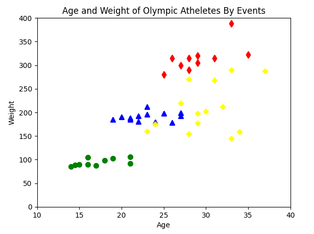
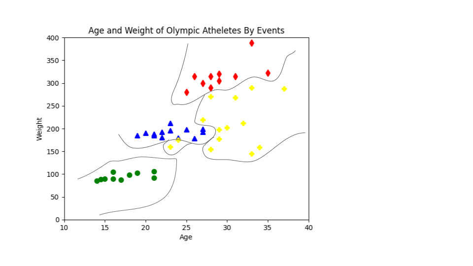
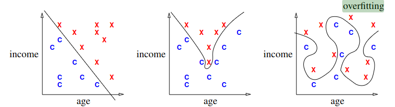
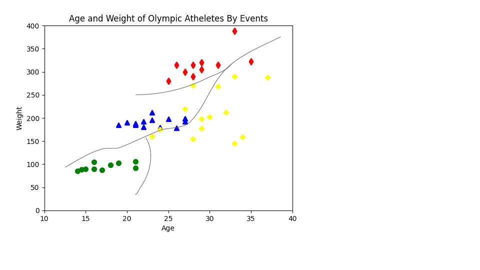
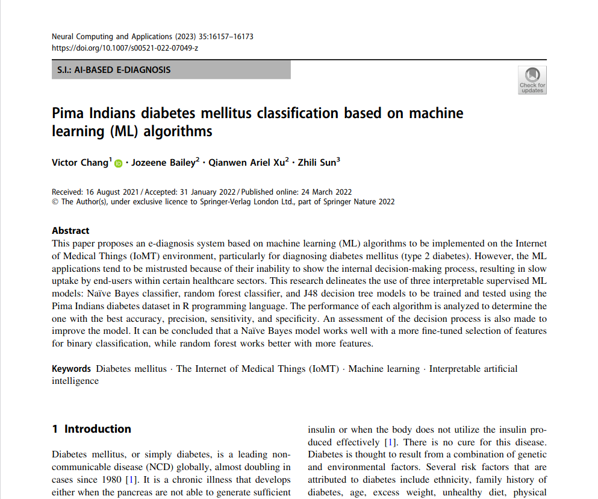
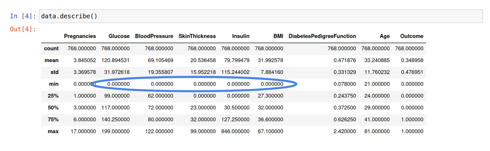
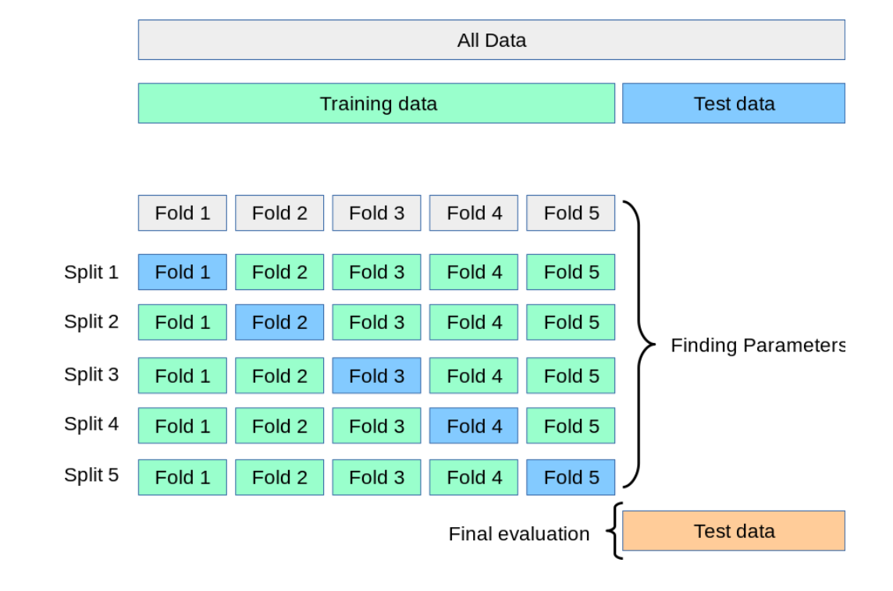
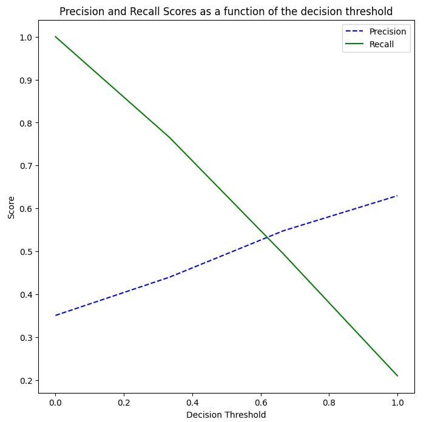

Nearest Neighbor Classification
===============================

In this module, we look at the Nearest Neighbor classification method. We also introduce the 
concept of overfitting. By the end of this module, students should be able to:

1. Describe the k-nearest Neighbor Algorithm
2. Describe overfitting and recognize it when it occurs in ML model training. 
3. Describe what a hyperparameter is and how it differs from other paramters in a ML model.
4. Implement k-nearest neighbor using sklearn. 
5. Describe how to recognize the optimal value for :math:`k` and how to use cross-validation 
   to analyze different hyperparameter values. 

1-Nearest Neighbor
------------------

Conceptually, the idea behind linear classification was relatively simple: create a 
line through the dataset and predict whether or not a point is in a class based 
on which side of the line the point falls. This approach works well in some cases; for example, 
in cases where the data are *linearly separable* or close to 
linearly separable. But plenty of datasets in the real-world cannot be modeled with 
a linear decision boundary very well.

For example, consider the following dataset depicting the age and weight of Olympic athletes 
by event. 

    Sample data showing the age and weight of Olympic athletes by event.

From visual inspection, we see that it would be difficult to model the classes with a linear 
decision boundary. The nearest neighbor model is an alternative to the linear classifier that can be 
used when the data cannot be easily modeled with a linear model.

The concept behind the nearest neighbor model is also simple: for a given sample, the 1-Nearest Neighbor 
model computes the distance between the sample and all data points in the training set and predicts 
the sample to be in the same class as the class of the "nearest" data point in the training set. 

Note that the 1-Nearest Neighbor model always has perfect accuracy on the training set: by definition, 
for each element in the training set, the distance to itself will be 0, and thus the model predicts 
it to be in its own class.

If we use 1-Nearest Neighbor on the sample dataset above, we can depict the resulting decision 
boundary as follows:

    Resulting decision boundary for the 1-NN model. 

As mentioned, the decision boundary perfectly predicts all elements in the training set. 
However, it should also be noted that the decision boundary above is very intricate. Do we think this 
model will do well in practice when applied to new data points not in its training set? 

Overfitting
-----------

Overfitting is a fundamental concept in machine learning. Overfitting occurs when further 
improving a model's performance 
on the training set causes its performance to be worse on future predictions. Overfitting happens 
when a model is fit to a relatively small number of examples and the model starts to use irrelevant 
aspects of the data for prediction. When this happens, the model's predictions will not generalize 
to unseen data. 

Consider the following example datasets and decision boundaries. 

    Examples illustrating the concept overfitting. Citation: [1].

Intuitively, the decision boundary on the right is very intricate and could represent 
overfitting. 

In general, the 1-Nearest Neighbor model is susceptible to overfitting. 

K-Nearest Neighbor 
------------------
We can modify the 1-Nearest Neighbor algorithm to be less susceptible to overfitting by looking at 
the closest :math:`k` data points in the training set, for some integer, :math:`k\geq 1`, instead 
of just the single closest data point in the training set. 

To classify a sample, we look at the classifications of the :math:`k` closest data points in the 
training set, and we predict the class which occurrence most often (with some tie breaker).

Of course, with :math:`k=1` we recover the 1-Nearest Neighbor algorithm, so this is a strict 
generalization. 

Using a larger value of :math:`k` tends to smooth out the decision boundary because the model 
effectively takes an average of the :math:`k` closest training samples when predicting. 
The result is that 
the model may no longer perform perfectly on the training set, but the performance on new samples 
could be improved due to reduced overfitting.

For example, we can depict the decision boundary of the K-Nearest Neighbor model applied to the 
Olympic athletes data set from before as follows: 

    Resulting decision boundary for the K-NN model. 

Hyperparameters
---------------

The parameter :math:`k` in the Nearest Neighbor model is an example of what is called a *hyperparameter*;
that is, it is a parameter of the model that is **not** derived as part of the training/fitting process.
Instead, the value of :math:`k` must be provided before fitting the model. 

Some models, such as the linear classifier we looked at previously, do not have any hyperparameters --
the weights of the model were all learned as part of the least squares gradient descent. Most models 
though will have some hyperparameters to control for overfitting. 

How can we figure out which value of :math:`k` we should use for our model?

Intuitively, the smaller the value of :math:`k`, the more influence individual data points 
in our training set will have on the model. Thus, if your data set is "noisy", i.e., has a lot of 
outliers, then a small choice of :math:`k` may not work well. 

On the other hand, a larger value of :math:`k` will result in smoother decision boundary and will 
have the effect of dampening out noise in the training set. The model tends to be 
more computationally expensive to compute for larger values of :math:`k` though. 

In practice, a simple way to determine :math:`k` is to build the model for multiple values of 
:math:`k` and pick the one that does best. As we increase :math:`k`, we can check how the model's
accuracy on the training set compares to the test set. 

K-NN in sklearn
---------------

We'll illustrate the K-Nearest Neighbor algorithm in sklearn on a dataset described in a 
paper from 2022 entitled "Pima Indians diabetes mellitus classification based on machine 
learning (ML) algorithms", [3]. The paper actually evaluates some ML models that we will 
look at in the next set of lectures, but here we focus on KNN. 

    Pima Indians diabetes mellitus classification based on machine learning (ML) algorithms

The dataset, which is available from Kaggle [4], consists of several medical predictor variables 
and one target variable, ``Outcome``. The variables and their types are as follows:

1. Pregnancies (Integer)
2. Glucose (Inetger)
3. Blood Pressure (Integer)
4. Skin Thickness (Integer)
5. Insulin (Integer)
6. BMI (Decimal)
7. Diabetes Pedigree Function (Decimal)
8. Age (Integer)
9. Outcome (0: No Diabetes, 1: Diabetes)

**Step 1.** *Getting and Preparing the Data*. We'll start by downloading 
the Pima Indian Diabetes dataset. As mentioned previously, the dataset is available for download 
from Kaggle `here <https://www.kaggle.com/datasets/uciml/pima-indians-diabetes-database?resource=download>`_. 
We have also put a copy on our class repository, as the Kaggle website seems to now require a login. You 
can download the file directly from this `URL <https://raw.githubusercontent.com/joestubbs/coe379L-sp24/master/datasets/unit02/diabetes.csv>`_.
The primary dataset is described in a csv file called ``diabetes.csv``.

.. code-block:: python3

  # Libraries to help with reading and manipulating data
  import numpy as np
  import pandas as pd

  data = pd.read_csv("diabetes.csv")

**Step 2.** *Data Exploration*. We'll use standard functions from pandas to explore the data and 
remove duplicate data. 

.. code-block:: python3

    data.shape
    >>> (768, 9)

    data.head()

    data.describe()  

    data.info()

    # look for duplicate entries in the data
    data.duplicated().sum()
    >>> 0

The output of ``data.describe()`` should look similar to:

    Output of `data.describe()`

The minimum values be 0 for some of the columns is surprising. Let's look into that a bit
more...

.. code-block:: python3 

    data.loc[data.Glucose == 0, 'Glucose']
    >>> 75     0
        182    0
        342    0
        349    0
        502    0
        Name: Glucose, dtype: int64

What should we do with the rows containing 0 values?  Note that the rows are different 
for different features:

.. code-block:: python3 

    # BMI column has different rows with 0s than the Glucose column:
    data.loc[data.BMI == 0, 'BMI']
    >>> 9      0.0
        49     0.0
        60     0.0
        81     0.0
        145    0.0
        371    0.0
        426    0.0
        494    0.0
        522    0.0
        684    0.0
        706    0.0
        Name: BMI, dtype: float64

    # Insulin column has 374 rows of 0s
    len(data.loc[data.Insulin == 0, 'Insulin']) 
    >>> 374

Since there are many rows with 0s, removing any row with a 0 would greatly reduce the size 
of the dataset. We will adopt the strategy used in the paper ([3]) which is to replace the 0 columns 
with the median for the feature:

.. code-block:: python3

    # Glucose, BMI, Insulin, Skin Thickness, Blood Pressure contains values which are 0
    data.loc[data.Glucose == 0, 'Glucose'] = data.Glucose.median()
    data.loc[data.BMI == 0, 'BMI'] = data.BMI.median()
    data.loc[data.Insulin == 0, 'Insulin'] = data.Insulin.median()
    data.loc[data.SkinThickness == 0, 'SkinThickness'] = data.SkinThickness.median()
    data.loc[data.BloodPressure == 0, 'BloodPressure'] = data.BloodPressure.median()

**Step 3.** *Split and Fit*. We'll split the data into training and test datasets. We'll use a 
70-30 split. 

.. code-block:: python3

    # x are the dependent variables and y is the target variable
    X = data.drop('Outcome',axis=1)
    y = data['Outcome']

    # Library to split data 
    from sklearn.model_selection import train_test_split

    # Spliting the data in 70:30 ratio
    X_train, X_test, y_train, y_test = train_test_split(X, y, test_size=0.3, stratify=y, random_state=1)

    X_train.shape
    >>> (537, 8)

    X_test.shape
    >>> (231, 8)

We'll use the ``KNeighborsClassifier`` class from the ``sklearn.neighbors`` module to instantiate a 
KNN model. 

To begin, we'll use a :math:`k` value of 3.

.. code-block:: python3

    from sklearn.neighbors import KNeighborsClassifier

    # instantiate the model
    knn = KNeighborsClassifier(n_neighbors=3)

    # fit the model to the training set
    knn.fit(X_train, y_train)    

**Step 4.** *Validation and Assessment*. Finally, we check the accuracy of the model on the test 
ans training data set. As before, we'll use the ``accuracy_score`` convenience function.

.. code-block:: python3

    # Check the accuracy on the test data
    from sklearn.metrics import accuracy_score, recall_score, precision_score, f1_score

    accuracy_test=accuracy_score(y_test, knn.predict(X_test))
    print('Accuracy of knn on test data is : {:.2}'.format(accuracy_test))

    # Check accuracy on the training data
    accuracy_train=accuracy_score(y_train, knn.predict(X_train))
    print('Accuracy of knn on train data is : {:.2}'.format(accuracy_train))

    >>> Accuracy of knn on test data is : 0.68
    >>> Accuracy of knn on train data is : 0.85

Cross-Validation
----------------
Let's return to the matter of deterining the value for the *k* in the KNN model. In the code above, 
we simply chose a value of *k=3* without any thought. We can do better. 

At a high level, the approach we will take is to train a bunch of different KNN models for
different values of *k* and see which one does the best, but some care is required when determining 
which datasets to use for training and testing. 

When we are trying to determine the optimal values of hyperparameters, such as the :math:`k` in 
the K-Nearest Neighbor model, repeated use of the same training set/testing set split can 
lead to overfitting *on the test set*. It is possible for knowledge about the test set to 
"leak" into our training process because we could tweak the hyperparameters to achieve high 
performance on the test set.

To prevent this from happening, we can partition the data set into 3 sets instead of just 2.
We would have a training set and a validation set, used to train and find the optimal 
hyperparameters, respectively, and finally we use the test set for measuring the accuracy 
of the model only after all training and validation has completed. 

However, partitioning the dataset into 3 sets drastically reduces the amount of data we 
can use for training our model. The quality of the model also could depend on how we choose 
to split data between the training and validation sets. 

To get around these issues, we can use a technique called cross-validation, or 
:math:`k`-fold cross-validation. With cross-validation, we still keep a separate test set 
for the final accuracy assessment, but we do not require a separate validation set. 

Instead, we split the training set up into :math:`k` subsets (as in :math:`k`-fold cross 
validation). For each integer between 1 and :math:`k`, the following procedure is performed:

1. The model is trained using :math:`k-1` of the data subsets. 
2. The resulting model is validated on the remaining subset. 

The performance metric measured and reported by the :math:`k`-fold cross-validation is then 
the average of the performance values computed in each of the step 2s above. 

    Pictorial representation of K-fold Cross-Validation. Citation: [2]

Cross-Validation in Sklean
~~~~~~~~~~~~~~~~~~~~~~~~~~

Let's see how to use the idea of cross-validation in sklearn. We'll continue with the 
above Pima Indian diabetes example and use cross-validation to find the optimal value 
of :math:`k`. 

The sklearn library provides the ``GridSearchCV`` convenience class as part of the 
``sklearn.model_selection`` module. With ``GridSearchCV``, we ask sklearn to use 
repeated :math:`k`-fold cross-validation to find an optimal hyperparameter. 

Instead of instantiating the model (in our case, ``KNeighborsClassifier``) with the value 
of the hyperparameter, we do not pass the hyperparameter at all:

.. code-block:: python3

    # we do not pass a value for k here
    knn_search_accuracy = KNeighborsClassifier()

We create a dictionary of the hyperparameters that we want to search for. The keys must be 
the exact parameter names for the model constructor, and the values should be the range 
of possible values (as an iterable) for the hyperparameter that we want to search in. 
For example:

.. code-block:: python3

    # Create a dictionary of all values we want to test for n_neighbors
    # note the use of 'n_neighbors', which is the exact function parameter name to the 
    # KNeighborsClassifier constructor
    # representing the hyperparameter we are looking to optimize
    param_grid = {"n_neighbors": np.arange(1, 100)}    

Then, we instantiate a ``GridSearchCV`` object, passing our model, the dictionary of 
hyperparameters and a parameter ``cv`` which is how many folds to use (5 is a typical number 
of folds to use).

.. code-block:: python3

    from sklearn.model_selection import GridSearchCV
    knn_gscv = GridSearchCV(knn_search_accuracy, param_grid, cv=5)

Finally, we use the ``fit()`` method of the ``GridSearchCV`` class. This performs model 
fitting using :math:`k`-fold cross-validation in a loop for each possible parameter value
specified in our dictionary. 

.. code-block:: python3

    # for each parameter in our param_grid, for each possible value, 
    # fit model to data using cv folds and compute the accuracy
    knn_gscv.fit(X_train, y_train)

Once completed, we can use the ``best_params_`` attribute to see the optimal values found:

.. code-block:: python3 

    # After the model has been fit, check top performing n_neighbors value
    knn_gscv.best_params_
    >>> {'n_neighbors': 13}

This tells us that a :math:`k` value of 13 was determined to be optimal for the Pima Indian
diabetes dataset. 

We can get the specific model that was optimal using the ``best_estimator_`` attribute. This 
attribute is exactly a single KNN estimator (model) and thus has methods such as 
``predict()`` which can be used to predict values on new data, etc. 

   >>> best_knn = knn_gscv.best_estimator_

We can then use the ``predict()`` method of the ``best_knn`` object itself to predict 
with the model trained with the optimal value of :math:`k`:

.. code-block:: python3

    >>> accuracy_test=accuracy_score(y_test, best_knn.predict(X_test))
    >>> print(f"Accuracy on the test data set for the model produced with the optimal k is: {accuracy_test}")

    # Check accuracy on the training data
    >>> accuracy_train=accuracy_score(y_train, best_knn.predict(X_train))
    >>> print('Accuracy of on train data for the model produced with the optimal k is: {:.2}'.format(accuracy_train))    

    Accuracy on the test data set for the model produced with the optimal k is: 0.7186147186147186
    Accuracy of on train data for the model produced with the optimal k is: 0.8

Improving Recall Through GridSearchCV 
-------------------------------------

Recall that for this particular model, we'd like to optimize recall to minimize the number of 
false negatives. We're going to explore two ways to do that. The first one is conceptually 
simple: we'll use GridSearchCV to find the value of the hyperparameter *k* that optimizes 
recall. 

To do this, we need only a small tweak to the code we used above. When constructing the 
GridSearchCV object, we'll pass an additional parameter, ``scoring="recall"``. The 
``scoring`` parameter which is the function used to evaluate the performance of the 
cross-validated model on the test set. We can pass a sinlge string argument to refer to 
the scoring function we want to optimize -- in this case, the ``"recall"`` function. 

.. code-block:: python3

    >>> knn_search_recall = KNeighborsClassifier()
    # specify the recall function to use when scoring 
    >>> knn_gscv2 = GridSearchCV(knn_search_recall, param_grid, cv=5, scoring="recall")
    
    # rest of the code is same as above ---
    # fit the set of models
    >>> knn_gscv2.fit(X_train, y_train)
    
    # hyperparameter values for the best model
    >>> knn_gscv2.best_params_
    {'n_neighbors': 7}

    # find the optimal model 
    >>> best_recall = knn_gscv2.best_estimator_

We can then compare the recall performance of this model to the previous ones.

.. code-block:: python3 

    # the list of models we want to test 
    models = [knn, best_knn, best_recall]
    for m in models: 
        # Recall 
        # on test data
        recall_test=recall_score(y_test, m.predict(X_test))
        print(f'Recall of {m} on test data is : {recall_test}')
        # on training data
        recall_train=recall_score(y_train, m.predict(X_train))
        print(f'Recall of {m} on train data is : {recall_train}')

The output should be similar to: 

.. code-block:: bash 

    Recall of KNeighborsClassifier(n_neighbors=3) on test data is : 0.49382716049382713
    Recall of KNeighborsClassifier(n_neighbors=3) on train data is : 0.7486631016042781

    Recall of KNeighborsClassifier(n_neighbors=13) on test data is : 0.5061728395061729
    Recall of KNeighborsClassifier(n_neighbors=13) on train data is : 0.6203208556149733

    Recall of KNeighborsClassifier(n_neighbors=7) on test data is : 0.5432098765432098
    Recall of KNeighborsClassifier(n_neighbors=7) on train data is : 0.6684491978609626

We see that using :math:`k=7` optimizes recall on the test dataset. 

.. note:: 

    GridSearchCV is a general method that works with any model, so the techniques above apply 
    to any type of hyperparameter search, not just KNN. 

.. note::

    While in this particular example, we are trying to optimize recall, note that the above
    method works for any supported scoring method. For a list of built in scoring methods, 
    see [6]. It is also possible to write your own; for more on that topic, see [7].

Improving Recall via the Decision Threshold 
-------------------------------------------

Let's look at a second method for improving recall related to the decision function learned by a 
model. Like the previous section, the method we present can be used generally for classification 
models; it is not restricted to KNN. It can also be used to improve precision instead, as will be 
apparent from the description of the method. 

Recall that classifiers use *decision functions* for predicting which class label a numeric value 
belongs to. Remember that when you fit a model such as Linear Classification, KNN, etc., to a 
dataset, you are dealing with numeric data, and to convert a numeric value to a class label a 
threshold is used. If :math:`t` is our threshold, then the decision function works using a simple rule:

**Decision Rule:**

* If :math:`m(d) >= t` then :math:`d \in C`
* If :math:`m(d) < t` then :math:`d \not\in C`

where :math:`m(d)` is the (numeric) model learned and applied to the data point :math:`d`. 

For each classifier, sklearn has implemented a *default* threshold, which is typically 0.5. This 
default threshold is what is used in calls to ``predict()``. But there is another function available 
on the model, the ``predict_proba()`` function. This function returns the raw numeric values output 
by the model as an array, 1 value for each possible (target) class label. 

For example, let's look at the following code: 

.. code-block:: python3 

  # call the predict method using the first model (knn) on the first 10 samples 
  >>>  knn.predict(X_test.iloc[0:10])
  array([0, 1, 0, 0, 0, 0, 1, 1, 1, 0])

  # call the predict_proba method on the same samples: 
  >>> knn.predict_proba(X_test.iloc[0:10])
  # output array -- the first column is decision function for class 0 and second column for class 1
  array([[1.        , 0.        ],
        [0.        , 1.        ],
        [0.66666667, 0.33333333],
        [1.        , 0.        ],
        [0.66666667, 0.33333333],
        [1.        , 0.        ],
        [0.33333333, 0.66666667],
        [0.33333333, 0.66666667],
        [0.        , 1.        ],
        [1.        , 0.        ]])

These outputs can be interpreted as the probabilities associated with each possible output label. 
In the case above, the first column represents the probability of the class being 0 (i.e., not 
diabetes) while the second column represents the probability of the class being 1 (i.e., has 
diabetes). 

And notice that the values agree with the ``predict()`` function output:

* Row 1: ``predict()`` is 0 and ``predict_proba`` is [1., 0.] (i.e., 100% likely to be 0, 0% likely to be 1).
* Row 2: ``predict()`` is 1 and ``predict_proba`` is [0., 1] (i.e., 0% likely to be 0, 100% likely to be 1).
* Row 3: ``predict()`` is 0 and ``predict_proba`` is [0.6667, 0.3333] (i.e., 67% likely to be 0, 33% likely to be 1).

and so on. 

This suggests a method for improving recall -- that is, reducing false negatives: To reduce false negatives, 
we can change the threshold so that the model predicts a negative label only when it is more confident. 

*Discussion:* How should we modify the threshold to make recall increase? 

To improve recall (i.e., reduce false negatives) we should decrease the decision threshold so that the 
model is more likely to predict that a sample belongs to the "has diabetes" class. By decreasing 
the decision threshold, in effect we require that the model be more confident that the label 
is not in the label before predicting it as such. 

We can implement a modified version of the predict function that uses an aribtrary decision 
threshold in a straight-forward way.

Observe that the two columns returned by the ``predict_proba()`` are actually redundant -- 
we really only need one of the columns to make a classification decision. We'll implement 
our modified decision function assuming we are passed an array of scores for the positive 
class; that is, the left column (column 1) in the output of ``predict_proba()``. In this way,
it will agree with our **Decision Rule** above. 

An example implementation is given below: 

.. code-block:: python3 

    def modified_predict(y_probs, threshold):
        """
        Returns modified predictions for a collection of raw probabilities, `y_probs`
        given a decision threshold, `threshold`.
        """
        result = []
        # iterate over the raw probabilities
        for y in y_probs:
            # compare each one to the threshold
            if y >= threshold:
                result.append(1)
            else:
                result.append(0)
        return result

We can now use our ``modified_predict()`` function in conjunction with the ``predict_proba()``
function to predict labels based on different thresholds. We just have to remember to 
pass the left column (column 1) of output from ``predict_proba()``.

.. code-block:: python3 

    >>> y_probs = knn.predict_proba(X_test)[0:10,1]
    
    # use a decision threshold of 0.3
    >>> modified_predict(y_probs, 0.3)
    [0, 1, 1, 0, 1, 0, 1, 1, 1, 0]

Compare the output of the ``modified_predict()`` to that of the original 
``knn.predict()``

.. code-block:: bash 

    # new output
    modified_predict(y_probs, 0.3)
    [0, 1, 1, 0, 1, 0, 1, 1, 1, 0]
    
    # original output 
    knn.predict(X_test.iloc[0:10])
    [0, 1, 0, 0, 0, 0, 1, 1, 1, 0])

We see that the modified predict function has classified two additional data points as 
"has diabetes". The threshold for classifying a sample as "has diabetes" has been decreased 
from the default value of 0.5. 

What do you think would happen if we changed 0.3 to 0.8? 

*Solution:* 

.. code-block:: python3
    
    >>> modified_predict(y_probs, 0.8)
    [0, 1, 0, 0, 0, 0, 0, 0, 1, 0]
 
As expected, we see a lot more data points have been classified as "does not have diabetes."

*Discussion:* What do you think is happening to precision and recall as the threshold changes? 

By decreasing the threshold, the model will predict more data points as being in the "has diabetes"
class and fewer as being in the "not diabetes". Therefore, we expect FPs (false positives) to 
**increase** while FNs (false negatives) should **decrease**. As a result, recall will improve 
while precision will go down. 

Let's create a function to print a simple confusion matrix for a model on some given data, 
X and y, for a given threshold. The function signature will look like this: 

.. code-block:: python3 

    def confusion_matrix_for_threshold(X, y, model, threshold):
        """
        Print a simple confusion matrix for the model, `model` on the data `X`, `y` 
        for a given decision threshold, `0 \leq threshold \leq 1`.
        """

How should we implement this function? We could use the ``ConfusionMatrixDisplay`` class 
that we have seen before from sklearn, but this time we'll instead implement one 
using the ``confusion_matrix()`` from the same ``sklearn.metrics`` module. The 
``confusion_matrix()`` function returns the raw values, as a numpy ndarray, so it can be more 
convenient to work with in code. We'll create a Pandas DataFrame out of it, just so 
that we can give it some nice labels for the rows and columns. 

.. code-block:: python3

    from sklearn.metrics import confusion_matrix

    def confusion_matrix_for_threshold(X, y, model, threshold):
        # first, get the raw scores 
        y_probs = model.predict_proba(X)[:,1]
        # then, get the modified labels 
        y_modified_pred = modified_predict(y_probs, threshold)
        # print a simple confusion matrix as a pandas dataframe so that 
        # we can label the rows and columns 
        print(pd.DataFrame(confusion_matrix(y, y_modified_pred),
                        columns=['Predicted_False', 'Predicted_True'], 
                        index=['Actual_False', 'Actual_True']))

We can now invoke our function with different thresholds and different models: 

.. code-block:: python3 

    >>> confusion_matrix_for_threshold(X_test, y_test, knn, 0.5)    
              Predicted_False  Predicted_True
    Actual_False              117              33
    Actual_True                41              40

.. code-block:: python3 

    >>> confusion_matrix_for_threshold(X_test, y_test, knn, 0.3)
                  Predicted_False  Predicted_True
    Actual_False               71              79
    Actual_True                19              62

.. code-block:: python3 
    
    models = [knn, knn_gscv.best_estimator_, knn_gscv2.best_estimator_]
    thresholds = [0.8, 0.5, 0.3]
    for m in models:
        print(f"Model: {m}\n")
        for t in thresholds:
            print(f"threshold: {t}"")
            confusion_matrix_for_threshold(X_test, y_test, m, t)    

Thus, we see that we can improve both recall and precision by adjusting the decision threshold. 
But keep in mind, that by improving one, we necessarily make the other worse. This is sometimes
referred to as the **Precision-Recall Curve**. 

We can even plot it using the matplotlib and the ``precision_recall_curve()`` function from sklearn.
This function takes two arguments: 

* ``y_true``: The first argument should be the actual targets (e.g., ``y_train`` or ``y_test``, etc).
* ``probas_pred``: The second argument should be the raw numeric scores returned by your model on 
  the corresponding input. For example, pass the values returned by the ``predict_proba()`` function 
  called on the input associated with the first argument (e.g. ``X_train`` or ``X_test``, etc.)

The function then computes the recall and precision scores for a fixed set of thresholds. It returns 
three arguments:

* ``precision``: ndarray of the precision scores. 
* ``recall``: ndarray of the recall scores. 
* ``thresholds``: ndarray of the thresholds used. Note that sklean automatically determines which 
  thresholds to use based on the unique probability values in the second input, ``probas_pred``. 
  That is, it uses all possible thresholds that could impact the Precision-Recall curve. 

Here is some sample code: 

.. code-block:: python3 

    from sklearn.metrics import precision_recall_curve
    from matplotlib import pyplot as plt

    def plot_precision_recall_vs_threshold(precisions, recalls, thresholds):
        plt.figure(figsize=(8, 8))
        plt.title("Precision and Recall Scores as a function of the decision threshold")
        plt.plot(thresholds, precisions[:-1], "b--", label="Precision")
        plt.plot(thresholds, recalls[:-1], "g-", label="Recall")
        plt.ylabel("Score")
        plt.xlabel("Decision Threshold")
        plt.legend(loc='best')

    # generate the probabilities on the test set; here we could use any model
    y_probs = knn.predict_proba(X_test)[0:,1]

    # the precision_recall_curve function from sklearn returns three parameters  
    precisions, recalls, thresholds = precision_recall_curve(y_test, y_probs)
    plot_precision_recall_vs_threshold(precisions, recalls, thresholds)

KNN For Regression
------------------

We conclude by remarking that the K-Nearest Neighbor algorithm can be used for regression tasks 
as well. The idea is simply to use a function of the :math:`k` nearest neighbors, such as the 
average or median, in the training set to compute the prediction on a new sample. 

The sklearn package includes the ``KNeighborsRegressor`` class for using the 
K-Nearest Neighbor algorithm to model continuous classes. See the documentation [5] for more 
information.

References and Additional Resources
-----------------------------------
1. UC Berkeley CS189/289A: Introduction to Machine Learning. https://people.eecs.berkeley.edu/~jrs/papers/machlearn.pdf
2. Cross-Validation: Evaluating Estimator Performance. Sklean 1.3.2 Documentation. https://scikit-learn.org/stable/modules/cross_validation.html
3. Chang V, Bailey J, Xu QA, Sun Z. Pima Indians diabetes mellitus classification based on machine learning (ML) 
   algorithms. Neural Comput Appl. 2022 Mar 24:1-17. doi: 10.1007/s00521-022-07049-z. 
   Epub ahead of print. PMID: 35345556; PMCID: PMC8943493.
4. Pima Indians diabetes dataset from Kaggle. https://www.kaggle.com/datasets/uciml/pima-indians-diabetes-database?resource=download
5. SKLearn.neighbors.KNeighborsRegressor: sklean documentation 1.3.2. https://scikit-learn.org/stable/modules/generated/sklearn.neighbors.KNeighborsRegressor.html
6. SKLearn scoring parameters. https://scikit-learn.org/stable/modules/model_evaluation.html#scoring-parameter
7. SKLearn: Implementing your own scoring object. https://scikit-learn.org/stable/modules/model_evaluation.html#implementing-your-own-scoring-object
