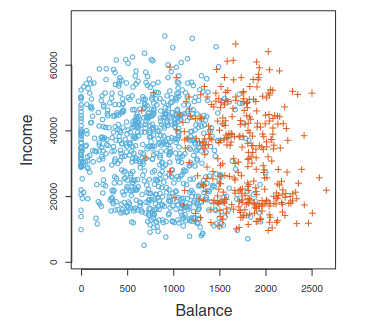
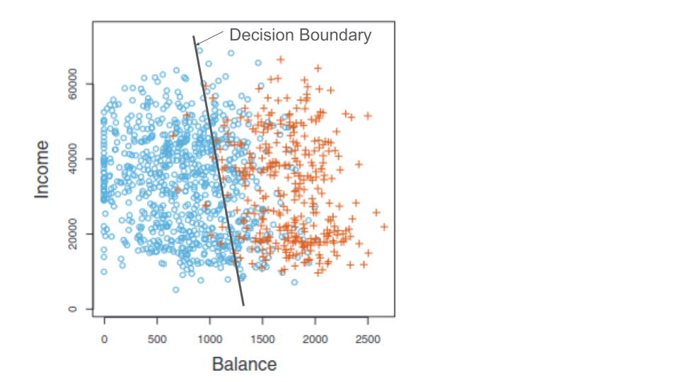
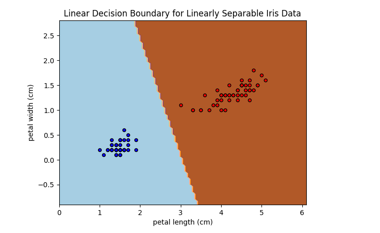

Classification: A First Look
============================

In this module we introduce the classification problem, work with some initial examples, and 
describe the training and testing phases involved in creating a classifier. We also 
take a first look at validation and overfitting. 

By the end of this module, students should be able to:

1. Describe the classification problem. 
2. Describe at a high level the linear classifier and the perceptron algorithm.
3. Describe the training and testing phases.
4. Plot and interpret a decision boundary and decision matrix to understand model performance. 

Introduction
------------

Classification is the problem of predicting an independent variable that takes values from a finite, discrete set. 
An ML model that predicts such a dependent variable is called a *classifier*. The possible values are called 
*classes*.

An important special case is a *binary classifier* which predicts a dependent variable which takes on just two 
possible values. That is, a binary classifier is a model which predicts two classes for the dependent variable.

For example, given a person's income and credit card history, a bank might want to predict if they will default.
The dependent variable here is whether or not the individual will default. There are two possible values:

* Will default
* Will not default

These are the two classes of the dependent variable, and an ML model that predicts this variable will thus be called
a binary classifier. 

Consider the following dataset depicting annual incomes and monthly credit card balances for a set of individuals. 

    Sample data showing annual incomes and monthly credit card balances for a set of individuals. 
    The individuals who defaulted on their credit card payments are shown in orange, and those 
    who did not are shown in blue. Citation: [1].

We can use this data to build an ML model for predicting whether an individual will default. The process is 
as follows:

1. Collect and prepare historical data about income, balance and default status.
2. Train a model using some of the prepared data. 
3. Validate the model using some of the prepared data. 
4. Deploy the model to predict the default status for new individuals. 

How might we train a classifier? There are many techniques. The first one we will look at is called *linear 
classification*. Before we look at some of the details of linear classification, does anyone have an 
intuition about how one might proceed to determine which individuals will default?

Is the image above suggestive of a way to predict the default status? 

    A linear decision boundary. Data points are classified based on which side of the line they fall. 

One approach is to use a linear equation (i.e., a line) to determine which class a data point belongs 
to. In the picture above we have drawn one possible line. Points on the left side of the line are 
classified as "will default" and points on the right are classified as "will not default". 

Linear Classification
---------------------

One approach to training classifiers makes use of a *decision function*. As we did in the previous module, 
we denote the independent variable with :math:`X` and the dependent variable with :math:`Y`. 

Given a class :math:`C` of the dependent variable, a 
*decision function*, :math:`f(X)`, is a function in the independent variable that can be used to 
determine if a point is in :math:`C`, as follows:

.. math:: 
    f(x) > 0  \iff x \in C

    f(x) <= 0 \iff x\not\in C

We define the set :math:`\{ x : f(x) = 0 \}` to be the *decision boundary* associated with :math:`f`. 

As the name suggests, with linear classification we define :math:`f(X)` using a linear function; that is, 
:math:`f(X)=mX + b` for some choice of :math:`m` and :math:`b`. 

In this case, the decision boundary is linear, :math:`\{ x : mX + b= 0 \}`. An example of a linear 
decision boundary was drawn in the income versus credit card balance plot above. 

How do we go about finding the optimal choice of :math:`m` and :math:`b`? Here, there are many techniques.
How well the different techniques perform depends in part on the data. 

For example, some techniques work better if the data are *linearly separable*, that is, if there 
exists a linear decision function that separates all data points that are in class :math:`C` from all 
points not in :math:`C`.

Perceptron Algorithm 
~~~~~~~~~~~~~~~~~~~~
We'll begin by looking at the Perceptron Algorithm which was originally conceived of by Frank Rosenblatt 
in his 1956 PhD thesis [2]. For linear classifiers, it can be slow to train, 
but it can be proven mathematically to always find a correct linear classifier when the data are 
linearly separable. Our derivation will feel similar to the treatment of Linear Regression we gave in the
previous module. 

Let :math:`X_1, ..., X_n` be :math:`n` different data points in our training set. Since we know the *labels*
for each of the points, we define :math:`y_1, ..., y_n` as follows:

.. math::

    y_i := 1 \iff X_i \in C

    y_i := -1 \iff X_i \not\in C

Our goal is to find the optimal choices of :math:`m` and :math:`b`. For simplicity, we'll assume that 
:math:`b=0` (i.e., that the line goes through the origin) just like we did with Linear Regression. 

Therefore, we want to find a choice of :math:`m` so that: 

.. math:: 

  mX_i > 0 \textrm{ if } y_i = 1

  mX_i <= 0 \textrm{ if } y_i = -1

In other words, we want to choose :math:`m` so that :math:`mX_i` and :math:`y_i` have the same sign for 
all :math:`1 <= i <= n`.

This gives us an idea for how we can define a loss function and associated cost function.
For any classifier, we define a *loss function* (or error function), :math:`L(mX_i, y_i)`, 
as:

.. math:: 

    L(mX_i, y_i) := 0 \textrm{ if } mX_i \textrm{ and } y_i \textrm{ have the same sign.}

    L(mX_i, y_i) := -m X_i y_i \textrm{ otherwise}

Note that the loss function is 0 when the model predicts the correct class for :math:`X_i` and the loss
function is positive otherwise. 

The cost function can now be defined as an average of the loss function over all points :math:`X_i`
(this is similar to what we did for linear regression). The cost function, :math:`C(m)`, associated 
with a linear classifier given by :math:`m`, is defined:

.. math::

    C(m) := \frac{1}{n} \sum_{i=1}^n L(mX_i, y_i) = \frac{1}{n} \sum_{d\in D} -m X_d y_d

where :math:`D` is the set of points which are misclassified by the classifier.

But the :math:`X_d` are all data points from our training set, and each of the :math:`y_d` are 
either 1 or -1, so this is a simple linear equation in :math:`m`. An optimization algorithm like 
Gradient Decent can be used to find an optimal :math:`m`. 

Linear Classification with Scikit Learn
---------------------------------------
Next we look at implementing a linear classifier using the ``sklearn`` package. In this first example, we'll 
illustrate the techniques on a classic dataset that describes iris flowers. We'll also introduce
helper functions for splitting data into a training data and testing data and computing the accurary of our
trained models. 

First, let us begin with a description of our dataset. The Iris Flower Dataset or Fisher's Iris Dataset was published
in a paper by British biologist Ronald Fisher in the paper, *The use of multiple measurements in taxonomic 
problems* (see [3]). The dataset includes four features for 150 samples of three species of 
iris: setosa, virginica and versicolor. The features are: sepal length, sepal width, petal length, petal width,
all measured in cm.

Loading the Data
~~~~~~~~~~~~~~~~
First, let us begin by loading the dataset. We'll use a Jupyter notebook for this portion since we will want 
to make use of some visualization. 

The ``sklearn`` package provides a convenience method for loading several classical datasets, including the Iris 
Flower Dataset:

.. code-block:: python3 

  from sklearn import datasets

  iris = datasets.load_iris()

As mentioned, this dataset contains 4 features for 150 samples of three different species of iris. 
Like all ``datasets`` objects from ``sklearn``, the ``iris`` object contains a ``data`` attribute 
holding the independent variables as well as a ``target`` attribute containing the dependent variable for
each sample. Each attribute as a ``numpy.ndarray``. There are also attributes ``features_names`` and ``target_names``
which contain the names of the independent and dependent variables, respectively. 

We can explore the dataset with Python: 

.. code-block:: python3

  >>> iris.feature_names
  ['sepal length (cm)',
  'sepal width (cm)',
  'petal length (cm)',
  'petal width (cm)']

  >>> iris.data 
  array([[5.1, 3.5, 1.4, 0.2],
       [4.9, 3. , 1.4, 0.2],
       [4.7, 3.2, 1.3, 0.2],
       [4.6, 3.1, 1.5, 0.2],
       [5. , 3.6, 1.4, 0.2],
       . . . 

  >>> type(iris.data)
  <class 'numpy.ndarray'>

  >>> iris.target_names
  array(['setosa', 'versicolor', 'virginica'], dtype='<U10')

  >>> iris.target
  array([0, 0, 0, 0, 0, 0, 0, 0, 0, 0, 0, 0, 0, 0, 0, 0, 0, 0, 0, 0, 0, 0,
       0, 0, 0, 0, 0, 0, 0, 0, 0, 0, 0, 0, 0, 0, 0, 0, 0, 0, 0, 0, 0, 0,
       0, 0, 0, 0, 0, 0, 1, 1, 1, 1, 1, 1, 1, 1, 1, 1, 1, 1, 1, 1, 1, 1,
       1, 1, 1, 1, 1, 1, 1, 1, 1, 1, 1, 1, 1, 1, 1, 1, 1, 1, 1, 1, 1, 1,
       1, 1, 1, 1, 1, 1, 1, 1, 1, 1, 1, 1, 2, 2, 2, 2, 2, 2, 2, 2, 2, 2,
       2, 2, 2, 2, 2, 2, 2, 2, 2, 2, 2, 2, 2, 2, 2, 2, 2, 2, 2, 2, 2, 2,
       2, 2, 2, 2, 2, 2, 2, 2, 2, 2, 2, 2, 2, 2, 2, 2, 2, 2])
  >>> type(iris.target)
  numpy.ndarray

Notice that the features are encoded as floats and that ``iris.data`` is a 2d-array of shape 150x4.
Similarly, the target classes are encoded with integers (0, 1, and 2) for the 3 different species, and 
that ``iris.target`` is a 1d-array of shape 150x1.  

To simplify our initial discussion, we are going to consider the subset of the data consisting of all 
samples in the first two classes (0 and 1), and we will also only consider the petal length and petal width 
features (columns 3 and 4). Notice that the first 100 data points belong to classes 0 and 1 (the last 50 
belong to class 2), so we can construct our dataset as follows:

.. code-block:: python3

    # only use the first 100 rows and the last two columns 
    X = iris.data[0:100,2:4]

    # only use first 100 rows
    y = iris.target[0:100]

Note that we have organized the data into the objects ``X`` and ``y`` for the independent and dependent variables,
respectively. This is a common convention we will use throughout the course. 

Training the Model
~~~~~~~~~~~~~~~~~~
Let us take a moment to recall the general strategy for working with ML models. 

1. Collect and prepare data with labels.
2. Train a model using some of the prepared data. 
3. Validate the model using some of the prepared data. 
4. Deploy the model to predict the default status for new individuals. 

We have completed step 1 for the iris dataset --  we are ready to move to step 2. 

We need to use some of the data for training and reserve some for testing how well the trained model 
performs on *data it hasn't seen*. This is a very important aspect of machine learning. You may 
read on the internet that there are ways to use all of the data for training, but don't be fooled by them!
If you use data the model has already seen in training to test it, you are undermining the integrity of 
the test.

In general, we'll want to train the model using "most" of the data and only hold back a relatively 
small amount to use as validation. What is "most" and how do we decide what to hold back for testing? 
There are a lot of aspects to this question, and we will revisit the topic throughout the semester, 
but for now, we'll split the data using 70% for training and 30% for testing. 

We'll also use a "stratification" technique to ensure (as much as possible) that the split preserves 
proportions of the target class. Fortunately, sklearn has a function to do the work for us:

The ``train_test_split`` function (cf., [4]) from ``sklearn`` is very helpful here:

.. code-block:: python3 

    from sklearn.model_selection import train_test_split
    X_train, X_test, y_train, y_test = train_test_split(X, y, test_size=0.3, stratify=y, random_state=1)

In the code above, we are collecting 4 new objects: ``X_train``, ``X_test``, ``y_train``, ``y_test`` representing
a splitting of the ``X`` and ``y`` data. The ``0.3`` specifies that we want 30% of the data to be used for test 
data and 70% to be used for training. 

Next, we specify ``stratify=y``. This is a very important parameter. Conceptually, it instructs sklearn to 
split the data in a way that preserves the frequency of occurrence of different target classes. In our case, we 
have an equal number of samples for each target (50 each), so a random splitting is likely fine. But in general,
using a stratified split will ensure a proportional splitting even when the samples are imbalanced. 

Finally, we specify ``random_state=1``. This controls the randomization that is used in a way that guarantees 
deterministic results. That is, when setting a value for ``random_state``, repreated calls to ``train_test_split``
will always result in the same splitting for the same input data. This has important consequences for 
reproducibility, a topic we will revisit throughout the semester. 

Having split the data, we are ready to train our model. We'll use the  ``SGDClassifier`` class from the 
``sklearn.linear_model`` module. The "SGD" stands for "Stochastic Gradient Descent" and the ``SGDClassifier``
provides a family of models based on an associated family of Gradient Descent algorithms.

In the code below, we first instantiate the SGDClassifier object, specifying some configurations. Then we actually 
perform the model training using the ``fit`` function. 

Naturally, we use the training data when calling ``fit``:

.. code-block:: python3

    from sklearn.linear_model import SGDClassifier

    # the alpha is used for the learning rate, which can impact overfitting vs underfitting, 
    # something we haven't discussed yet, but just note that a higher value of alpha more likely
    # to underfit. Can try changing alpha=0.05 if the model doesn't achieve 100% accuracy. 
    clf = SGDClassifier(loss="perceptron", alpha=0.01)

    clf.fit(X_train, y_train)

Note that we specify ``loss="perceptron"`` to indicate we want to use the Perceptron algorithm, as discussed 
in class previously. The ``SGDClassifier`` supports several other algorithms (e.g., "hinge", "squared_hinge", 
"log_loss", etc.). 

The ``alpha`` parameter deals with something called regularization, which we haven't discussed yet -- ignore it 
for now. 

The ``clf`` object is the trained model, and it can be used to predict the species of iris samples using the 
``clf.predict()`` method`. 

Validation 
~~~~~~~~~~
Now that the model has been trained we can proceed to step 3 -- validation. Our goal here is to compute the 
accuracy of our model against the test dataset (i.e., the ``test_`` data objects above). We'll also compute 
the accuracy of the model against the training data to see how they compare. 

For validation, we'll make use of another helpful function: the ``accuracy_score`` from the ``sklearn.metrics``
module. The basic usage is straightforward:

.. code-block:: python3

    from sklearn.metrics import accuracy_score

    # Check the accuracy on the test data
    accuracy_test=accuracy_score(y_test, clf.predict(X_test))

    # Check accuracy on the training data
    accuracy_train=accuracy_score(y_train, clf.predict(X_train))

As suggested by the code above, the ``accuracy_score`` function takes two parameters: the target (dependent)
variables and the predictions on the independent variables. Our dependent variables are just the 
``y_test`` and ``y_train`` objects defined before, and for the preduction, we apply the ``clf.predict`` function 
to each of the ``X_test`` and ``X_train`` arrays, respectively. 

The result returned by ``accuracy_score`` is simply a float from 0 to 1 containing the fraction of correctly 
classified samples. 

How did our model do?

.. code-block:: python3

  >>> accuracy_train 
  1.0

  >>> accuracy_test
  1.0

In fact, our model was perfect on both the test and training data! One way to understand this is to visualize
the data -- the Iris dataset is linearly separable, as we will see. 

Additional Properties of the Model
~~~~~~~~~~~~~~~~~~~~~~~~~~~~~~~~~~~

* ``clf.classes_``: These are the possible target class values the model is trying to predict. 
* ``clf.decision_function()``: This function computes the actual decision value for a given `X`
  that is used by the ``predict()`` function. Note that it requires an array of the same shape as the 
  data on which it was trained. 
* ``clf.coef_``: The coefficients learned. Note that when the target (dependent variable) is 1-dimensional, 
  as in the case above, the ``coef_`` attribute will be a 1-D array of length equal to the number of 
  features. 
* ``clf.intercept_``: The y-intercept learned. Together with ``clf.coef_``, this determines the 
  ``clf.decision_function``.

Examples: 

.. code-block:: python3 

    >>> clf.classes_
    array([0, 1])

    >>> clf.coef_
    array([[2.17976136, 0.84768497]])

    >>> clf.intercept_
    array([-6.61195757])

    # consider one data point; it's a 1-D array with two values:
    >>> X_train[0]
    array([1.5, 0.2])

    # apply the decision_function to a single value (note the shape of the input):
    >>> clf.decision_function([X_train[0]])
    array([-3.17277854])

    # this is the same as computing the linear combination of the coef_ and intercept_:
    >>> np.sum( clf.coef_*X_train[0]) + clf.intercept_
    array([-3.17277854])

    >>> clf.decision_function(X_train)
    array([-3.17277854,  4.46849599, -3.08801005, -3.39075468, -3.60873082,
       -4.12945158,  4.51693513, -3.17277854,  5.37672989, -3.00324155,
       . . .

    # note that class predictions agree with the assoicated sign (positive or negative) of 
    # the decision_function above
    >>> clf.predict(X_train)
    array([0, 1, 0, 0, 0, 0, 1, 0, 1, 0, 0, 0, 0, 1, 1, 1, 1, 1, 1, 0, 1, 1,
       1, 0, 0, 0, 0, 1, 1, 1, 1, 0, 1, 1, 1, 0, 1, 1, 0, 1, 1, 1, 0, 0,
       1, 1, 0, 1, 0, 1, 0, 0, 0, 0, 0, 0, 1, 0, 1, 1, 1, 1, 0, 0, 1, 0,
       0, 0, 1, 0])

    >>> clf.coef_
    array([[2.17976136, 0.84768497]])

    >>> clf.intercept_
    array([-6.61195757])

Visualizing the Decision Boundary
~~~~~~~~~~~~~~~~~~~~~~~~~~~~~~~~~

We'll use the ``DecisionBoundaryDisplay`` class from the ``sklearn.inspection`` in conjunction with ``matplotlib``
to create a visualization of the decision boundary.

Note that this technique only works in 2 dimensions, which is why we artificially 
restricted our dataset to two independent variables. 

.. code-block:: python3

    import matplotlib.pyplot as plt
    %matplotlib inline

    from sklearn.inspection import DecisionBoundaryDisplay

    # get current axis (gca) or create new ones if none exist. 
    ax = plt.gca()

    # use the DecisionBoundaryDisplay
    DecisionBoundaryDisplay.from_estimator(
        clf, # the trained model
        X,   # the independent variables -- must be 2D!!
        cmap=plt.cm.Paired, # the color map 
        ax=ax,  # the axis 
        response_method="predict",  # the prediction method 
        xlabel="petal length (cm)",  # lables 
        ylabel="petal width (cm)",
    )

The above code draws the decision boundary. We also plot the dataset using the following code: 

.. code-block:: python3

    import numpy as np 
    # we use two colors because there are two target classes ('setosa', 'versicolor')
    colors = "br"
    # Plot also the training points:
    # iterate over each of the classes (and colors) and make a plot 
    for i, color in zip(clf.classes_, colors):
        # pick out the indexes where the dependent var equals i 
        idx = np.where(y == i)
        plt.scatter(
            X[idx, 0],
            X[idx, 1],
            c=color,
            cmap=plt.cm.Paired,
            edgecolor="black",
            s=20,
        )
    plt.title("Linear Decision Boundary for Linearly Separable Iris Data")
    # Set limits just large enough to show all data, then disable further autoscaling.
    plt.axis("tight")

The result should look similar to the following: 

    Resulting plot of the linear decision boundary for the Iris dataset. 

Training on the Full Dataset 
~~~~~~~~~~~~~~~~~~~~~~~~~~~~~

Let's go back and train on the full dataset with all of the features. 

How should we modify the code above? Implement the 
following high-level steps:

1. Create `X` and `y` variables pointing to your independent and dependent variables, respectively.
2. Split the data into training and test. 
3. Train the model 
4. Check the accuracy on the training and test data. 

How does the accuracy compare with the previous version? 

*Solution:*

.. code-block:: python3 

    # We want to use the entire dataset, so we set X and y differently: 
    X = iris.data
    y = iris.target

    # The rest is the same:
    # first, we split the data
    X_train, X_test, y_train, y_test = train_test_split(X, y, test_size=0.3, stratify=y, random_state=1)
    # next we 
    clf = SGDClassifier(loss="perceptron", alpha=0.01)
    clf.fit(X_train, y_train)

    # Check the accuracy on the test data
    accuracy_test=accuracy_score(y_test, clf.predict(X_test))
    # Check accuracy on the training data
    accuracy_train=accuracy_score(y_train, clf.predict(X_train))
    print(f"Train accuracy: {accuracy_train}; Test accuracy: {accuracy_test}")

Visualizing the Confusion Matrix 
~~~~~~~~~~~~~~~~~~~~~~~~~~~~~~~~
A confusion matrix is a useful tool for understanding the performance of a model beyond 
just the accuracy rate. 

A confusion matrix compares the predicated label of a model against the actual label 
for all values in the target class. It can be used to quickly target specific classes that the 
model might be performing better or worse on. 

We can use the ``ConfusionMatrixDisplay.from_estimator()`` function to easily plot a confusion
matrix for a model we have fit. See the sample code below: 

.. code-block:: python3

    from sklearn.metrics import ConfusionMatrixDisplay
    cm_display = ConfusionMatrixDisplay.from_estimator(clf, X_test, y_test,
                                                   cmap=plt.cm.Blues,normalize=None)

.. figure:: ./images/confusion_matrix_iris.png
    :width: 1000px
    :align: center

The confusion matrix above shows that our model did well predicting the Setosa (label 0) 
and the Virginica (label 2) flower types, but "confused" the Versicolor (label 1) for the 
Setosa two times. 

Hands-on Lab: Classifying Spam Email
------------------------------------
In this section, we guide you through developing a linear classifier for spam 
email detection. We'll use the "Spambase" dataset, a classic dataset 
hosted on the UC Irvine Machine Learning Repository [5].

The dataset consists of metadata about a set of emails. A total of 58 attributes 
are provided for each email. 

The first 48 attributes are of the form ``word_freq_<WORD>``
for some word, <WORD>. These attributes contain the percentage of words (as a float between 
0 and 1) in the email that match <WORD>. 

Six attributes are of the form ``char_freq_<CHAR>`` for some character, <CHAR>. These 
attributes contain the the percentage of characters (as a float between 
0 and 1) in the email that match <CHAR>. 

The last three attributes are defined as follows:

* ``capital_run_length_average``: Average length of uninterrupted sequences of capital 
  letters.
* ``capital_run_length_longest``: Length of longest uninterrupted sequence of 
  capital letters. 
* ``capital_run_length_total``: Sum of the lengths of uninterrupted sequences of 
  capital letters. (i.e., total number of capital letters in the email)

Finally, a single attribute ``spam`` with values in :math:`\{ 0, 1 \}` is the target
(dependent) variable. A value of 1 indicates the email was spam while a value of 0
indicates that it was not spam.  

The lab is structured as a series of exercises. We'll make use of the material above 
on linear classification as well as previous material on data analysis. We'll also 
introduce the confusion matrix in Exercise 4. Use a Jupyter notebook to work through 
the exercises below in class. 

**Exercise 1.** *Getting and Preparing the Data*. To get started, we'll download 
the Spambase dataset. The dataset is available for download from the 
UCI Archive `here <https://archive.ics.uci.edu/dataset/94/spambase>`_. The primary 
dataset is described in a csv file called spambase.data. An auxillory file called 
spambase.names describes the dataset. 

1. Unpack and save the data file to your local machine. Read the data into a Pandas 
   dataframe.

2. Check and print the number of rows and columns in the dataset. 

**Exercise 2.** *Data Exploration*.

1. Compute standard statistics for each of the columns in the dataset, including:
   count, mean, standard deviation, min and max. 

2. Determine if there are any duplicate rows in the data set. If there are any 
   duplicate rows, remove them. 

3. Determine if there are any null/missing values in the data set. 

4. Determine how many rows are spam and how many are not spam.  

**Exercise 3.** *Split and Fit*. 

1. Split the data into training and test datasets. Make sure your split is 
   reproducible and that it maintains roughly the proportion of spam and non-spam emails.

2. Fit the data to a linear classifier using the Perceptron algorithm. 

**Exercise 4.** *Validation and Assessment*. 

1. Check the accuracy of your model on the test data set. 

2. Check the accuracy of your model on the training data set. 

3. Plot a confusion matrix for your model. How does the model perform with respect to different labels in 
   the target class? Do you think one is more important to minimize? 
   

References and Additional Resources
-----------------------------------
1. UC Berkeley CS189/289A: Introduction to Machine Learning. https://people.eecs.berkeley.edu/~jrs/papers/machlearn.pdf
2. Professor’s perceptron paved the way for AI – 60 years too soon. https://news.cornell.edu/stories/2019/09/professors-perceptron-paved-way-ai-60-years-too-soon
3. R. A. Fisher (1936). "The use of multiple measurements in taxonomic problems". Annals of Eugenics. 7 (2): 179–188. doi:10.1111/j.1469-1809.1936.tb02137.x. hdl:2440/15227
4. sklearn train_test_split documentation: https://scikit-learn.org/stable/modules/generated/sklearn.model_selection.train_test_split.html
5. Hopkins,Mark, Reeber,Erik, Forman,George, and Suermondt,Jaap. (1999). Spambase. UCI Machine Learning Repository. https://doi.org/10.24432/C53G6X.
