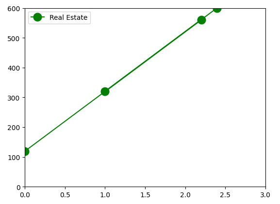
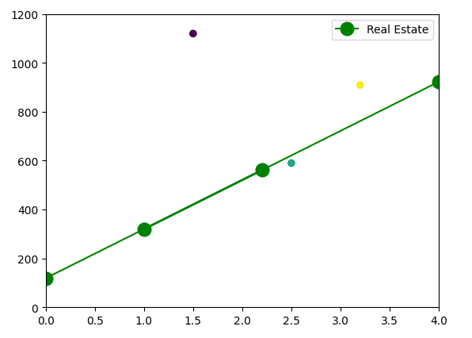

Linear Regression
=================

In this module, we introduce our first ML algorithm called Linear Regression. We also 
introduce the SciKit Learn Python library which provides an implementation of Linear 
Regression and many other ML algorithms. 

By the end of this module, students should be able to:

1. Understand the basics of the Linear Regression model and which ML problems it could
   potentially be applied to. 

2. Install and import the SciKit Learn Python package into a Python program, and use 
   SciKit Learn to implement a basic Linear Regression model.

Introduction
------------

In Linear Regression, we make the assumption that there is a linear relationship between the dependent 
and independent variables. To simplify the discussion, we'll assume for now that there are just 
two variables, one *independent* and one *dependent*. 

Recall from the previous lecture that our goal is to model (or predict) the dependent variable
from the independent variable. It is customary to use :math:`X` for the independent variable and 
:math:`Y` for the dependent variable. To say that there is a linear relationship between :math:`X` and :math:`Y` 
is to say that they are related by a linear equation.

We know from elementary algebra that a linear equation has the form 

.. math::

  Y - Y_1 = m(X- X_1)

and is uniquely determined by two points :math:`(X_1, Y_1)` and :math:`(X_2, Y_2)`. This is called the 
**point-slope form** of the linear equation. Note that by solving the left-hand side of the equation for 
:math:`Y`, we can put the equation in **slope-intercept** form: 

.. math::

   Y = mX + B 

Consider the case of predicting the market value of a piece of real estate. We know in the real world,
the value of a property depends on a number of factors, but for simplicity, let us make the assumption that the 
value is determined by the square footage. Let us further assume that the relationship is linear. 

We can restate the remarks above in this context as follows: Given the square footage and value of two properties, 
we can uniquely determine the linear equation relating square footage and value. Here are two properties in the 
Austin area that were recently listed on the MLS: 

* Property 1: 1,007 square feet; $320,000
* Property 2: 2,202 square feet; $561,000

We can simplify the data slightly be dividing by 1,000. 

Therefore, we can think of these properties as corresponding to the 
points :math:`(1, 320)` and :math:`(2.2, 561)` which leads to the system of equations:

.. math::

  Y - 320 = m(X- 1)

  Y - 561 = m(X- 2.2)

and then to the formula :math:`Y = 200.83(X - 1) + 320` which we can visualize as follows:

Congratulations! In some sense, this is our very first linear model. It models the value of a 
real estate property (the :math:`Y` variable) as a linear function of square footage (the :math:`X` variable).

Using this formula, we could predict the value of another property based on its square footage. Here are
some additional properties. How does our model perform?

* Property 3: 2,550 square feet; actual value: $590,000; predicted value: ?
* Property 4: 3,202 square feet; actual value: $910,000; predicted value: ?
* Property 4: 1,500 square feet; actual value: $1,120,000; predicted value: ?

*Solution:*

We plug the points into the equation :math:`Y = 200.83(X - 1) + 320` and compute :math:`Y`:

* Property 3: Predicted Value = :math:`200.83(2.5-1) + 320 = $621,245`
* Property 4: Predicted Value = :math:`200.83(3.2-1) + 320 = $761,826` 
* Property 5: Predicted Value = :math:`200.83(1.5-1) + 320 = $420,415`

If we add these additional data points to our plot, we see that our model did pretty well on Property 3, 
less good on Property 4, and was completely wrong about Property 5. 

Incorporating Additional Data 
-----------------------------

There are two main problems with our initial approach. 

The first issue is that the linear model we generated was based on the data of just two properties. The MLS lists 
thousands of properties in the Austin area. Shouldn't we try to somehow create the model based on as much of 
that data as possible? 

.. note:: 

   In machine learning, there is typically an assumption that incorporating more data into the model training 
   process will produce a more accurate model. 

However, if we try to add even a third point to our linear equation we run into issues: the first two points 
uniquely determined the line. Put another way, there is no simultaneous solution to the equations:

.. math::

  Y - 320 = m(X- 1)

  Y - 561 = m(X- 2.2)

  Y - 590 = m(X- 2.55)

These equations are just the result of entering the three properties (i.e., :math:`(1, 320)`,  
:math:`(2.2, 561)` and :math:`(2.55, 590)`) into the general form :math:`Y - Y_1 = m(X- X_1)`.

In mathematics, we say that such a system of equations os *overdetermined*; i.e., there are more equations than 
unknowns, and such systems typically have no solution. In general, when working with real-world data 
we will not be able to find exact solutions to the set of model equations.

Instead, with Linear Regression, the basic idea is to find a linear equation that, when used to 
predict the dependent variable of the known data points, minimizes a *cost* function. The cost
function is related to another function, called the *error* function, which is also called a *loss* function.
The error function assigns an error to each data point, and the cost function aggregates these errors 
across a set of data points. 

There are different ways to define the error function, but conceptually, the error function will 
be similar to the difference between the predicted value and the actual value. Similarly, there are
different wayt to define the cost function using the error function but one way is to just add up the 
errors of all data points in our training set. 
Of course, the difference could be positive or negative, and if we just add up the 
differences, the positive and negative values could cancel each other out, so instead of just 
summing the errors, one can sum up the squares of the errors. Finally, since summing all of the errors 
will result in a larger cost for increases in the size of the data set, we want to take an average instead.
That leads to the following equation for cost:

.. math:: 

   Cost(M) = (\frac{1}{|D|})\sum_{d\in Data} M_{error}(d) \approx \sum_{d\in Data} (M(d) - Y_{actual}(d))^2
   
The equation above says that the cost associated with a model, :math:`M`, is given by the sum of the 
squares of the differences between the actual value and the model's predicted value across the elements 
:math:`d` in a dataset, :math:`D` divided by the total size of :math:`D`. This approach is called 
the **least squares approximation** of the linear model.  

Finding the Linear Model Algorithmically 
----------------------------------------

How do we find the linear model, :math:`M`, that minimizes the cost function, :math:`Cost(M)`? 
We'll try to provide the basic idea of what is involved, though we don't give full details in 
this section. 

Recall that the model, :math:`M`, is defined by just two parameters, the :math:`m` and :math:`B` in the 
slope-intercept form:

.. math::

   Y = mX + B

So, our goal is to find :math:`m` and :math:`B` that minimizes :math:`Cost(M)`. To simplify the
discussion, let us assume that :math:`B=0` (the y-intercept). 

Suppose we have :math:`n` data points in our data set: :math:`(x_1, y_1), ..., (x_n,y_n)`. Then the 
cost is a function of :math:`m` and :math:`B` as follows:

.. math::

   Cost(m, B ) = \sum_{j\in 1,..,n} (mx_j + B - y_j)^2

Since we are assuming :math:`B=0`, we are left with:

.. math::

   Cost(m) = \sum_{j\in 1,..,n} (mx_j - y_j)^2

But all of the :math:`x_j, y_j` are known values coming from points in our dataset, so this is just 
a quadratic equation in the variable :math:`m`. From Calculus, we know:

  1. This equation is differentiable,
  2. It will have a minimum where the derivative is 0,  
  3. The derivative is a linear function so it will have exactly one zero. 

So, it turns out we can find the model that minimizes the cost by finding the zero of a linear function. 

.. note:: 

   The discussion above ignores a lot of details. In practice, a number of additional issues come up.
   Moreover, there is the matter of how to actually fund the zeros of a differentiable function. If 
   you are interested, the Gradient Decent algorithm is a general purpose optimization algorithm for 
   finding the minimum of a differential function. We may provide some details of the Gradient Decent 
   algorithm later in the semester, time permitting. 

.. note::

  In the discussion above, we assumed we had just one independent variable (square footage), but 
  similar ideas can be used to deal with the case of multiple independent variables. 

SciKit Learn
------------
In this section, we introduce the Python Package SciKit Learn (``scikit-learn`` on PyPI). This 
package provides implementations for a number of ML algorithms we will cover in this class. 
It also works well with NumPy, Pandas, Matplotlib, etc. 

To install scikit-learn using pip:

.. code-block:: bash

   [container/virtualenv]$ pip install scikit-learn

The main package is the ``sklearn`` package; check your installation: 

.. code-block:: python3 

   >>> import sklearn 

Linear Regression in Sklearn: First Steps
^^^^^^^^^^^^^^^^^^^^^^^^^^^^^^^^^^^^^^^^^
As a first step, let's create a linear regression model using our real-estate data from above. 

To get started, we create a ``LinearRegression`` object from the ``sklearn.linear_model`` module:

.. code-block:: python3 

   >>> lr = sklearn.linear_model.LinearRegression()

The next step is to fit the model to some data. We'll go ahead and use all of the data points 
from the five properties in the discussion above. We'll use the ``.fit()`` function to fit the model to a collection of data.

Recall we have the following data points representing our 5 real estate properties: 
:math:`(1, 320), (2.2, 561), (2.55, 590), (3.2, 910)`, and :math:`(1.5, 1120)`. 

We need to pass the ``x`` values and the ``y`` values as separate arrays to the ``fit()`` function. 

Keep in mind that, in this first example, we have just one independent variable, but in general, 
there will be multiple independent variables in the data set. For example, we will look at a real estate 
dataset that has additional variables such as: the age of the structure, the distance 
to the nearest bus station, the number of convenience stores nearby, etc. 

With that in mind, we need to be careful when providing the data to the ``fit()`` function. The 
``LinearRegression`` class is designed to work for the general case, where there will be many 
independent variables. Thus, we pass each ``x`` value as an array of (in this case, 1) value, and similarly 
for ``y``: 

.. code-block:: python3 

   >>> data_x = [[1], [2.2], [2.55], [3.2], [1.5]]
   >>> data_y = [[320], [561], [590], [910], [1120]]
   
   # now, we can fit the model to the data 
   >>> lr.fit(data_x, data_y)

That's it! With that little bit of code, sklearn executed the least squares approximation algorithm to find 
the linear model that minimizes the error function.

We can now use the ``lr`` object to predict additional values. Suppose we know the values of some 
additional properties:

  * Property 6: 2,300 square feet, $640,000
  * Property 7: 2,780 square feet, $780,000

We can predict the values using the model's ``.predict()`` function (**note:** the 2-d array!):

.. code-block:: python3 

   >>> lr.predict([[2.3]])
   --> array([[723.61514037]]

   >>> lr.predict([[2.78]])
   --> array([[777.13546123]])

Thus, the model predicts that the value of Property 6 will be $723,615 and the value of Property 7 
will be $777,135.  

Predicting on Test Data and Plotting the Results
^^^^^^^^^^^^^^^^^^^^^^^^^^^^^^^^^^^^^^^^^^^^^^^^

We can call the ``predict()`` function on an array of data, as follows:

.. code-block:: python3 

   >>> test_data_x = [[2.3], [2.78], [3.5], [1.2], [0.8]]
   >>> test_data_y = [[640], [780], [900], [680], [570] ] # actual values
   >>> test_predict = lr.predict(test_data) # values predicted by model on the test data

Note the shape of the ``test_predict`` object:

.. code-block:: python3

   >>> test_predict.shape
   --> (5,1)

We can use matplotlib to visualize the results of the model's predictions on these test data: 

.. code-block:: python3

   # plot the data
   >>> import matplotlib.pyplot as plt

   >>> plt.scatter(test_data_x, test_data_y, color="black")
   >>> plt.plot(test_data_x, test_predict, color="blue", linewidth=3)

.. figure:: ./images/lr_test_predict.png
    :width: 1000px
    :align: center
