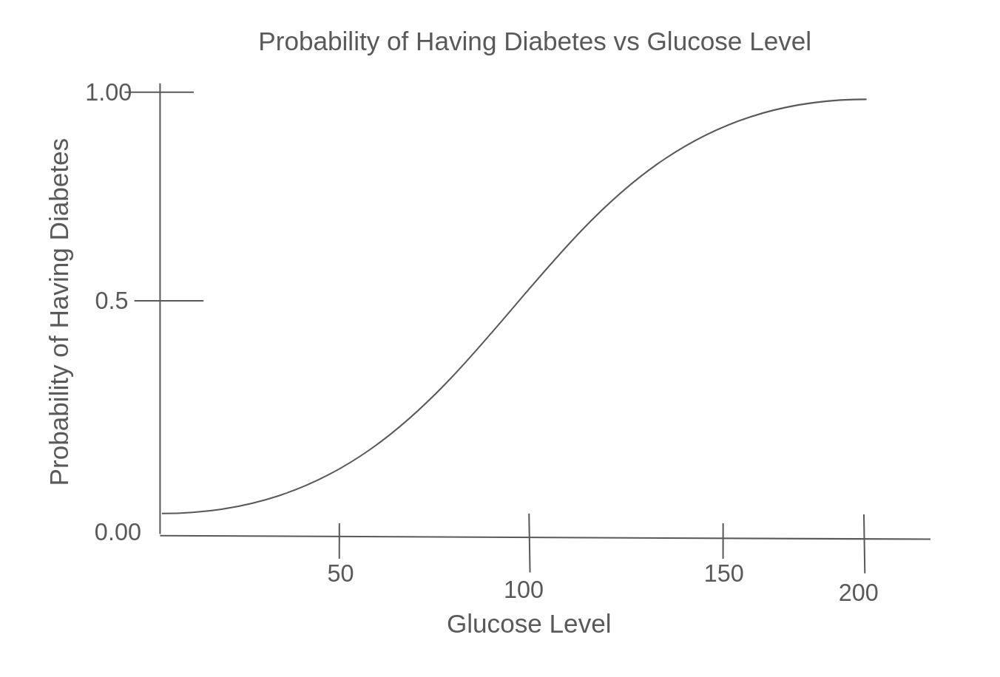

Logistic Regression and Naive Bayes
===================================

In this module we introduce the Logistic Regression and Naive Bayes classifiers. We discuss 
general guidelines for when to use each. Finally, we show how to implement 
Logistic Regression and Naive Bayes using sklearn.

By the end of this module, students should be able to:

1. Describe how the logistic regression and Naive Bayes classifier models work 
   at a high level.
2. Describe when each model is most appropriate to use (and why).
3. Implement each using the sklearn package. 

Logistic Regression
-------------------
In this section, we introduce the Logistic Regression model. As with the other methods in this 
unit, we will not cover all details but instead will give just a basic sense of the ideas 
involved. 

The basic idea with Logistic Regression is to build upon the Linear Regression model with the 
goal of learning a *probability distribution function* that can be used for classification 
problems. Despite "regression" appearing in the name, logistic regression models are used 
for **classification** problems. 

In Logistic Regression, we build a linear regression model and then pass the result through a 
"logistic" function. The logistic function has the form:

.. math:: 

    p(x) = \frac{1}{1 + e^{-k(x-x_0)}}

where :math:`k, x_0` are constants/parameters with :math:`k>0`. 

Note the following attributes of this function: 

* As :math:`x\to -\infty`, :math:`e^{-k(x-x_0)} \to \infty` and thus :math:`p(x) \to 0`
* As :math:`x\to\infty`, :math:`e^{-k(x-x_0)} \to 0` and thus :math:`p(x) \to 1`
* For :math:`x:= x_0`, :math:`e^{-k(x-x_0)} = 1` and thus :math:`p(x_0) = 0.5`

As a result, the logistic function can be thought of as mapping an arbitrary Real number 
to a probability, i.e., a value between 0 and 1. 

Example: Diabetes vs Glucose  
~~~~~~~~~~~~~~~~~~~~~~~~~~~~~
For simplicity, let's assume we have a binary classification problem with just one independent 
variable. For example, suppose we are trying to predict whether a person has diabetes based 
only on their glucose level. We know the higher a person's glucose, the more likely they are 
to have diabetes. 

The idea is that, in this case, we can model the probability that the individual has 
diabetes as a logistic function of their glucose level. It might look similar to the following:

    Example logistic regression plot for diabetes vs glucose

All logistic functions have an "S shaped curve", similar to the shape to the curve above. 
In logistic regression, the model learns a set of linear coefficients corresponding to each 
of the independent variables, just as in the case of linear regression.

As in the case of linear regression, we can define a loss function (or error function) 
and use it to define a cost function which we can then minimize using an algorithm such 
as gradient descent. 

Logistic Regression in Sklearn
~~~~~~~~~~~~~~~~~~~~~~~~~~~~~~~

The sklearn package provides the ``LogisticRegression`` class from the 
``sklearn.linear_model`` module. More details are provided in [1]/ 

Let's use this class to develop a 
logistic regression model for the Spambase dataset we looked at in the hands-on 
lab. 

We'll begin by importing the required libraries, as usual: 

.. code-block:: python3 

    import numpy as np
    import pandas as pd
    from sklearn.model_selection import train_test_split    

Here's a condensed version of the pre-processing code. We load the data, take care of 
duplicate rows, create the independent and dependent variables, and split the data between 
training and testing. For details, see the Spambase `solution <spambase_solution.html>`_.  
 
.. code-block:: python3

    # Data load and pre-processing
    data = pd.read_csv("spambase.csv")
    data=data.drop_duplicates()
    # x are the dependent variables and y is the target variable
    X = data.drop('Class',axis=1)
    y = data['Class']
    X_train, X_test, y_train, y_test = train_test_split(X, y, test_size=0.3, stratify=y, random_state=1)
    
We can now use the ``LogisticRegression`` model. We proceed in a similar way as with other models. 
We pass the following arguments to the ``LogisticRegression`` constructor:

* ``max_iter=1000``: This is the maximum number of iterations the solver will use for converging. 
  The default is 100, but here we pass 1000 to give it more time to converge. 
* ``random_state=1``: This is used to shuffle the data. (Same as with the SGD Linear Classifier) 

We also introduce the convenience function ``classification_report`` from the ``sklearn.metrics`` module. 
This function produces a nice report of several measures we have looked at, including accuracy, recall, 
precision, and f1-score. 

Keep in mind when reading the output of ``classification_report`` that the values for precision, 
recall, f1-score and support are provided for **all target class labels.** This could cause 
confusion. We have defined these metrics essentially for the target class equal to ``1``. 
For simplicity, you can just ignore the class 0 values. 

.. code-block:: python3
  :emphasize-lines: 15, 17, 26, 28

    from sklearn.linear_model import LogisticRegression
    from sklearn.metrics import classification_report 

    # fit the LG model -- random_state is used to shuffle the data; max_iter is max # of iterations for solver to converge (default is 100)
    model = LogisticRegression(random_state=1, max_iter=1000).fit(X_train, y_train)
    # print the report
    print(f"Performance on TEST\n*******************\n{classification_report(y_test, model.predict(X_test))}")
    print(f"Performance on TRAIN\n********************\n{classification_report(y_train, model.predict(X_train))}")    

    Performance on TEST
    *******************
                precision    recall  f1-score   support

            0       0.93      0.95      0.94       759
            1       0.93      0.89      0.91       504

    accuracy                            0.93      1263
    macro avg       0.93      0.92      0.93      1263
    weighted avg    0.93      0.93      0.93      1263

    Performance on TRAIN
    ********************
                precision    recall  f1-score   support

            0       0.92      0.95      0.94      1772
            1       0.92      0.88      0.90      1175

    accuracy                            0.92      2947
    macro avg       0.92      0.91      0.92      2947
    weighted avg    0.92      0.92      0.92      2947

The performance we see on the Spambase dataset is quite good, with:

* Precision: 93% on test; 92% on train.
* Recall: 89% on test; 88% on train.
* F1-score: 91% on test; 90% on train.
* Accuracy: 93% on test; 92% on train.

Additional Attributes of the ``LogisticRegression`` Model 
~~~~~~~~~~~~~~~~~~~~~~~~~~~~~~~~~~~~~~~~~~~~~~~~~~~~~~~~~

The ``LogisticRegression`` model has properties that correspond to those in the 
``LinearRegression`` model. For example: 

* ``coef_`` -- These are the coefficients of the linear model, one for each independent variable. 
* ``intercept_`` -- This is the y-intercept of the linear model. 
* ``decision_function()`` -- This function computes the linear combination of the coefficients and 
  intercept on the input value. 

Examples: 

.. code-block:: python3 

  >>> model.coef_
  array([[-9.29814189e-02,  9.92573753e-02,  1.09152790e-01,  8.96019796e-01, ... 

  >>> model.intercept_
  array([-1.20439078])

  >>> model.decision_function(X.iloc[0:30])
    array([ 0.44253113,  3.29796463,  9.78664297,  1.27385669,  1.27435141,
            1.30753829,  1.42185792,  1.33587747,  7.63445158,  1.55576244,
            1.75783096,  0.28563902,  0.43062415,  1.87945063,  5.92703366,
            2.47824842,  0.48599367,  3.1695837 ,  0.54082181,  4.94680336,
           -1.36835159,  2.23581157,  2.04519452,  1.00424771, -1.51608141,
            2.23537993,  3.52236714,  1.28034749,  6.99194046, -0.86387585])

  # Compute the dot product and add the intercept "by hand"
  # Note: output agrees with first output from decision function above. 
  >>> np.sum( model.coef_*X.iloc[0:1].values) + model.intercept_
  array([0.44253113])

  # Predict the first 30 samples; note that the prediction agrees with the sign 
  # of the decision function. 
  >>> model.predict(X.iloc[0:30])
  array([1, 1, 1, 1, 1, 1, 1, 1, 1, 1, 1, 1, 1, 1, 1, 1, 1, 1, 1, 1, 0, 1,
       1, 1, 0, 1, 1, 1, 1, 0])

Logistic Regression: Strengths and Weaknesses 
~~~~~~~~~~~~~~~~~~~~~~~~~~~~~~~~~~~~~~~~~~~~~

Here we try to summarize the strengths and weaknesses of the Logistic Regression model. Keep in 
mind, these are general statement that *tend to apply* to most datasets. 

Logistic Regression Strengths
^^^^^^^^^^^^^^^^^^^^^^^^^^^^^
* *Easy to understand and interpret:* Logistic Regression models tend to be relatively easy to understand and interpret, as they 
  produce probabilities that are foundational in statistics. 

* *Overfitting is usually avoidable:* A number of techniques, such as regularization, enable 
  logistic regression models to avoid overfitting. 

Logistic Regression Weaknesses
^^^^^^^^^^^^^^^^^^^^^^^^^^^^^^
* *Cannot learn non-linear decision boundaries:* Like all linear models, the big disadvantage here 
  is that logistic regression models cannot learn non-linear decision boundaries. For many real-world
  datasets, this is a show stopper. 
* *Required data preparation:* Logistic regression requires significant data preparation to perform
  well, even in the best cases. Examples include normalization and scaling. These can be time
  consuming and computationally expensive on large datasets. We will look at some of these 
  techniques in the next module. 

Naive Bayes 
-----------
The next type of ML model we will discuss is the Naive Bayes model. 

This model is based on a simple (i.e., "naive") assumption that that feature variables 
in the dataset are *pair-wise conditionally independent*, meaning that, given two variables, 
knowing the value of one variable does not provide any information about the value of the other.
For example, the following pairs of variables could be considered independent:

 * student height and course grade 
 * car color and car fuel efficiency
 * petal length and petal color (probably? but I am not a botanist...)

On the other hand, the following variables are unlikely to be independent:

 * petal length and stem length 
 * student height and weight 
 * car model and car fuel efficiency

.. note:: 

    The above notion of conditional independence can be made into a mathematically 
    precise definition, but we will not go into those details here. 

Note that Naive Bayes may still be of some use even in cases where the assumption of independence 
may not hold. 

The assumption of Naive Bayes allows us to write down a simple equation: 

.. math::

  P(y| x_1, ..., x_n) \sim P(y) \prod_{i=1}^n P(x_i | y)

where the notation :math:`P(y| x)` can be read as "the probability of *y* given *x*". For 
a supervised learning classification problem, the :math:`y` here represents some 
possible target class label. 

Note that the left hand side of the equation is the thing we are trying to model in 
any machine learning problem. We usually don't have an easy formula for it. 

But this equation says that the probability of the thing we care about --- i.e., the conditional 
probability of our dependent variable, :math:`y`, given the independent variables :math:`x_1, ..., x_n` --- 
is proportional to the the product of the individual conditional probabilities, :math:`P(x_i| y)`, 
and the probability of y itself. Those are much simpler objects to work with. 

For example, thinking of y as some target class label, :math:`P(y)` is then just the frequency of 
occurrences of that label in the training set, which is trivial to compute (just count up the 
number of occurrences and divide by the total size of the dataset). 

Similarly, :math:`P(x_i|y)` is just the frequency of occurrences of :math:`x_i` when restricting 
to the subset of records with target label :math:`y`. When :math:`x_i` is a categorical 
feature, this is straight-forward: it is literally just the fraction of occurrences in the 
subset of the rows of the dataset that have target class :math:`y`. 

When :math:`x` 
is a continuous variable, something more is needed --- essentially we require a way 
of computing likelihoods for a continuous feature. That in turn requires some additional assumptions, 
for instance, that the continuous feature variables are sampled from a Gaussian (i.e., "normal")
distribution. With an assumption like that in place (and a little bit of Calculus), we can 
compute the probabilities. 

Deriving all the equations is actually fairly involved and would take much more time than we 
want to spend on it, but hopefully this gives you a general sense of the ideas involved. 

Types of Naive Bayes Models 
~~~~~~~~~~~~~~~~~~~~~~~~~~~

There are several types of Naive Bayes Models. Here we mention just a few:

* Gaussian Naive Bayes: Can be used for classification problems involving datasets with 
  continuous variables. In addition to the "naive" assumption of conditional independence, 
  the model makes the assumption that the continuous features are sampled from a Gaussian 
  (i.e., normal) distribution. 

* Multinomial Naive Bayes: This model is good for discrete feature variables. It has found 
  good use in text classification problems, where the goal is to classify an article by type 
  (e.g., "Biology", "Computer Science", "Mathematics")
  or sentiment analysis (e.g.,
  classifying social media responses to advertisement campaigns as either "liking" or "not 
  liking" the ad). In this case, the independent variables consist of word count vectors, i.e., 
  the number of times a specific word occurs in the text. 

* Bernoulli Naive Bayes: This model assumes each feature is binary-valued (i.e., 0 or 1).
  Like Multinomial Naive Bayes, this model can be used on text classification problems. 
  Instead of using word count vectors, word occurrence vectors are used, 

All of these types and others are supported by sklearn; for more details, see [2].

Naive Bayes in sklearn
~~~~~~~~~~~~~~~~~~~~~~
Let's return to our Iris dataset and use Naive Bayes. As with the previous models, the 
pattern will be similar. For expediency, we do not discuss in detail the data analysis 
and pre-processing. For details, see our original discussion of the Iris dataset in the 
linear classification `module <linear_classification.html#linear-classification-with-scikit-learn>`_. 

To begin, we import libraries, load and split the dataset: 

.. code-block:: python3 

    from sklearn.datasets import load_iris
    from sklearn.model_selection import train_test_split

    X, y = load_iris(return_X_y=True)
    X_train, X_test, y_train, y_test = train_test_split(X, y, test_size=0.2, random_state=0)    

We'll use the ``GaussianNB`` class from the ``sklearn.naive_bayes`` module. This class 
implements a Gaussian Naive Bayes algorithm, as described above. We can instantiate the 
constructor without passing any arguments: 

.. code-block:: python3 

    gnb = GaussianNB()
    y_pred = gnb.fit(X_train, y_train).predict(X_test)

As before, we'll use ``classification_report`` to report the performance:

.. code-block:: python3 

    from sklearn.metrics import classification_report
    print(classification_report(y_test, y_pred))

                precision    recall  f1-score   support

            0       1.00      1.00      1.00        11
            1       0.93      1.00      0.96        13
            2       1.00      0.83      0.91         6

    accuracy                            0.97        30
    macro avg       0.98      0.94      0.96        30
    weighted avg    0.97      0.97      0.97        30

Naive Bayes: Strengths and Weaknesses 
~~~~~~~~~~~~~~~~~~~~~~~~~~~~~~~~~~~~~

Here we try to summarize the strengths and weaknesses of the Naive Bayes model. Keep in 
mind, these are general statement that *tend to apply* to most datasets. 

Naive Bayes Strengths
^^^^^^^^^^^^^^^^^^^^^
* *Conceptually easy:* Like, Logistic Regression, the Naive Bayes model is conceptually 
  relatively easy to understand and implement. 
* *Good scaling:* Naive Bayes tends to be faster and more efficient to implement than 
  Logistic Regression, and requires less storage.
* *Good in high dimensions:* Naive Bayes can work better with high dimensional data (e.g., 
  text classification) than other classifiers. 

Naive Bayes Weaknesses
^^^^^^^^^^^^^^^^^^^^^^
* *Poor accuracy when assumptions fail:* When the pair-wise conditional independence assumption
  fails, the performance of Naive Bayes classifiers can suffer. 
* *Zero frequency issue:* Given that the probabilities are multiplied together in the equation 
  above, Naive Bayes suffers from the "zero frequency issue" where, if some class value 
  does not appear in the training set, its probability formally is 0, which causes the entire 
  expression to be 0. In practice, there do exist techniques to handle this issue, but they
  add complexity. 

References and Additional Resources
-----------------------------------

1. Logistic Regression in SKlearn. https://scikit-learn.org/stable/modules/generated/sklearn.linear_model.LogisticRegression.html
2. Sklearn Documentation: Naive Bayes. https://scikit-learn.org/stable/modules/naive_bayes.html

