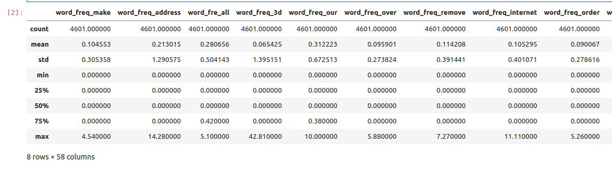
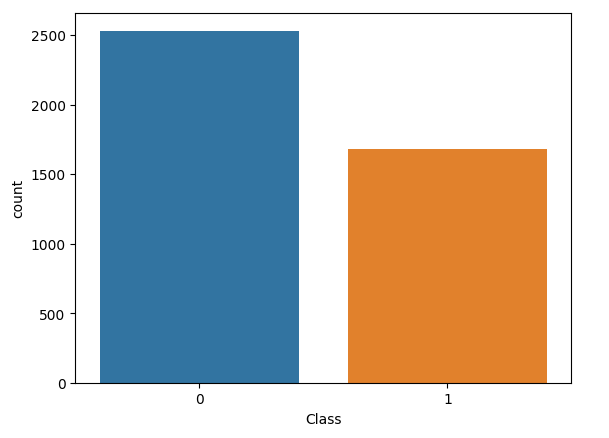
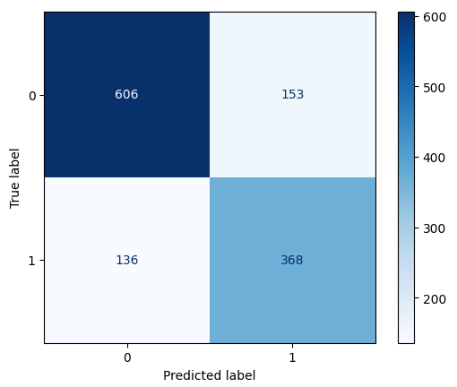

Solution to Spambase Lab
=========================

**Exercise 1.** *Getting and preparing the data.* 
~~~~~~~~~~~~~~~~~~~~~~~~~~~~~~~~~~~~~~~~~~~~~~~~

Begin by downloading the file to your local machine: 

.. code-block:: bash 

    # download zip file 
    $ wget https://archive.ics.uci.edu/static/public/94/spambase.zip

    # unpack file
    $ unzip spambase.zip

    # check files
    $ ls -l 
    -rwx------ 1 jstubbs jstubbs 702942 May 22  2023 spambase.data
    -rwx------ 1 jstubbs jstubbs   6429 May 22  2023 spambase.DOCUMENTATION
    -rwx------ 1 jstubbs jstubbs   3566 May 22  2023 spambase.names
    -rw-rw-r-- 1 jstubbs jstubbs 125537 Feb 15 10:18 spambase.zip

    $ file spambase.data 
    spambase.data: CSV text

    $ head spambase.data
    0,0.64,0.64,0,0.32,0,0,0,0,0,0,0.64,0,0,0,0.32,0,1.29,1.93,0,0.96,0,0,0,0,0,0,0,0,0,0,0,0,0,0,0,0,0,0,0,0,0,0,0,0,0,0,0,0,0,0,0.778,0,0,3.756,61,278,1
    0.21,0.28,0.5,0,0.14,0.28,0.21,0.07,0,0.94,0.21,0.79,0.65,0.21,0.14,0.14,0.07,0.28,3.47,0,1.59,0,0.43,0.43,0,0,0,0,0,0,0,0,0,0,0,0,0.07,0,0,0,0,0,0,0,0,0,0,0,0,0.132,0,0.372,0.18,0.048,5.114,101,1028,1
    0.06,0,0.71,0,1.23,0.19,0.19,0.12,0.64,0.25,0.38,0.45,0.12,0,1.75,0.06,0.06,1.03,1.36,0.32,0.51,0,1.16,0.06,0,0,0,0,0,0,0,0,0,0,0,0,0,0,0,0.06,0,0,0.12,0,0.06,0.06,0,0,0.01,0.143,0,0.276,0.184,0.01,9.821,485,2259,1

Note that the file has no header row. Let's add that: 

.. code-block:: bash 

    # open the file in an editor, e.g., vim, and paste the following line at the top
    "word_freq_make,word_freq_address,word_fre_all,word_freq_3d,word_freq_our,word_freq_over,word_freq_remove,word_freq_internet,word_freq_order,word_freq_mail,word_freq_receive,word_freq_will,word_freq_people,word_freq_report,word_freq_addresses,word_freq_free,word_freq_business,word_freq_email,word_freq_you,word_freq_credit,word_freq_your,word_freq_font,word_freq_000,word_freq_money,word_freq_hp,word_freq_hpl,word_freq_george,word_freq_650,word_freq_lab,word_freq_labs,word_freq_telnet,word_freq_857,word_freq_data,word_freq_415,word_freq_85,word_freq_technology,word_freq_1999,word_freq_parts,word_freq_pm,word_freq_direct,word_freq_cs,word_freq_meeting,word_freq_original,word_freq_project,word_freq_re,word_freq_edu,word_freq_table,word_freq_conference,char_freq_;,char_freq_(,char_freq_[,char_freq_!,char_freq_$,char_freq_#,capital_run_length_average,capital_run_length_longest,capital_run_length_total,Class"

Now, read the file into a pandas DataFrame:

.. code-block:: python3

    >>> import pandas as pd 
    >>> data = pd.read_csv("spambase.csv")

We can check and print the number of rows and columns using different methods; e.g., the ``info()`` funcion: 

.. code-block:: python3 

    >>> data.info()
    <class 'pandas.core.frame.DataFrame'>
    RangeIndex: 4601 entries, 0 to 4600
    Data columns (total 58 columns):
    #   Column                      Non-Null Count  Dtype  
    ---  ------                      --------------  -----  
    0   word_freq_make              4601 non-null   float64
    1   word_freq_address           4601 non-null   float64
    .  .  . 

There are 4,601 rows and 58 columns.

**Exercise 2.** *Data Exploration.*
~~~~~~~~~~~~~~~~~~~~~~~~~~~~~~~~~~~~

First, we compute standard statistics for each of the columns in the dataset, 
including: count, mean, standard deviation, min and max. 

.. code-block:: python3

    >>> data.describe()

Next, we determine if there are any duplicate rows in the data set. If there are 
any duplicate rows, we remove them.

.. code-block:: python3

    # look for duplicate entries in the data
    >>> data.duplicated().sum()
    
    391

    >>> data = data.drop_duplicates()

Next, we determine if there are any missing values in the dataset. There are different ways to do 
this. One way it to look at the output of ``data.info()`` -- it shows that all columns contain 4,601
non-null rows, the number of total rows in the dataset. Alternatively, here is a one-liner that 
provides a True/False response: 

.. code-block:: python3
    
    >>> data.isnull().values.any()
    False

Finally, we determine how many rows are spam and how many are not spam. We know this is controlled 
by the ``Class`` column. Again, there are different techniques. For example, we could use a filter 
to check the number of values for each class label:

.. code-block:: python3
    
    >>> data[data['Class'] == 0]
    . . . 
    [2531 rows x 58 columns]

    >>> data[data['Class'] == 1]
    . . . 
    [1679 rows x 58 columns]

We see there are 2,531 non-spam and 1,679 spam rows. We could also create a count plot to visualize 
this: 

.. code-block:: python3

  >>> import seaborn as sns
  >>> sns.countplot(data=data,x='Class')
  >>> plt.show()

**Exercise 3.** *Split and Fit.*
~~~~~~~~~~~~~~~~~~~~~~~~~~~~~~~~~

We split the data into training and test datasets using the ``train_test_split()`` function. To make sure 
our split is reproducible, we use the ``random_state`` parameter, and to ensure that it maintains roughly 
the proportion of spam and non-spam emails we use the ``stratify`` parameter:

.. code-block:: python3

   >>> from sklearn.model_selection import train_test_split
   >>> X_train, X_test, y_train, y_test = train_test_split(X, y, test_size=0.3, stratify=y, random_state=1)

With the data split, we can train the model. 

.. code-block:: python3

  >>> from sklearn.linear_model import SGDClassifier
  >>> clf = SGDClassifier(loss="perceptron", alpha=0.01)
  >>> clf.fit(X_train, y_train)

**Exercise 4.** *Validation and Assessment.*
~~~~~~~~~~~~~~~~~~~~~~~~~~~~~~~~~~~~~~~~~~~~~

We evaluate our model and the test data: 

.. code-block:: python3

  >>> from sklearn.metrics import accuracy_score
  >>> accuracy_test=accuracy_score(y_test, clf.predict(X_test))
  >>> print('Accuracy on test data is : {:.2}'.format(accuracy_test))
  
  Accuracy on test data is : 0.77

as well as on the training data: 

.. code-block:: python3 

    >>> accuracy_train=accuracy_score(y_train, clf.predict(X_train))
    >>> print('Accuracy on train data is : {:.2}'.format(accuracy_train))

    Accuracy on train data is : 0.72

We plot a confusion matrix for our model: 

.. code-block:: python3 

    >>> from sklearn.metrics import ConfusionMatrixDisplay
    >>> cm_display = ConfusionMatrixDisplay.from_estimator(clf, X_test, y_test,
                                                   cmap=plt.cm.Blues,normalize=None)

This shows that the model predicted that spam emails were non-spam 136 times and predicted that 
non-spam emails were spam 153 times. The model also correctly predicted 606 non-spam emails and 
368 spam emails. 

