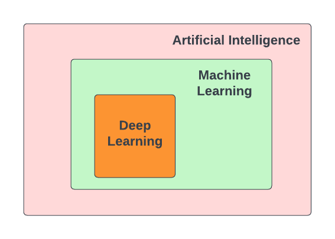
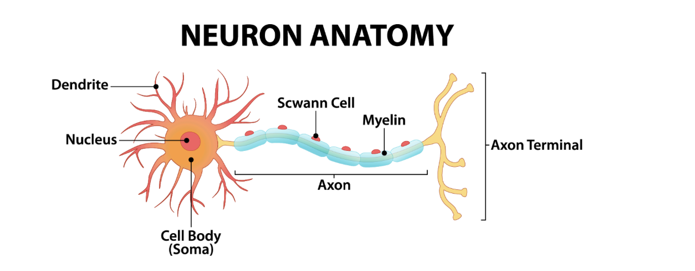
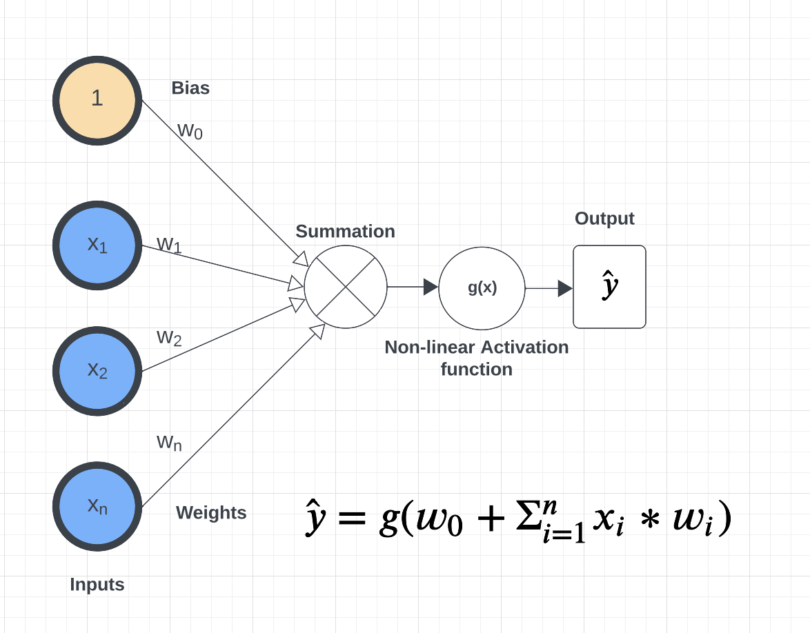
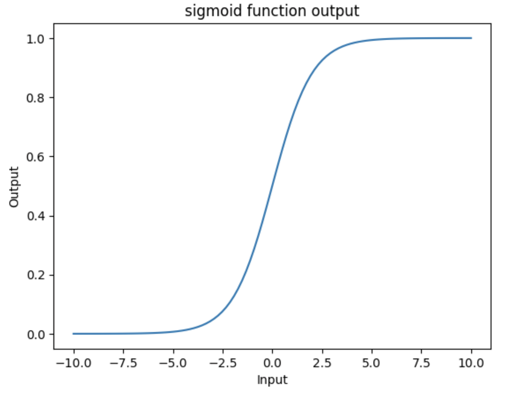
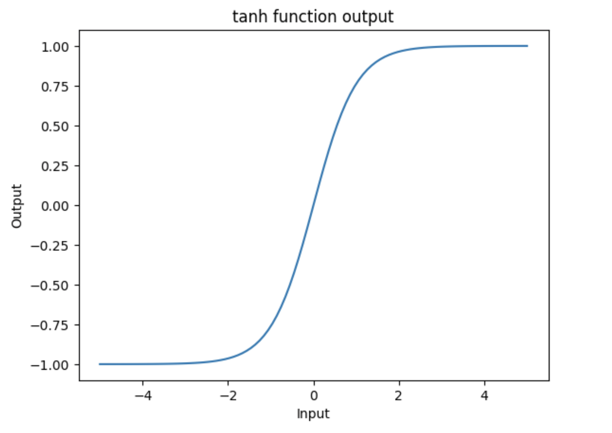
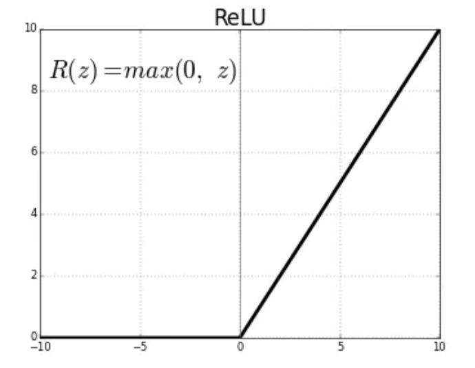
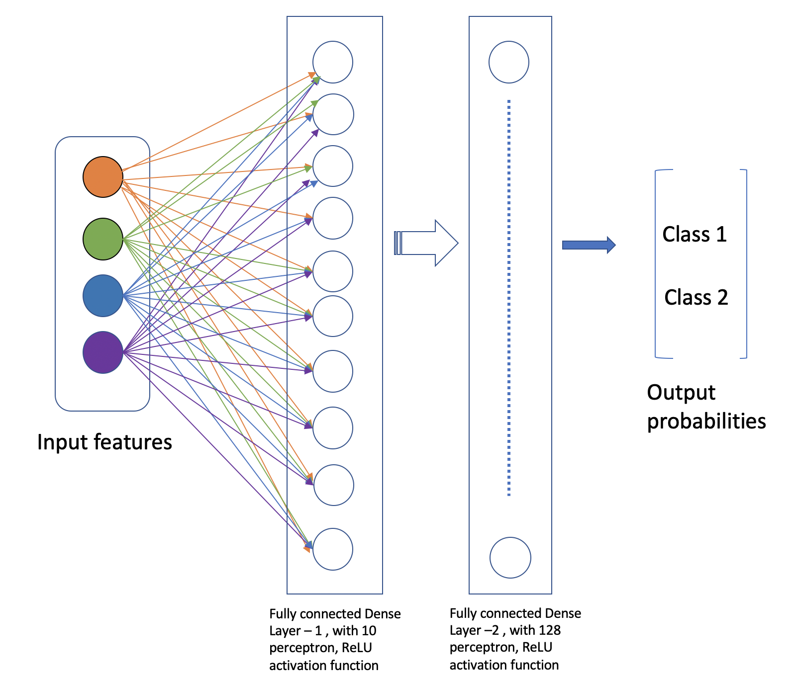

Introduction to Deep Learning
==============================

In recent years, Deep Learning has made remarkable strides. **Deep Learning** is a subfield of 
Machine Learning. Both Deep learning (DL) and Machine learning (ML) are subfields of Artificial
Intelligence (AI). Deep learning has evolved faster in the last few years and is an advanced 
phase of machine learning. The unique thing about Deep Learning is that it makes use 
of **Artificial Neural Networks (ANN)**, which have similarities with the functioning of a human brain.
 

Some of the popular applications that have become integral part 
of our everyday lives are:

**Image and Speech recognition:**
Unlocking smartphones through facial recognition; 
Object identification while driving autonomous cars;
Security cameras installed at our houses, smart door bells.

**Natural Language processing (NLP):**
Chatbots like Siri, Google assistants, and Alexa;
Language translation in real-time using Google Translate

**Recommendation systems:**
Netflix and Amazon for movie recommendation. 

**Robotics:**
Humanoid robots doing mundane human tasks. 

The range of applications is extensive, and each of these examples incorporates deep learning in various ways.

**Why do we care about Deep Learning?** 

Until now the datasets given to us were ``hand-engineered``.For example, the Spambase dataset that we analyzed contained many features
such as word frequency and character frequency that were manually engineered ahead of time for us.
The specific words chosen for the frequencies (there were 48 such) were carefully selected so that 
our ML models could perform moderately well. But from the starting point of the "raw" text emails, 
it is not clear how to engineer those features or which words to choose for the the frequency 
features. 

Extracting meaningful patterns, also known as features, from the data by hand is extremely time 
consuming and non-scalable, and also needs domain knowledge. Using Deep Learning we can delegate this responsibility of feature extraction and prediction to the machine.
Deep learning makes use of Artificial neural networks (ANN), so let's try to understand what are ANN.

.. If you recall the used-cars dataset, it had features such as 
  Engine, Power, Milage, New Price, etc. All these features were used to make predictions for the 
  cost of used cars.

Artificial Neural Networks (ANN)
~~~~~~~~~~~~~~~~~~~~~~~~~~~~~~~~~~~

Artificial neural networks, or just ``neural networks`` for short, have been around for several decades. 
But recently, we are seeing an uptick in the number of applications that make use of neural networks. So let's try to understand what are some of the factors 
that have contributed to the increase in use of neural networks in the recent years.

1. Access to machines with ``GPUs`` (Graphical Processing Unit) to run compute-intensive Deep Learning algorithms.

   - DL tasks involve high dimensional data such as audio, text and images. Processing and analyzing this 
     data needs intensive mathematical computations (matrix multiplications), which can be efficiently done on GPUs.
     For example, the Nvidia Tesla V100 GPU, has about 670 cores for accelerating AI workloads and is available at an affordable cost.

   - Also, training DL models that have millions or billions of trainable parameters (weights and biases), is faster on GPU versus CPU. 

   
2. Availability of advanced machine learning framework such as ``TensorFlow`` [2]. 
   
   - TensorFlow is an ``open-source`` machine learning framework developed by Google. 

   - It provides ecosystem of tools, libraries and resources for building and deploying DL models. 

   - TensorFlow is optimized for performance on GPU and TPU (Tensor Processing Unit - AI accelerator 
     developed by Google for running workloads based off of TensorFlow).

   - With TensorFlow we can build a wide range of ANNs --- from simple, feedforward NNs to 
     complex DL architectures. 

3. Lastly, easy availability of datasets for training DL models.
   For example, the ImageNet [1] project has provided over 14 million free images, which 
   has helped in advancing computer vision research.

**Basic Idea**

Neural networks are mathematical systems that can learn patterns from data and model real-world 
processes. In this sense, a neural network is just another kind of machine learning model like 
the ones we have already studied (Linear Classifiers, KNN, Logistic Regression, etc.).

The basic architecture of a neural network is depicted below. Inputs are fed to a series of layers,
composed of *perceptrons*, before ultimately producing an output. 

.. figure:: ./images/ann-arch-overview.png
    :width: 1000px
    :align: center
    :alt: Neuron Anatomy [1]

A ``perceptron`` is the basic building block of a neural network. It is a simple mathematical object which 
can perform computations on numeric values. The definition of a perceptron is inspired from 
neurons in human brain. The human brain has approximately 82 billion neurons, which work in coordination, 
and are capable of making decisions and acting upon it within few seconds, based on the input signals received 
through our senses.

Perceptron
~~~~~~~~~~~
A *perceptron* is analogous to a single neuron. As mentioned, neural networks are comprised of 
layers of perceptrons. This perceptron is very much like the perceptron algorithm we discussed in Unit 2 
when covering linear classification. 
The basic architecture of a perceptron is depicted below. 

As you can see from the figure above, a perceptron takes an input :math:`x= [x_i]`, of a fixed length, `n`, (that 
is :math:`i= 1,...,n`), 
and maintains a set of *weights*, :math:`w=[w_i]`, of the same length, :math:`n`. Each input is
multiplied by the corresponding weight. For example, :math:`x_1*w_1`, 
:math:`x_2*w_2`, and so on to :math:`x_n*w_n`. We sum the products and finally add the 
:math:`w_0` term, called the *bias*.
Mathematically, the bias term represents the y-intercept of the linear equation associated with the perceptron. 
The bias together with the set of weights (i.e., the set of values :math:`w_0, w_1,...,w_n`) are referred 
to as the parameters of the perceptron. 

Finally, the output is then passed to a non-linear function also known as the *activation function*.
This is the key improvement over the linear classification model we discussed in Unit 2. 

**Why do we need non-linear functions?**
The patterns in the data we encounter in the real world are typically highly non-linear. 
To extract meaningful patterns from these datasets, we need models that are non-linear.
In the upcoming lectures we will cover different types of activation functions such as 
``sigmoid``, ``tanh``, ``ReLU``, and ``softmax``. 

Inference and Training
~~~~~~~~~~~~~~~~~~~~~~

**Inference.**
Inference refers to the process of making predictions, decisions, or drawing conclusions based 
on a trained model and input data.
Given an input, :math:`x=(x_1, ..., x_n)`, we can pass it through a neural network whose first 
layer has number of perceptrons of the same dimension :math:`n`. Each perceptron produces an output 
:math:`y` which can in turn be passed to any number of perceptrons in another layer, which in turn 
produces additional outputs. This process continues until reaching the output layer where a final 
result is computed. The final output is an array of numeric values. 

For classification problems, we impose a scheme to derive a class label from a numeric value in the 
output. As discussed in Unit 2, we can make use of the notion of a *decision function* where, for a 
specific class label, *C*, we predict :math:`x\in C` based on the sign of the decision function --- 
if the output is positive, we predict :math:`x\in C` while if the output is negative, we predict 
:math:`x\not\in C`. Binary classification problems make use of one decision function while multi-label 
classification problems use one decision function for each possible label. 

**Training.** How should we choose values for the parameters (i.e., the :math:`w_0, w_1,...,w_n` for
each perceptron)
to produce a neural network that is a good predictor? Just like with other models we have seen, 
we begin with random values for the weights and iteratively adjust them based some labeled data.
This process is referred to as "model training". 

The basic idea is similar to other models: we define an error function and associated cost function 
and iteratively minimize it by updating the parameters. As in the other cases, we use gradient 
descent to update the parameters in the opposite direction of the gradient. 

If :math:`E` is the error function, then conceptually, given some parameter :math:`w`, we 
would like to update it like so: 

.. math:: 

    w_{new} := w_{prev} - \alpha\frac{\partial E}{\partial w}

where :math:`\alpha` is some small number between 0 and 1 (this is called the "learning rate") and 
:math:`\frac{\partial E}{\partial w}` is the partial derivation of :math:`E` with respect to :math:`w`. 

We find the weights that reduces the error for the entire network. Time permitting we will go over the
basics of backpropogation given in the Supplementary material in this lecture. 

Building A Neural Network By Hand
~~~~~~~~~~~~~~~~~~~~~~~~~~~~~~~~~~

What would it take to build a neural network from basic libraries like numpy? We won't implement a 
complete solution, but let's take a look 
at some of the basic building blocks that we would need.  

Implementing a Perceptron and Layer
^^^^^^^^^^^^^^^^^^^^^^^^^^^^^^^^^^^
To implement a neural network, at a minimum we would need functions to:

1. Create individual perceptrons of a specific size (i.e., *dimension*)
   and initialize and maintain that number of weights equal as well as a bias term.
2. Create layers in our network comprised of a certain number of perceptrons 
   as well as the non-linear activation function to use.
3. Compute the output of a layer for some input of the appropriate shape. 

We could implement a perceptron using a numpy array to hold the weights and bias:

.. code-block:: python3 

    def create_perceptron(dim):
        """
        Create a perceptron of dimension `dim` and initialize it with random weights. 
        """
        # we use dim+1 because we want to have a bias term and `dim` weights
        return np.random.random(dim+1)

We could then implement a layer as a certain number of perceptrons with an activation function: 

.. code-block:: python3 

    def create_layer(num_perceptrons, dim, activation_function):
        """
        Create a layer of `num_perceptrons` perceptron, each of dimension `dim` with activation function `activation_function`.
        Initialize the weights of all perceptrons to a random float between 0 and 1. 
        """
        # represent the layer as a list of dictionary of perceptrons
        layer = []
        for i in range(num_perceptrons):
            layer.append({"weights": create_perceptron(dim), "activation_function": activation_function})
        return layer

We need a way to compute the output of a layer from an input. To do that though, we first need to say a little 
more about activation functions. Let's look at the `sigmoid` activation function in a little more detail. 

The ``sigmoid`` Activation Function
^^^^^^^^^^^^^^^^^^^^^^^^^^^^^^^^^^^
Let's look at the ``sigmoid`` activation function. Mathematically, ``sigmoid`` function is defined as:

.. math::

    f(z) =  \frac{\mathrm{1} }{\mathrm{1} + e^{-z}}

Let's try to write this as a helper function using Python. The code is pretty simple.
You just import numpy and implement the above formula. 
The sigmoid function returns a value between 0 and 1, which can be interpreted as a probability.   

.. code-block:: python3 

    import numpy as np

    def sigmoid(z):
        return 1.0 / (1 + np.exp(-z))

Next, let's try to plot the sigmoid function. 

.. code-block:: python3

    # Import matplotlib, numpy and math 
    import matplotlib.pyplot as plt 
    import numpy as np 
    import math 
    
    x = np.linspace(-10, 10, 100) 
    
    plt.plot(x, sigmoid(x)) 
    plt.xlabel("x") 
    plt.ylabel("Sigmoid(X)") 
    
    plt.show() 

Can someone guess what does the code :code:`x = np.linspace(-10, 10, 100)` do?

What can you infer about the output from the plot, try giving it a different range (-6 and 6)?
It takes any range of real numbers and returns the output value which falls in the range of 0 to 1. 

In summary, the sigmoid function: 

* Is differentiable  
* Maps almost all values to a value either very close to 0 or very close 1. 
* Therefore, sigmoid can be used as a decision function for classification problems. 

The ``tanh`` activation function
^^^^^^^^^^^^^^^^^^^^^^^^^^^^^^^^^
Similar to sigmoid, but better. The range of the tanh function is from (-1 to 1). 
The advantage is that the negative inputs will be mapped strongly negative and the zero inputs 
will be mapped near zero in the tanh graph.

In summary, the tanh function: 

* Is differentiable  
* Mainly used for classification between two classes.

The ``ReLU`` (Rectified Linear Unit) activation function
^^^^^^^^^^^^^^^^^^^^^^^^^^^^^^^^^^^^^^^^^^^^^^^^^^^^^^^^^
The ReLU is most popular and simple activation function used today. It is used in almost all the 
Convolutional Neural network, that we will see in the upcoming lectures. 

Range of output is from 0 to infinity.
f(z) is zero when z is less than zero and f(z) is equal to z when z is above or equal to zero.

Sigmoid and tanh activation functions are mostly used in classification problems
in the output layer. Where as ReLU is mostly used in the hidden or intermediate layers.

Creating Layers and Computing the Output of Layers 
^^^^^^^^^^^^^^^^^^^^^^^^^^^^^^^^^^^^^^^^^^^^^^^^^^
Now that we know how to implement an activation function, we can create a layer with it using 
the create_layer function we defined previously. For example, let's create a layer with 
5 perceptrons of dimension 3 using the sigmoid activation function we just defined:

.. code-block:: python3 

    >>> l1 = create_layer(5, 3, sigmoid)

Next, we need to implement a function to compute the output of a layer from the input of 
another layer. Given an input, ``X``, we need to iterate over all of the perceptrons in 
the layer and compute the dot product with its weights :math:`w_1,...,w_n` -- note we are 
starting with :math:`w_1`, **not** :math:`w_0`. We then need to add the :math:`w_0` term, 
as this is the bias before applying the activation function. The ultimate result will be 
an array of outputs, one for each perceptron in the layer. 

Here is an example implementation: 

.. code-block:: python3 

    def compute_output_for_layer(X, layer):
        """
        Compute the output of a layer for some input, `X`, a numpy array of 
        """
        # our result will be a list of outputs for each perceptron
        result = []
        # for each perceptron in the layer
        for p in layer:
            # compute the dot product of the input with weights w_1, .., w_n and add the bias, w_0
            out = np.dot(X, p['weights'][1:]) + p['weights'][0]
            # then, apply the activation function 
            result.append(p['activation_function'](out))
        return result    

We can now create an input and compute the output of our layer: 

.. code-block:: python3 

    >>> X = [0.8, -2.3, 2.15]
    >>> o1 = compute_output_for_layer(X, l1)
    >>> o1
    [0.294773293601466,
    0.29064381699480163,
    0.7720800756699581,
    0.9238752623623957,
    0.4755367087316097]

If we wanted to add a second layer to our network, we could do that. To pass the output of this 
layer to the input of the next layer, we require the input dimension of the perceptrons in the next 
layer that will process the outputs to be the same input dimension as the output dimension. If we 
want a *fully connected* network, where the output of every perceptron in one layer is passed as an 
input to every perceptron in the next layer, then the input dimension of the next layer must equal 
the number of of perceptrons in the previous layer. 

In the code below, we create a second layer with 2 perceptrons of dimension 5. 

.. code-block:: python3 

    >>> l2 = create_layer(2, 5, sigmoid)

We can pass the output of ``l1`` as the input to ``l2``:

.. code-block:: python3 

    >>> o2 = compute_output_for_layer(o1, l2)
    >>> o2 
    [0.8332717112765128, 0.8277819032135856]

Proceeding in this way, we could create networks of arbitrary depth. Of course, we would also need 
a way to update the weights based on input samples (i.e., training data). Fortunately, we can use a 
library that makes all of this much easier. 

TensorFlow
~~~~~~~~~~~

A very powerful python library for building neural networks called **TensorFlow** is 
available for us to use. Developed by Google, TensorFlow provides both a low-level and a high-level API. 
The high-level API is referred to as Keras and is the API you will almost always want to use unless 
you are implementing your own algorithms for low-level tasks, such as training. We will look at 
Keras in the next section, but in this section we give a quick introduction to the low-level TensorFlow
API.

We begin by importing the library. It is customary to import tensorflow as ``tf``:

.. code-block:: python3 

    import tensorflow as tf 

The basic building block in TensorFlow is the *tensor*. Some of you studying Physics may have
heard of tensors in terms of its use in General Relativity. For this class,
let's just stick to defining tensors as multi-dimensional arrays with a uniform datatype.
You can think of tensors as similar to numpy's ndarrys. 

**In-Class Exercise:** Before we move on, lets create some basic tensors.

1. *Rank-0 or scalar Tensor*. It is a scalar with constant value and no axes.

.. code-block:: python3 

    >>> rank_0_tensor = tf.constant(4)
    >>> print(rank_0_tensor)

If you run the code above, the output should be:  

.. code-block:: python3 

    tf.Tensor(4, shape=(), dtype=int32)

From Linear Algebra you may recall that scalars only have magnitude but no direction. Hence, a rank-0 or
scalar tensor has no shape.

2. *Rank-1 tensor*. You can simply consider it as 1-D array.

.. code-block:: python3 

    # Let's make this a float tensor.
    >>> rank_1_tensor = tf.constant([2.0, 3.0, 4.0])
    >>> print(rank_1_tensor)

What is the output of above code?

Can you construct a rank-2 tensor or simply a 2X3 matrix?

.. code-block:: python3 

    >>> rank_2_tensor = tf.constant([[1,2,4],
                                     [5,6,7]])
    >>> print(rank_2_tensor)

Similarly, we can create higher order tensors. See the documentation for more information [3].

TensorFlow also provides implementations of the mathematical functions which we will be 
using when building Neural Networks. For example, we can use off the shelf TensorFlow functions 
for the activation functions we want to use in our perceptrons.

Examples:

.. code-block:: python3 

    tf.math.sigmoid(z)
    tf.math.tanh(z)
    tf.nn.relu(z)

You would have noticed the last one is taken from the neural networks API (i.e., the ``nn`` module) 
of TensorFlow.
You can also get similar APIs from **TensorFlow Keras**, which we are also going to use  
for building Neural Networks.

Let's try to build a simple neural network using Keras.

Building a First Neural Network with TensorFlow Keras
~~~~~~~~~~~~~~~~~~~~~~~~~~~~~~~~~~~~~~~~~~~~~~~~~~~~~

TensorFlow Keras refers to the high-level neural networks API provided by TensorFlow. 
Keras is integrated directly into TensorFlow, making it easy to build and train neural 
networks with TensorFlow as the backend.

In the example below, you will see how easy it is to build a simple neural network
with Keras. We will build a *sequential* model to classify the Iris dataset we looked at in Unit 2. 
A sequential model is a network where the layers are stacked up one after another in a linear fashion.

Loading the Data
^^^^^^^^^^^^^^^^

Before we get started building the model, let's import the dataset and remember its basic characteristics: 

.. code-block:: python3 

    >>> from sklearn import datasets
    >>> iris = datasets.load_iris()
    
    # the independent variables 
    >>> iris.data.shape
    (150, 4)

    # the dependent variables 
    >>> iris.target.shape
    (150, 0)

Let's first consider just a binary classification problem by restricting to the first 100 rows. Let's 
also convert the target to a categorical type. 

.. code-block:: python3 

    # first 100 rows have target value 0 or 1
    >>> X = iris.data[:100]
    >>> y = iris.target[:100]

    # convert target to categorical
    >>> import pandas as pd 
    >>> y = pd.get_dummies(y, drop_first=False)

Building the Model 
^^^^^^^^^^^^^^^^^^

Step 1: Import Modules from Keras and Initialize the Model
^^^^^^^^^^^^^^^^^^^^^^^^^^^^^^^^^^^^^^^^^^^^^^^^^^^^^^^^^^

Since we will be creating a sequential neural network model we import Sequential from Keras.model. 
We will also have one or more densely connected hidden layer, hence we import Dense from Keras.Layers.

.. code-block:: python3 

    from keras.models import Sequential
    from keras.layers import Dense

We use the ``Sequential()`` constructor to create a new model object: 

.. code-block:: python3 

    model = Sequential()

Step 2: Add Layers to the Model
^^^^^^^^^^^^^^^^^^^^^^^^^^^^^^^

We add layers to the model using the add method. In this case:

* The first layer added is a dense (fully connected) layer with 10 perceptrons and an input_dim=4. 
  We could have chosen any number of perceptrons here, but we must specify an input dimension since it is the 
  first layer. Moreover, the input dimension must match the shape -- i.e., number of features -- of our input.
  Since there are 4 features in the Iris dataset, we use an input dimension of 4. Finally, we use the 
  ``ReLU`` activation function. 
* The second layer added is another dense layer with 128 perceptrons. Note that we do not specify an input 
  dimension because Keras can infer the dimension because it must match the output dimension from the 
  previous layer. (Question: what should the input dimension be)?
* The third layer will be the last layer in our model. This layer represents the output layer so we need 
  the output dimension (i.e., the number of perceptrons) to match the number of labels in our target.
  Since there are 2 possible labels (0 and 1), we use a layer with 2 perceptrons. And again, like the previous 
  layer, we do not need to specify the input dimension as it can be inferred from the output dimension 
  of the previous layer. Finally, we use the sigmoid activation function. 

.. code-block:: python3 

    # One input layer can have any number of neurons; we chose 10, however,
    # the input dimension must match the number of features in the independent variable -- therefore, we set 
    # it to 4 
    model.add(Dense(10, input_dim=4, activation='relu'))

    # we can add any number of hidden layers with any number of neurons; here we choose 1 layer with 128 neurons. The
    # hidden layers should all use RELU
    model.add(Dense(128, activation='relu'))
    # sigmoid activation function is selected for binary classification; there are 2 neurons in this
    # last layer because there are 2 target labels to predict (it matches the shape of y)
    model.add(Dense(2, activation='sigmoid'))

Step 3: Compile the Model and Check Model Summary 
^^^^^^^^^^^^^^^^^^^^^^^^^^^^^^^^^^^^^^^^^^^^^^^^^^

We compile the model, specifying the optimizer (Adam), the loss function (binary crossentropy, suitable 
for binary classification problems), and metrics to evaluate during training (accuracy).
We haven't really discussed optimizers before this, but the key point to remember is that it is an 
algorithm used to update the weights and biases of the model during training in order to minimize the 
loss function and improve the model's performance.

Time permiting we will look at different types of optimizers.

.. code-block:: python3 

    model.compile(optimizer='adam', loss='binary_crossentropy', metrics=['accuracy'])

Let's now print and explore the model summary:

.. code-block:: python3 

    model.summary()

The output should look similar to the following: 

.. code-block:: python3

    Model: "sequential"
    _________________________________________________________________
    Layer (type)                Output Shape              Param #   
    =================================================================
    dense (Dense)               (None, 10)                50        
                                                                    
    dense_1 (Dense)             (None, 128)               1408      
                                                                    
    dense_2 (Dense)             (None, 2)                 258       
                                                                    
    =================================================================
    Total params: 1716 (6.70 KB)
    Trainable params: 1716 (6.70 KB)
    Non-trainable params: 0 (0.00 Byte)
    
    
Let's break down the summary:

**Model.** The type of model of listed, in this case it is a Sequential model

**Layer (type).** 
Each layer in the model is listed along with its type. For example, "dense"
indicates a fully connected layer. Recall that we had 3 total layers: one input layer with 
10 perceptrons, one "hidden" layer with 128 perceptrons, and one
output layer with 2 perceptrons. 

**Output Shape.** The output shape of each layer. The ``(None, 10)`` means that the output of this 
particular layer is a 2D tensor with a variable batch size and 10 elements in the second dimension.
Note that the output dimension is the same as the number of perceptrons for the layer, which is what we would
expect for a fully connected network (i.e., dense layers). 

**Param #.** The number of parameters (weights and biases) in each layer.
In the first dense layer there are 10 perceptrons, each with a total of 5 parameters -- 
the input dimension was 4 and there is a bias term. Therefore, the first layer has a total of 
:math:`5*10 = 50` parameters. 

Similarly, the second layer has 128 perceptrons each with an input dimension equal to the output dimension of 
the first layer, which is 10. Thus, each of the 128 perceptrons has :math:`10+1=11` parameters, and therefore the 
entire layer has :math:`128*11 = 1408` parameters. 

..
    8 weights (count the number of connections from 2 inputs neurons to 4 neurons in the layer 1) and 4 bias (one for each neuron). Summing them together to get 12 parameters.
    In the output layer there are 4 connection from previous layer to output neuron + 1 bias term, making it to total 5

*Exercise.* Convince yourself that there are 258 parameters in the last layer. 

Step 4: Train the model. 
^^^^^^^^^^^^^^^^^^^^^^^^

Just like when using sklearn, once we have our model constructed we are ready to train the model. We use the 
``fit()`` function, like with sklearn, but keep in mind this is a different ``fit()`` function that takes different 
arguments. We'll look at just a few of the more important ones here: 

* ``x`` and ``y`` -- The input and target data, respectively. A number of valid types can be passed here, 
  including numpy arrays, TensorFlow tensors, Pandas DataFrames, and others. 
* ``epochs`` -- The number of complete passes over the entire input and output dataset that will be performed 
  during training.
* ``batch_size`` -- The number of samples per gradient update.
* ``validation_split`` -- The percentage, a a float, of the dataset to hold out for validation. Keras will
  compute the validation score at the end of each epoch. 
* ``verbose`` -- (0, 1, or 2). An integer controlling how much debug information is printed during training. 
  A value of 0 suppresses all messages. 

.. code-block:: python3 

    >>> model.fit(X, y, validation_split=0.2, epochs=20, batch_size=128, verbose=2)

    Epoch 1/20
    1/1 - 0s - loss: 0.5912 - accuracy: 0.6250 - val_loss: 0.7342 - val_accuracy: 0.0000e+00 - 60ms/epoch - 60ms/step
    Epoch 2/20
    1/1 - 0s - loss: 0.5837 - accuracy: 0.6375 - val_loss: 0.7001 - val_accuracy: 0.4500 - 21ms/epoch - 21ms/step
    Epoch 3/20
    1/1 - 0s - loss: 0.5777 - accuracy: 0.8000 - val_loss: 0.6726 - val_accuracy: 0.8000 - 21ms/epoch - 21ms/step
    Epoch 4/20
    1/1 - 0s - loss: 0.5727 - accuracy: 0.9625 - val_loss: 0.6510 - val_accuracy: 0.9500 - 20ms/epoch - 20ms/step
    Epoch 5/20
    1/1 - 0s - loss: 0.5682 - accuracy: 1.0000 - val_loss: 0.6344 - val_accuracy: 1.0000 - 21ms/epoch - 21ms/step
    Epoch 6/20
    1/1 - 0s - loss: 0.5639 - accuracy: 1.0000 - val_loss: 0.6221 - val_accuracy: 1.0000 - 21ms/epoch - 21ms/step
    Epoch 7/20
    1/1 - 0s - loss: 0.5595 - accuracy: 1.0000 - val_loss: 0.6132 - val_accuracy: 1.0000 - 21ms/epoch - 21ms/step
    Epoch 8/20
    1/1 - 0s - loss: 0.5546 - accuracy: 1.0000 - val_loss: 0.6070 - val_accuracy: 1.0000 - 21ms/epoch - 21ms/step
    Epoch 9/20
    1/1 - 0s - loss: 0.5492 - accuracy: 1.0000 - val_loss: 0.6030 - val_accuracy: 1.0000 - 20ms/epoch - 20ms/step
    Epoch 10/20
    1/1 - 0s - loss: 0.5433 - accuracy: 1.0000 - val_loss: 0.6007 - val_accuracy: 1.0000 - 21ms/epoch - 21ms/step
    Epoch 11/20
    1/1 - 0s - loss: 0.5368 - accuracy: 1.0000 - val_loss: 0.5996 - val_accuracy: 1.0000 - 21ms/epoch - 21ms/step
    Epoch 12/20
    1/1 - 0s - loss: 0.5299 - accuracy: 1.0000 - val_loss: 0.5994 - val_accuracy: 1.0000 - 21ms/epoch - 21ms/step
    Epoch 13/20
    1/1 - 0s - loss: 0.5227 - accuracy: 1.0000 - val_loss: 0.5999 - val_accuracy: 1.0000 - 21ms/epoch - 21ms/step
    Epoch 14/20
    1/1 - 0s - loss: 0.5153 - accuracy: 1.0000 - val_loss: 0.6010 - val_accuracy: 1.0000 - 21ms/epoch - 21ms/step
    Epoch 15/20
    1/1 - 0s - loss: 0.5080 - accuracy: 1.0000 - val_loss: 0.6024 - val_accuracy: 1.0000 - 22ms/epoch - 22ms/step
    Epoch 16/20
    1/1 - 0s - loss: 0.5008 - accuracy: 1.0000 - val_loss: 0.6041 - val_accuracy: 1.0000 - 21ms/epoch - 21ms/step
    Epoch 17/20
    1/1 - 0s - loss: 0.4938 - accuracy: 1.0000 - val_loss: 0.6059 - val_accuracy: 1.0000 - 21ms/epoch - 21ms/step
    Epoch 18/20
    1/1 - 0s - loss: 0.4872 - accuracy: 1.0000 - val_loss: 0.6076 - val_accuracy: 0.9500 - 20ms/epoch - 20ms/step
    Epoch 19/20
    1/1 - 0s - loss: 0.4809 - accuracy: 1.0000 - val_loss: 0.6086 - val_accuracy: 0.9500 - 20ms/epoch - 20ms/step
    Epoch 20/20
    1/1 - 0s - loss: 0.4748 - accuracy: 1.0000 - val_loss: 0.6089 - val_accuracy: 0.9500 - 21ms/epoch - 21ms/step

You can read more about the parameters available to the ``fit()`` function in the documentation [6].

Step 5: Pass Input Data and Make Predictions
^^^^^^^^^^^^^^^^^^^^^^^^^^^^^^^^^^^^^^^^^^^^

We create a list input_data containing some input examples from the Iris dataset
and then use the predict method of the model to obtain predictions for these inputs. 
Since the model is untrained, these predictions may not be meaningful.

.. code-block:: python3

    input_data = [[0, 1 , 0 , 1], [1, 0, 1 , 1], [1, 1, 1, 0]]
    predictions = model.predict(input_data)

With these steps we were able to set up a simple feedforward neural network using Keras with two dense layers (input and output) and specify the model's architecture, compilation parameters, and makes predictions on some input data. 
However, without training, the model's weights are randomly initialized, so the predictions may not be accurate. 
Training the model using **backpropagation** is necessary to adjust the weights and make accurate predictions.

**Exercise:** Can you walk through this code and tell what's happening?

.. code-block:: python3

    from keras.models import Sequential
    from keras.layers import Dense

    model = Sequential()

    model.add(Dense(64, input_dim=10, activation='relu',))
    model.add(Dense(32, activation='relu'))
    model.add(Dense(1, activation='sigmoid'))

    model.summary()

Supplement: Feed-Forward Networks and Backpropagation
~~~~~~~~~~~~~~~~~~~~~~~~~~~~~~~~~~~~~~~~~~~~~~~~~~~~~~
If :math:`E` is the error function, then conceptually, given some parameter :math:`w`, we 
would like to update it like so: 

.. math:: 

    w_{new} := w_{prev} - \alpha\frac{\partial E}{\partial w}

where :math:`\alpha` is some small number between 0 and 1 (this is called the "learning rate") and 
:math:`\frac{\partial E}{\partial w}` is the partial derivation of :math:`E` with respect to :math:`w`. 
But how do we view the error as a function of a given parameter, :math:`w`, and, moreover, how do 
compute the partial derivative? 

In the case of a neural network with layers of perceptrons, each with their own parameters, 
the relationship between the error function and a specific parameter, :math:`w`, depends on the location 
of the parameter in the network. 

To illustrate, let us assume that the network is structured so that outputs of perceptrons on one 
layer get fed as inputs to the next layer -- that is, there are no cycles or "loops" between 
perceptrons across layers. Such neural networks are called "feed-forward networks" because the outputs 
are fed forward. 

In such a network, we can think of the individual layers as intermediate functions that the input passes 
through. Let us assume we have :math:`n` layers and let :math:`L_j` denote the function for layer 
:math:`j`. Then, conceptually, we compute an output :math:`y` from an input :math:`X` by passing it through 
each layer:

.. math:: 

    y = L_n( L_{n-1} ( \ldots ( L_2 (L_1(x)) ) \ldots ) )

or, in function composition notation:  

.. math:: 

    y = L_n \circ L_{n-1} \circ \ldots \circ L_2 \circ L_1(x)

Since the error is similar to the difference between the output and some constant, we have 

.. math:: 

    E \approx L_n \circ L_{n-1} \circ \ldots \circ L_2 \circ L_1(x) - y_{actual}

Any parameter :math:`w` is a parameter of some perceptron in some layer. This shows that the error is 
indeed a function of every parameter. But what would be involved in computing the partial derivatives? 

If the :math:`w` we are interested in is in the last layer (i.e., :math:`L_n` or the "output layer"), then 
in fact this is a straightforward partial derivative. On the other hand, for :math:`w` in an intermediate 
layer, to compute the partial derivative we will need to use the chain rule and the result will involve 
the layers after it. For example, for a network with two layers: 

.. math:: 

    E \approx L_2 \circ L_{1}(w)     
    \implies

    \frac{\partial E}{\partial w} \approx \frac{\partial L_2}{\partial L_1}\frac{\partial L_1}{\partial w}

This suggests that we compute the derivatives "backwards" -- that is, starting with the last layer 
and working back through the network to the first layer. This process is called "backpropagation" and is 
an important algorithm for updating the weights in a neural network.

.. 
    When input data is fed into a perceptron during training, it produces predicted 
    values referred to as y hat. These predictions aim to closely match the actual target values. 
    To accomplish this objective, the neural network initiates with random weights and iteratively 
    refines them. This refinement process involves calculating derivatives with respect to each weight, 
    enabling the model to progressively adjust its predictions to align closely with the actual values 
    is known as Backpropagation. We will deep dive into this topic in the upcoming lectures. But for now, 
    remember that Backpropagation enables the model to train better.

References:

1. ImageNet[https://www.image-net.org/index.php]
2. TensorFlow [https://www.tensorflow.org]
3. Creating tensors [https://www.tensorflow.org/guide/tensor]
4. Bias [https://towardsdatascience.com/why-we-need-bias-in-neural-networks-db8f7e07cb98]
5. Keras [https://www.tensorflow.org/guide/keras]
6. Keras Documentation: Model fit. https://www.tensorflow.org/api_docs/python/tf/keras/Model#fit

