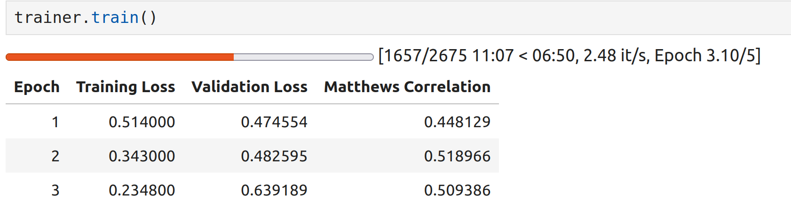

Fine-Tuning Transformers 
=========================

In this module, we provide a detailed introduction to *transfer learning* with the transformers 
library, and we walk though a detailed example of using fine-tuning to train an LLM to 
improve performance on a benchmark. 

By the end of this module, students should be able to:

Introduction
------------

As we have discussed previously, many so called "foundational" transformer models have been 
trained on large amounts of data to learn the general structure of the input space (e.g., language).
By themselves, they are not necessarily well suited for any specific task. To get good performance 
on a specific task, a common approach is to *fine-tune* the model with a (relatively smaller) 
labeled dataset. This fine-tuning phase essentially consists of another training phase, but one 
where we start with the pre-trained transformer weights that already encode significant information 
about the structure of the input space. 

As usual, we'll illustrate the techniques with a concrete example. We'll use the transformers 
library to fine-tune a BERT model on an NLP task we haven't looked at much yet: classifying 
sentences as either grammatically correct or containing a grammatical error. To fine-tune a model, 
one requires a labeled dataset. Fortunately, the GLUE benchmark we discussed in the last module 
includes a dataset we can use for exactly this task. If you have a different task you would like 
to fine-tune a model on, you might look for a benchmark or other sources of publicly available 
datasets. 

Loading and Inspecting the Data 
--------------------------------

We'll use the COLA (Corpus of Linguistic Acceptability) dataset from the GLUE benchmark. Fortunately, 
this dataset is available directly from the HuggingFace Hub. Moreover, we can use the ``datasets`` 
library, a kind of companion library to transformers, to work with these datasets. The ``load_dataset()``
function makes it easy to download any dataset from the Hub:

.. code-block:: python3 

    from datasets import load_dataset
    dataset = load_dataset("glue", "cola")
    dataset
    ->
    DatasetDict({
        train: Dataset({
            features: ['sentence', 'label', 'idx'],
            num_rows: 8551
        })
        validation: Dataset({
            features: ['sentence', 'label', 'idx'],
            num_rows: 1043
        })
        test: Dataset({
            features: ['sentence', 'label', 'idx'],
            num_rows: 1063
        })
    })    

The ``load_dataset()`` function returns a ``DatasetDict`` which automatically splits the data into 
train, validation and test for us. Note also that metadata about the dataset as well as the dataset 
files themselves will be downloaded from the HF Hub directly to your HF .cache directory. The 
dataset files are not necessarily immediately downloaded, but they will be downloaded as soon as you 
start to access them in code. 

Let's take a look at a couple of random elements to get a sense for the data: 

.. code-block:: python3 

    print(dataset['train'][0], dataset['train'][18])
    -> {'sentence': "Our friends won't buy this analysis, let alone the next one we propose.", 
        'label': 1, 
        'idx': 0} 
       {'sentence': 'They drank the pub.', 
        'label': 0, 
        'idx': 18
        }

This looks pretty straight-forward: we have a sentence and a label as well as an index. What do you 
think the label values 0 and 1 mean? We can confirm our guess with the ``features`` attribute 
of the dataset object; 

.. code-block:: python3 

    dataset['train'].features
    -> {'sentence': Value(dtype='string', id=None),
        'label': ClassLabel(names=['unacceptable', 'acceptable'], id=None),
        'idx': Value(dtype='int32', id=None)
        }

We see that indeed, the 0 label corresponds to 'unacceptable' and the 1 label corresponds to 
'acceptable'. 

Preprocessing the Training Data 
--------------------------------
From the previous modules, we know that we will need to preprocess our training data, including 
tokenizing the input strings. We also need to worry about batching and padding our input. 

There are a couple of methods we can use here. With the first method, we simply use the tokenizer 
object directly on our datasets, e.g., 

.. code-block:: python3 

    tokenized_dataset = tokenizer(datasets["train"], padding=True, truncation=True)

While conceptually simpler, this first method comes with some downsides. First, it requires that we load 
and keep the entire dataset into memory. It also returns a plain Python dictionary instead of a Dataset 
object. Additionally, it pads the dataset using the largest input in the entire set, which 
is inefficient. 

Instead, we will use a different approach. We will define a function which knows how to preprocess a 
single input or a batch of inputs. We can then use the ``map`` function to apply our function in 
batches. This will be significantly more efficient, especially for larger datasets.

In fact, our preprocess function is quite simple; all we need to do is get the ``sentence`` out of 
the sample passed in and tokenize it. Of course, we need to instantiate our tokenizer. We'll use 
the ``AutoTokenizer.from_pretrained()`` as before, passing our checkpoint. For the purposes of this 
example we'll use the ``distilbert-base-uncased`` which is significantly smaller than the base BERT 
(which will make training times more reasonable) but achieves similar performance. 

.. code-block:: python3 

    from transformers import AutoTokenizer

    checkpoint = "distilbert-base-uncased"
    tokenizer = AutoTokenizer.from_pretrained(checkpoint, use_fast=True)

    def preprocess(sample):
        return tokenizer(sample["sentence"], truncation=True)

Note that our ``preprocess`` function works equally well whether the input ``sample`` is a 
single input or a batch of inputs; either way, we can still access the ``"sentence"`` key 
and pass those to the tokenizer, which we know supports a batch-style API. 

You might be wondering about our use of the ``truncation=True`` flag; that is because our 
dataset could have an input 
sequence that is longer than the maximum allowable sequence for the model. Every model has a limit 
governed by the size of the input layer, and we cannot exceed that. 

You might also be wondering about padding; we will deal with that separately in a minute. 

With the code above in place, we're ready to apply the pre-processing to our dataset. As mentioned, 
we use ``map()`` function associated with our dataset, passing in our ``preprocess`` function. We 
also pass ``batched=True`` to allow it to batch the inputs which is more efficient:

.. code-block:: python3 

    tokenized_dataset = dataset.map(preprocess, batched=True)

Now, we still need to deal with padding. We want to only apply the padding needed for a given batch, 
to minimize the padding used and save space. To do this, we'll introduce the idea of a *collator* 
function. In general, a collator function is used for putting together samples inside a batch. 
We're able to do any kind of processing we want to do during while the collator is executing and 
deciding on which elements go into the next batch. What we want to do is figure out the maximum size 
of the inputs going into a given batch, and set the padding for all the other inputs accordingly. 

We could certainly write out own collator to do this, but transformers provides for us that does 
the right padding for the given tokenizer. To use it, all we have to do is instantiate a 
``DataCollatorWithPadding`` object, passing our tokenizer: 

.. code-block:: python3 

    from transformers import DataCollatorWithPadding
    data_collator = DataCollatorWithPadding(tokenizer=tokenizer)

We'll use the ``data_collator`` object when we train the model in the next section. 

Training the Model 
------------------

In this section we'll actually train out model. There are a few steps to doing that: defining 
a metric for evaluating our model, defining a ``TrainingArguments`` instance, which is similar to 
defining the configuration/hyperparameters for training, and finally, instantiating the 
``Trainer`` object and calling the ``train()`` method. Let's look at each in turn. 

Defining the Model Metric 
^^^^^^^^^^^^^^^^^^^^^^^^^

We're almost ready to train our model, but we need one more crucial component --- we need to define 
the metric that will be used to evaluate the model. 

Recall that we are using the COLA dataset associated with the GLUE benchmark. Like other benchmarks, 
COLA includes a metric as well. We want to use that for evaluating our model. 

We can load the metric associated with our dataset using the ``load`` function of the 
``evaluate`` library. The ``evaluate`` library is another sibling library of transformers that 
can be used for evaluating models. 

.. code-block:: python3 

    from evaluate import load
    metric = load('glue', 'cola')

We can't quite use this metric in its current state. We need to provide a function that takes an 
``EvalPrediction`` object, which is a tuple with a ``logits`` field and a ``labels`` field, and returns 
a dictionary mapping strings to floats, where the strings are the names of the metrics returned and 
the floats are the actual values for each metric. The ``metric`` object we just loaded has a 
``compute()`` method that will return a dictionary in the right form; we just need to pass it 
actual ``predictions`` and ``labels``, which means we will need to do a tiny bit of post-processing. 

Recall that our model will return logits and we most post-process them to make an actual 
prediction. In the previous lecture we applied an activation function (softmax) to get a probability 
and then compared the values. But since this is a classification problem, all we really need to do 
is figure out which label had the largest value. We could do that using the ``argmax`` from numpy.
But, we always must keep in mind that these are batch APIs, so we want to take the argmax with 
respect to the second (i.e., last) axis.

.. code-block:: python3 

    import numpy as np 

    def compute_metrics(preds):
        logits, labels = preds
        predictions = np.argmax(logits, axis=-1)
        return metric.compute(predictions=predictions, references=labels)    

Defining ``TrainingArguments``
^^^^^^^^^^^^^^^^^^^^^^^^^^^^^^

.. code-block:: python3 

    from transformers import AutoModelForSequenceClassification, TrainingArguments, Trainer

    batch_size = 16 # can experiment with different sizes 
    args = TrainingArguments(
        f"distilbert-finetuned-cola", # directory to save the model
        evaluation_strategy = "epoch", # evaluate after each epoch
        save_strategy = "epoch", # save after each epoch
        learning_rate=2e-5, # the learning rate to use
        per_device_train_batch_size=batch_size, # the batch size
        per_device_eval_batch_size=batch_size,
        num_train_epochs=5, # number of epochs; 5 took about 30 minutes
        weight_decay=0.01,
        load_best_model_at_end=True,
        metric_for_best_model="matthews_correlation" # metric associated with COLA GLUE
    )

Defining ``Trainer``
^^^^^^^^^^^^^^^^^^^^

.. code-block::

    # autoload a model from the base for sequence classification, 
    # we pass 2 labels since this is binary classification. 
    model = AutoModelForSequenceClassification.from_pretrained(checkpoint, num_labels=2)

    trainer = Trainer(
        model,  # the pre-trained model
        args,  # the TrainingAgruments, defined above
        train_dataset=tokenized_dataset["train"], # the training dataset
        eval_dataset=tokenized_dataset["validation"], # the validation dataset
        tokenizer=tokenizer, # our tokenizer
        data_collator=data_collator, # the collator we defined above
        compute_metrics=compute_metrics # our function for computing the metrics
    ) 

We are now ready to call ``train()`` to fine-tune our model! 

.. code-block:: python3 

    trainer.train()

You should see output similar to this:

    Output from trainer.train()

Note that this could take between 20 and 30 minutes for 5 epochs on the class VM. 
The model will be saved in the directory provided to the TrainingArguments (in my case above, the 
``distilbert-finetuned-cola`` directory in the current working directory) based on the saving 
strategy defined. 

Loading and Saving Models 
--------------------------

Saving and loading models is straight-forward. We can load a model we have saved to disk using  
using the same ``AutoModel`` class that we used for training. We just need to pass the name of the 
directory where we saved the model, e.g., 

.. code-block:: python3 

    model = AutoModelForSequenceClassification.from_pretrained('distilbert-finetuned-cola')

    
If we need to save a model we have created through another means (e.g., not part of a training run), 
we can always use the ``.save_pretrained()`` method:

.. code-block:: python3 

    model.save_pretrained("<some_directory")

.. code-block:: python3 

