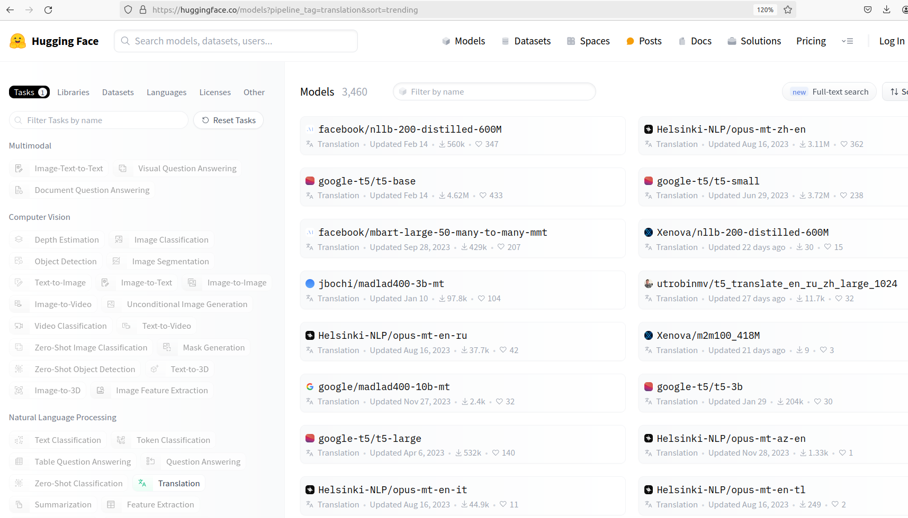
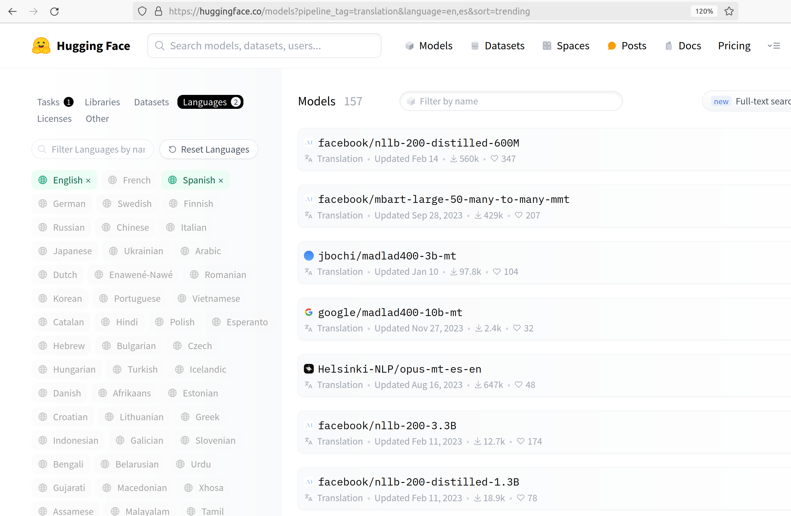
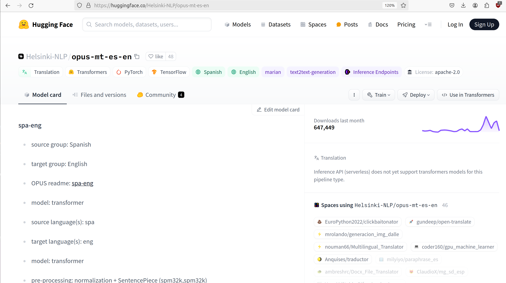
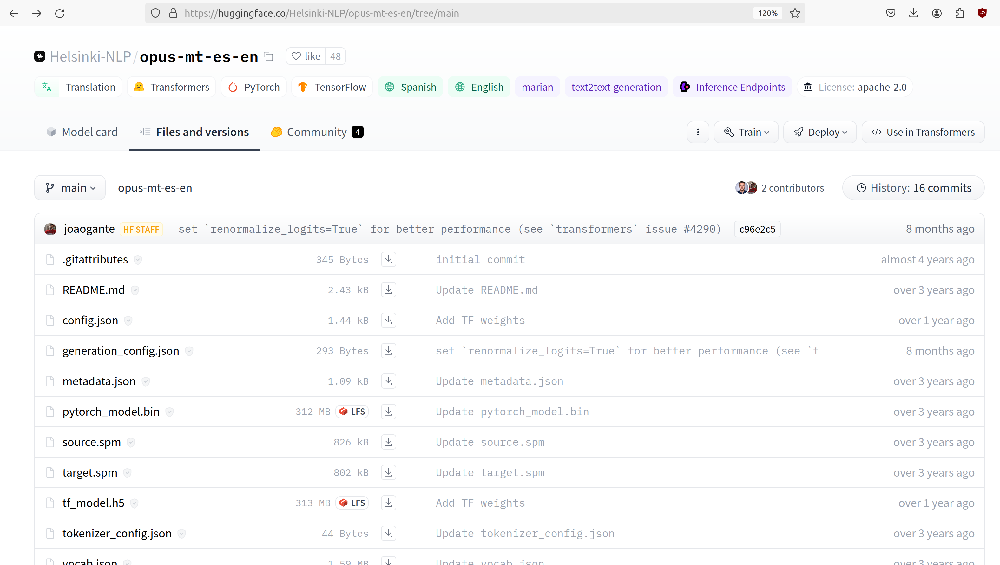
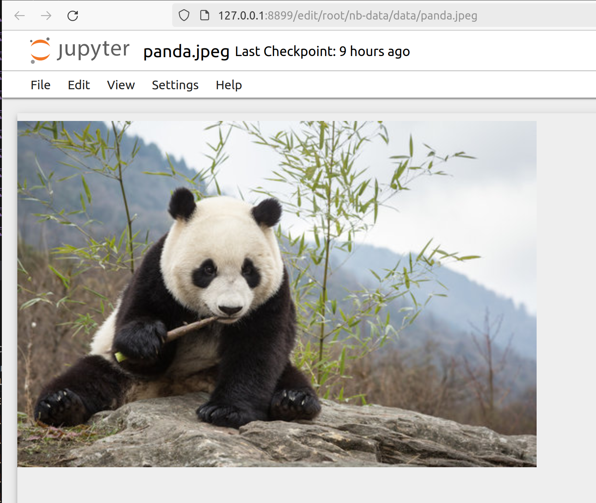

Hands-on Transformers 
=====================

In this module, we introduce the ``transformers`` library from Hugging Face and we show some 
initial examples of working with pre-trained models for solving NLP tasks. 

By the end of this module, students should be able to: 

1. Use pipeline objects to work with pre-trained models on a number of NLP tasks.
2. Understand the basic components of a pipeline, including data preprocessing, 
   model application and post-processing.
3. Understand how to use a Tokenizer to convert text to numerical inputs and to 
   convert numerical values back to text, including different variants on the API 
   (returning tensors, batching, padding, etc).
4. Work with (pre-trained) model checkpoints from the HuggingFace Hub in various ways, including 
   with attention heads for different NLP tasks. 
   

Introduction to Pipelines 
-------------------------
As we mentioned briefly in the previous module, ``pipeline`` objects from the transformers library 
are basic abstractions that simplify interactions with large models. We'll look at the steps 
of a pipeline in more detail momentarily, but first let's see some basic examples.  

The simplest way to create a pipeline is to use the ``pipeline`` function and pass a specific 
task type. For example, we can create a pipeline by specifying the English to French translation 
task type, ``translation_en_to_fr``:

.. code-block:: python3

    from transformers import pipeline
    en_to_fr_translator = pipeline("translation_en_to_fr")

This bit of code first looks up the default model for this task type and checks whether that model 
has already been downloaded to your huggingface cache directory. If not, it downloads it to the 
cache directory and then instantiates the model. 

(Note that, by default, the huggingface cache directory is ``~/.cache/huggingface``, but you can 
change that by setting the ``$HF_HOME`` environment variable). 

We can now pass it some input and directly get some output: 

.. code-block:: python3 

    en_to_fr_translator("Hello, my name is Joe.")
    -> [{'translation_text': 'Bonjour, mon nom est Joe.'}]

We can pass it multiple inputs as well, as a Python list: 

.. code-block:: python3 

    en_to_fr_translator(["Machine learning is a branch of Artificial Intelligence", 
                     "The United States Declaration of Independence was written in 1776."])
    -> [{'translation_text': 'L’apprentissage automatique est une branche de l’intelligence artificielle'},
        {'translation_text': "La Déclaration d'indépendance des États-Unis a été rédigée en 1776."}]

The transformers library includes many recognized tasks with default models. There are task types 
from each of the following areas:

* Computer Vision, including text-to-image, image-to-text, and image-to-image tasks.
* Natural Language Processing, including sentiment analysis, language translation and question answering
  tasks. 
* Audio processing, including text-to-speech, audio classification and speech recognition tasks. 
* Multimodal, including document question and answering (i.e., answering questions on a visual document) 
  and visual question and answering (answering open-ended questions based on an image). 

Some specific examples include:

* ``translation_xx_to_yy`` -- Language translation from language xx to language yy.
* ``sentiment-analysis`` -- Also called text classification, i.e., classifying the sentiment 
  expressed in text. 
* ``summarization`` -- Producing a summary of the input text. 
* ``image-classification`` -- Classifying objects in an image. 
* ``image-to-text`` -- Generate a summary/caption for an image. 
More information is available on the HuggingFace documentation site, 
`here <https://huggingface.co/tasks>`_ ([2]). For a complete list of valid task definition 
strings, see the 
`pipeline API reference <https://huggingface.co/docs/transformers/en/main_classes/pipelines#transformers.pipeline.task>`_.

And just as with the language translation pipeline we defined above, we can defined similar 
pipelines for other tasks. For example, a text summarization pipeline: 

.. code-block:: python3 

    summarizer = pipeline("summarization")
    summarizer("""NLP is one of the oldest areas of AI and has a long history dating back at least to the 1950s.
        One of the first efforts to garner public attention was the Georgetown-IBM experiment in 1954, which
        attempted automatically translate Russian sentences to English.
        Here is a screenshot from an early, famous NPL program called ELIZA, developed at MIT between 1964 and
        1967. THe ELIZA program prompted users with questions in natural language text and enabled them to
        submit answers, also in natural language. The goal was to simulate a psychotherapy session.""")
    
    Output ->
    [{'summary_text': " NPL is one of the oldest areas of AI and has a long history dating back at least to 
      the 1950s . The Georgetown-IBM experiment in 1954 attempted to automatically translate Russian sentences 
      to English . MIT's ELIZA program prompted users with questions in natural language text and enabled 
      them to answer them with answers ."}]

Some tasks, however, do not have a default model. For example, if we try to build a pipeline for the 
English to Spanish translation task, we get an error: 

.. code-block:: python3 

    en_to_es_translator = pipeline("translation_en_to_es")
    -> ValueError: The task does not provide any default models for options ('en', 'es')

For these, we need to pass a specific model to use. Let's see how we can explore the HuggingFace
Hub to find such a model. 

HuggingFace Hub 
---------------

There are many models for English to Spanish translation available from the transformers 
library. How do we go about finding them? One option is to use the HuggingFace Hub to search 
for models by task. The transformers library can utilize any of the publicly available models on 
the hub. 

1. Navigate to the HuggingFace website, `here <https://huggingface.co/>`_. 
2. Click Models to browse and search for models. As of the time of this writing there are 
   over 595,000 models on the hub. 
3. Click to filter by task type; we would like to search for models that can perform the 
   "Translation" task type, so we click that. 
4. Next, select the "Languages" filter tab to filter by languages. We are interested in English to 
   Spanish, so we select those. 

    The models associated with the "Translation" task type. 

This should filter the list of models down to around 157 models. We can see the task associated with 
each of the models ("Translation" in this case) as well as the number of downloads, 
and the number of hearts. By clicking a model, we can see more information about it. 

    Translation models that include English and Spanish. 

Let's select the ``Helsinki-NLP/opus-mt-es-en`` model. By clicking it we are taken to the main 
page for the model. There we can see the *model card* for the model. A model card is an idea that 
is gaining traction in the ML community. It is a separate file that accompanies the model and provides 
additional metadata about it. On HuggingFace, model cards are always captured in markdown, contained 
in a file called README.md.

    The model card for the the ``Helsinki-NLP/opus-mt-es-en`` model. 

This particular model card doesn't have a lot of information on it, but it does include the performance 
of this model on different *benchmarks*. More about benchmarks in a future lecture. 

On the Files and Versions tab, we can see the actual physical files associated with the model. On 
the HuggingFace Hub, models are just git repositories containing files. Note that the actual 
serialized model has been made available for both pytorch and tensorflow (the ``pytorch_model.bin`` 
and ``tf_model.h5`` files, respectively). We also see the README.md file which is the model's 
model card.  

    The git repository of files for the the ``Helsinki-NLP/opus-mt-es-en`` model. 

Working With Model IDs
^^^^^^^^^^^^^^^^^^^^^^^

Let's use this model in some code. We can use the same ``pipeline()`` function as before, 
but this time we'll use the ``model=`` argument to specify the model we want to use. Models on the 
HuggingFace Hub have ids similar to docker container images, where a namespace indicates the user 
or organization that created and owns the model. The namespace precedes the name of the model itself. 
Note that, also like DockerHub, some models do not have a namespace. These are models that are 
maintained by HuggingFace itself, as opposed to the community. For example, 
``distilbert-base-uncased`` is a model ID without a namespace while 
``google-bert/bert-base-uncased`` is a model ID associated with the ``google-bert`` 
`organization <https://huggingface.co/google-bert>`_.

When there is a namespace, the namespace and the model name are separated by a ``/`` character, 
as in ``<name_space>/<model_name>`` (this is the same as on the Docker Hub). 
In our langauge translation model example above, ``Helsinki-NLP`` is the namespace and 
``opus-mt-es-en`` is the model name. The ``Helsinki-NLP`` namespace is owned by the 
Language Technology Research Group at the University of Helsinki, see 
`here <https://huggingface.co/Helsinki-NLP>`_ for more details. 

.. code-block:: python3 

    en_sp_translator = pipeline(model="Helsinki-NLP/opus-mt-en-es")
    en_sp_translator("Hello, my name is Joe.")
    -> [{'translation_text': 'Hola, mi nombre es Joe.'}]

And we don't need to restrict ourselves to text tasks. We can use computer vision models just 
as easily with the ``pipeline()`` function. Let's see an example of the "image-to-text" task. 

.. code-block:: python3 

    # create a pipeline with the default model for the task 
    image_to_text = pipeline('image-to-text')

    # use the model on an image; in this case we can simply pass it the path to a file
    image_to_text("../data/panda.jpeg")
    -> [{'generated_text': 'a large black bear sitting on top of a rock '}]

    The panda.jpeg image passed to the image_to_text pipeline. 

Model Architectures and Checkpoints
^^^^^^^^^^^^^^^^^^^^^^^^^^^^^^^^^^^^

HuggingFace distinguishes model *architectures* from *checkpoints*; the former represents 
the structure of the model (e.g., how many layers, how many trainable parameters, etc.) 
while the latter includes both the architecture and the trained parameters (i.e., weights). 
For example, BERT is a model architecture while ``google-bert/bert-base-uncased`` is a model 
checkpoint. Note that when we say *model*, we usually mean a model checkpoint, but sometimes 
there can be ambiguity. 

Components of a Pipeline
------------------------
In general, the following
steps must be taken to perform inference with a model on some input text: 

1. Convert the raw text to tokens (i.e., *input ids*) using a *tokenizer*.
2. Apply the model to the input ids to produce *logits*, that is, raw numeric values.  
3. Post-process the outputs of the model to produce probabilities (e.g., through the application 
   of *softmax*) and then class labels. 

These high-level steps are depicted in the diagram below: 

.. figure:: ./images/HF_pipeline.png 
    :width: 500px
    :align: center

    The basic components of a pipeline. 
    (Image credit: HuggingFace NLP Course: Behind the Pipeline [1])

Each step involves multiple complexities that we will explain. We will begin with the tokenizer. 

Tokenizers
----------
As mentioned above, the tokenizer converts raw text to a series of (integer) token ids. There 
are various methods for implementing tokenizers. Just like any other data preprocessing method, it is 
critical that the exact steps used to tokenize the text for training are also used for 
inference. Thus, in general, we associate a specific tokenizer to each model version/checkpoint. 

We'll work with the ``bert-base-uncased`` model checkpoint to illustrate the concepts. This model is 
the BERT base model introduced in the 2018 paper 
`BERT: Pre-training of Deep Bidirectional Transformers for Language Understanding <https://arxiv.org/abs/1810.04805>`_.
You can read more about the model from its model card, `here <https://huggingface.co/google-bert/bert-base-uncased>`_.

The transformers library provides the ``AutoTokenizer`` class to simplify loading the tokenziers 
associated with a model. Specifically, the ``from_pretrained()`` method can be used to load the 
tokenizer in one command: 

.. code-block:: python3 

    from transformers import AutoTokenizer
    checkpoint = "bert-base-uncased"
    tokenizer = AutoTokenizer.from_pretrained(checkpoint)

The transformers class has instantiated a tokenizer that 
we can immediately use on a sentence to get a sense of how it works: 

.. code-block:: python3 

    d = tokenizer("The food was good, not bad at all.")
    print(d)
    ->
    {'input_ids': [101, 1996, 2833, 2001, 2204, 1010, 2025, 2919, 2012, 2035, 1012, 102], 
     'token_type_ids': [0, 0, 0, 0, 0, 0, 0, 0, 0, 0, 0, 0], 
     'attention_mask': [1, 1, 1, 1, 1, 1, 1, 1, 1, 1, 1, 1]
    }

A dictionary is returned with three keys; ``input_ids`` are the tokens returned for our input sentence. 
We'll discuss the other keys in a minute. We can also turn the IDs back to tokens; we use the 
``convert_ids_to_tokens()`` method to do that:

.. code-block:: python3 

    tokenizer.convert_ids_to_tokens(d['input_ids'])
    ->
    ['[CLS]',
    'the',
    'food',
    'was',
    'good',
    ',',
    'not',
    'bad',
    'at',
    'all',
    '.',
    '[SEP]']    

We see that in addition to handling the words and punctuation, two "special" tokens were inserted:
the ``[CLS]`` and ``[SEP]`` tokens. If we look at the 
`Training Procedure <https://huggingface.co/google-bert/bert-base-uncased#training-procedure>`_ 
section on the model card, we see that the model was trained in part on the following task: 
given two sentences, sentence A and sentence B, predict whether sentence A and B correspond to 
two consecutive sentences in the original text. The model was shown a mix of both consecutive
sentences and sentences that were not consecutive as part of training. In order to structure the 
input, the special ``[CLS]`` and ``[SEP]`` tokens were inserted, as follows: 

.. code-block:: bash 

    [CLS] Sentence A [SEP] Sentence B [SEP]

The tokenizer allows us to mimic this procedure --- we simply pass a pair of sentences as 
individual arguments to the tokenizer: 

.. code-block:: python3 

    d2 = tokenizer("The food was good, not bad at all.", "The food was bad, not good at all.")
    print(d2) 
    -> 
    {'input_ids': [101, 1996, 2833, 2001, 2204, 1010, 2025, 2919, 2012, 2035, 1012, 102, 
                        1996, 2833, 2001, 2919, 1010, 2025, 2204, 2012, 2035, 1012, 102], 
     'token_type_ids': [0, 0, 0, 0, 0, 0, 0, 0, 0, 0, 0, 0, 1, 1, 1, 1, 1, 1, 1, 1, 1, 1, 1], 
     'attention_mask': [1, 1, 1, 1, 1, 1, 1, 1, 1, 1, 1, 1, 1, 1, 1, 1, 1, 1, 1, 1, 1, 1, 1]
    }

You are probably speculating that the separators have been inserted between the sentences based on those 
token id's at the beginning and end of the ``input_ids`` lists. We can confirm 
it by using the ``convert_ids_to_tokens()`` function:

.. code-block:: python3 

    tokenizer.convert_ids_to_tokens(d2['inputs_ids'])
    ->
    ['[CLS]',
    'the',
    'food',
    'was',
    'good',
    ',',
    'not',
    'bad',
    'at',
    'all',
    '.',
    '[SEP]',
    'the',
    'food',
    'was',
    'bad',
    ',',
    'not',
    'good',
    'at',
    'all',
    '.',
    '[SEP]']

This explains the ``token_type_ids`` as well --- the type tracks whether the token belonged to the 
first sentence (value 0) or the second (value 1). 

Batching Inputs 
^^^^^^^^^^^^^^^
In addition to accepting *two different* input arguments, as in the example above, the tokenizer objects can 
also accept *batches* of inputs, provided as a single list argument. For example: 

.. code-block:: python3 

    tokenizer(["The food was good, not bad at all.", "The food was bad, not good at all."])
    ->
    {'input_ids': [[101, 1996, 2833, 2001, 2204, 1010, 2025, 2919, 2012, 2035, 1012, 102], 
                   [101, 1996, 2833, 2001, 2919, 1010, 2025, 2204, 2012, 2035, 1012, 102]], 
     'token_type_ids': [[0, 0, 0, 0, 0, 0, 0, 0, 0, 0, 0, 0], [0, 0, 0, 0, 0, 0, 0, 0, 0, 0, 0, 0]], 
     'attention_mask': [[1, 1, 1, 1, 1, 1, 1, 1, 1, 1, 1, 1], [1, 1, 1, 1, 1, 1, 1, 1, 1, 1, 1, 1]]}    

Notice how, in this case, ``the token_type_ids``   all have value 0. That is because fundamentally we are using 
a different API when we pass a *single* Python list argument: we are using the batch API. 

Returning Tensors 
^^^^^^^^^^^^^^^^^

The ``input_ids`` object is very close to the type of object that can be fed directly into the 
model, but we need to make two small changes to it first; those are: 

1. We need to return tensor objects, in one of the supported deep learning frameworks, such as 
   Pytorch or TensorFlow. 
2. We need to pad the list of ``input_ids`` with an extra dimension, because the model object 
   presents a batch API, just like with keras and sklearn. 

We can accomplish both of these by using the ``return_tensors`` argument, passing a string representing 
the framework we want returned, with ``"pt"`` for Pytorch and ``"tf"`` for TensorFlow. 

.. code-block:: python3 

    d = tokenizer("The food was good, not bad at all", return_tensors="pt")
    tensors = d['input_ids']
    print(type(tensors), tensors.shape) 
    print(tensors)
    -> <class 'torch.Tensor'> torch.Size([1, 12])
    -> tensor([[ 101, 1996, 2833, 2001, 2204, 1010, 2025, 2919, 2012, 2035, 1012,  102]])

Note the 2-dimensions, both in the shape and the output of the ``tensors`` object itself --- 
there are double open and closed brackets (i.e., ``[[`` and ``]]``).

Returning Tensors from the Batch API and Using Padding 
^^^^^^^^^^^^^^^^^^^^^^^^^^^^^^^^^^^^^^^^^^^^^^^^^^^^^^

Just as in the example above, we can ask for tensors to be returned when using the batch API of the 
tokenizer via the same ``return_tensors`` parameter. However, we have to be careful; if the inputs are 
different sizes, we can run into issues. Let's look at the following example: 

.. code-block:: python3 

    tokenizer(["The food was good", "The food was bad, not good at all."], return_tensors='pt')
    
If we try to execute the code above, we get the following exception: 

.. code-block:: bash 

    -> ValueError: Unable to create tensor, you should probably activate truncation and/or padding...

The issue is that our transformer model, like all ANNs, require rectangular inputs, but since the inputs 
are different length, we get an issue trying to convert to a (rectangular) tensor. 

We can get around this problem by passing ``padding=True``; e.g., 

.. code-block:: python3 

    tokenizer(["The food was good", "The food was bad, not good at all."], return_tensors='pt', padding=True)
    -> 
    {'input_ids': tensor([[ 101, 1996, 2833, 2001, 2204,  102,    0,    0,    0,    0,    0,    0],
                          [ 101, 1996, 2833, 2001, 2919, 1010, 2025, 2204, 2012, 2035, 1012,  102]]), 
     'token_type_ids': tensor([[0, 0, 0, 0, 0, 0, 0, 0, 0, 0, 0, 0],
                               [0, 0, 0, 0, 0, 0, 0, 0, 0, 0, 0, 0]]), 
     'attention_mask': tensor([[1, 1, 1, 1, 1, 1, 0, 0, 0, 0, 0, 0],
                               [1, 1, 1, 1, 1, 1, 1, 1, 1, 1, 1, 1]])}

What's happened here is that transformers has adding *padding*, i.e., a special token, to the first, shorter 
input to make it have the same length as the second input --- note the 0s at the end of the first tensor in the 
``input_ids`` object. We can also see the actual tokens used 

.. code-block:: python3 

    d3 = tokenizer(["The food was good", "The food was bad, not good at all."], padding=True)
    tokenizer.convert_ids_to_tokens(d3['input_ids'][0])
    -> 
    ['[CLS]',
    'the',
    'food',
    'was',
    'good',
    '[SEP]',
    '[PAD]',
    '[PAD]',
    '[PAD]',
    '[PAD]',
    '[PAD]',
    '[PAD]']

Finally, this also explains the last object returned, the ``attention_mask``. This object encodes which 
elements of the input_ids vector should be ignored (or "masked") when fed through the network. We do not 
want the padding tokens to be interpreted as part of the original input data so we mask them from the model.

If we look back at the output above, we see the mask has a 0 in each of the elements where the original 
input vector had a padding token. 

.. code-block:: python3

    {'input_ids': tensor([[ 101, 1996, 2833, 2001, 2204,  102,    0,    0,    0,    0,    0,    0],
                          [ 101, 1996, 2833, 2001, 2919, 1010, 2025, 2204, 2012, 2035, 1012,  102]]), 
    'attention_mask': tensor([[1, 1, 1, 1, 1, 1, 0, 0, 0, 0, 0, 0],
                              [1, 1, 1, 1, 1, 1, 1, 1, 1, 1, 1, 1]])}

Models from Checkpoints and Language Embeddings 
------------------------------------------------

The tensors we computed in the previous section can be fed directly into the model associated with 
the original ``checkpoint``. We use the ``AutoModel`` class and the ``from_pretrained()`` method, 
analogous to how we instantiated the tokenizer: 

.. code-block:: python3 

    from transformers import AutoModel
    model = AutoModel.from_pretrained(checkpoint)

    model(tensors)
    
We get a BaseModelOutput object which includes a large set of tensors. 

.. code-block:: shell 

    BaseModelOutputWithPoolingAndCrossAttentions(last_hidden_state=tensor([[[-0.0231, -0.0906, -0.2436,  ..., -0.1892,  0.3635,  0.2982],
            [-0.2885, -0.8670, -0.8317,  ..., -0.1848,  0.9399,  0.2939],
            [ 0.0991, -0.4587,  0.3661,  ..., -0.0423, -0.0259,  0.0489],
            ...,
            [-1.2494, -0.4512, -0.0637,  ...,  0.2568,  0.7048, -0.2646],
            [ 0.5333,  0.0407, -0.4287,  ...,  0.4020, -0.3481, -0.4612],
            [ 0.5275,  0.2445,  0.0053,  ...,  0.3517, -0.5527, -0.3193]]],
        grad_fn=<NativeLayerNormBackward0>), pooler_output=tensor([[-8.9383e-01, -4.4092e-01, -9.1071e-01,  7.6117e-01,  6.6928e-01,
            -4.6003e-02,  9.2318e-01,  2.5568e-01, -8.2578e-01, -9.9998e-01,    
    . . .

We can also apply the ``embeddings.word_embeddings()`` method of the model directly to our
tokens to see the language embeddings: 

.. code-block:: python3 

    print(model.embeddings.word_embeddings(tensors))
    -> 
    tensor([[[ 0.0136, -0.0265, -0.0235,  ...,  0.0087,  0.0071,  0.0151],
         [-0.0446,  0.0061, -0.0022,  ..., -0.0363, -0.0004, -0.0306],
         [-0.0179, -0.0035, -0.0022,  ..., -0.0005,  0.0112, -0.0379],
         ...,
         [-0.0546,  0.0065, -0.0213,  ...,  0.0427,  0.0057, -0.0381],
         [-0.0207, -0.0020, -0.0118,  ...,  0.0128,  0.0200,  0.0259],
         [-0.0145, -0.0100,  0.0060,  ..., -0.0250,  0.0046, -0.0015]]],
       grad_fn=<EmbeddingBackward0>)

At this point we have performed the first two steps of the inference process. We need to post-process the output, 
and for that we need to discuss different model heads. 

Model Heads and Post-processing
--------------------------------

When we used ``AutoModel.from_pretrained()``, we loaded the base model which produces, for each input, an output 
vector of relatively high dimension, called the *hidden states* or the *features* for the input. We can think 
of this output as the associated "features" of the input, computed from the model's "understanding" of the 
structure of language. 

But we cannot use these features directly in any NLP task. For that, we need to supply an extra layer to the 
model, called a *head*, for the specific task we are interested in. The inputs to the head will be the outputs 
of the base model, i.e., the output of the last hidden layer.

We can get the shape out the output using the ``last_hidden_state`` attribute of an output, like so: 

.. code-block:: python3 

    inputs = tokenizer("The food was good, not bad at all.", return_tensors="pt")['input_ids']
    output = model(inputs)
    output.last_hidden_state.shape
    -> torch.Size([1, 12, 768])

The dimensions returned are as follows:

* *batch size* -- how many inputs were processed at a time; (in our case, 1 sentence).
* *sequence length* -- the length of the numerical representation of the sequence. 
* *hidden size* -- the vector dimension of the hidden state. 

Instead of using the ``AutoModel`` class to load the base model, we can use a different class to load a model 
checkpoint with a specific task head. 
For example, we can use the ``AutoModelForSequenceClassification`` class to load the same BERT model 
checkpoint but with a classification task head added. 

.. code-block:: python3 

    from transformers import AutoModelForSequenceClassification
    model = AutoModelForSequenceClassification.from_pretrained(checkpoint)

If we run the code above, we get a warning: 

.. code-block:: bash 

    Some weights of BertForSequenceClassification were not initialized from the model checkpoint at 
    bert-base-uncased and are newly initialized: ['classifier.bias', 'classifier.weight']. 
    You should probably TRAIN this model on a down-stream task to be able to use it for predictions and inference.

This warning is telling us that our base checkpoint did not include such a task head, so transformers initialized 
a random one. Thus, we should not expect good performance from this model. Instead we should fine-tune the 
model using a labeled dataset. We'll look at that next time. 

Instead, let's load a different checkpoint from the HuggingFace Hub, one that has already been fine-tuned with  
a classification head. We'll use the ``distilbert-base-uncased-finetuned-sst-2-english`` checkpoint; you 
can read more about it 
`here <https://huggingface.co/distilbert/distilbert-base-uncased-finetuned-sst-2-english>`_.

.. code-block:: python3 

    checkpoint = "distilbert-base-uncased-finetuned-sst-2-english"
    model2 = AutoModelForSequenceClassification.from_pretrained(checkpoint)
    outputs = model(inputs2)
    outputs 
    -> SequenceClassifierOutput(loss=None, logits=tensor([[-0.0956, -0.0271]], grad_fn=<AddmmBackward0>), 
        hidden_states=None, attentions=None)

We see that the output is now a ``SequenceClassifierOutput``, which has a ``logits`` attribute with a shape: 

.. code-block:: python3 

    outputs.logits.shape
    -> torch.Size([1, 2])

    outputs.logits
    -> tensor([[-3.9782,  4.3248]], grad_fn=<AddmmBackward0>)

Note that these are not probabilities but the raw outputs from the model; to convert them to probabilities, we 
need to normalize them with the softmax function. We can use the pytorch or tensorflow. Below we use pytorch 
since we had previously asked for pytorch tensors: 

.. code-block:: python3 

    import torch
    predictions = torch.nn.functional.softmax(outputs2.logits, dim=-1)
    print(predictions)    
    -> tensor([[2.4772e-04, 9.9975e-01]], grad_fn=<SoftmaxBackward0>)

These are the probabilities of the labels the model is predicting for our sentence. We can use the model's
``config.id2label`` attribute to see the labels it is using: 

.. code-block:: python3 

    model.config.id2label
    -> {0: 'NEGATIVE', 1: 'POSITIVE'}

Thus, we see that the model has classified the sentence as positive with 99.97% confidence. We can wrap this up 
into a simple post-processing function that is batch-ready, as follows: 

.. code-block:: python3 

    def get_prediction(logits):
        results = []
        predictions = torch.nn.functional.softmax(outputs2.logits, dim=-1)
        for p in range(len(predictions)):
            if predictions[p][0] > predictions[p][1]:
                results.append(model.config.id2label[0])
            else: 
                results.append(model.config.id2label[1])
        return results

**Exercise.** Let's bring everything together in a single coding exercise. The goal here is to call the 
entire, end-to-end process on a set of inputs. We'll break it down into a series of 5 steps. 
Try coding up the following:

1. Create a Python list of 5 or 6 input sentences to try the model on. 
2. Tokenize the inputs, making sure to generate tensors that can be passed to the model. (Hint: which API are you 
   using from the tokenizer? Do you need to do anything special to get input_ids that can be passed to the model?)
3. Pass the tokens output in step 2 to the model to get the raw logits. 
4. Pass the logits returned from the model in step 3 to our post-processing function, defined above, to produce 
   the predictions for each sentence. 
5. Display the predictions. 

**Solution.** Here is a solution. 

.. code-block:: python3 

    # a list of inputs to try our model on 
    inputs = ["I am happy", "I am sad", "This is good", "This is bad", "I enjoyed the pizza", "I am worried about the exam"]

    # tokenize the inputs; we'll need to use padding here, and we'll just grab the input_ids object 
    tokens = tokenizer(inputs, return_tensors="pt", padding=True)['input_ids']

    # pass the tokens through the model 
    outputs = model(tokens)

    # get predictions from our model outputs using the post-processing function 
    predictions = get_prediction(outputs.logits)

    # print the prediction
    for i in range(len(inputs)):
        print(f"Sentence: {inputs[i]}; prediction: {predictions[i]};    

.. 
    .. code-block:: python3 

        inputs = ["I am happy", "I am sad", "This is good", "This is bad", "I enjoyed the pizza", "I am worried about the exam"]
        tokens = tokenizer(inputs, return_tensors="pt", padding=True)['input_ids']
        outputs = model(tokens)
        outputs2 = model2(tokens)
        preds1 = get_prediction(outputs.logits)
        preds2 = get_prediction(outputs2.logits)
        for i in range(len(inputs)):
            print(f"Sentence: {inputs[i]}; prediction: {preds1[i]}; prediction2: {preds2[i]}")
        -> 
        Sentence: I am happy; prediction: POSITIVE; prediction2: POSITIVE
        Sentence: I am sad; prediction: NEGATIVE; prediction2: NEGATIVE
        Sentence: This is good; prediction: POSITIVE; prediction2: POSITIVE
        Sentence: This is bad; prediction: NEGATIVE; prediction2: NEGATIVE
        Sentence: I enjoyed the pizza; prediction: POSITIVE; prediction2: POSITIVE
        Sentence: I am worried about the exam; prediction: NEGATIVE; prediction2: NEGATIVE    

Additional References 
---------------------
1. HuggingFace NLP Course. Chapter 2: Behind the Pipeline. https://huggingface.co/learn/nlp-course/chapter2/2
2. HuggingFace Tasks. https://huggingface.co/tasks

