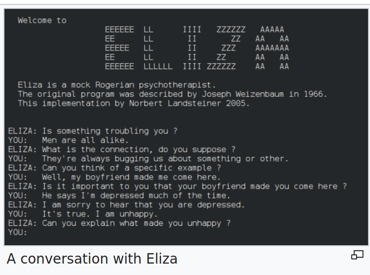
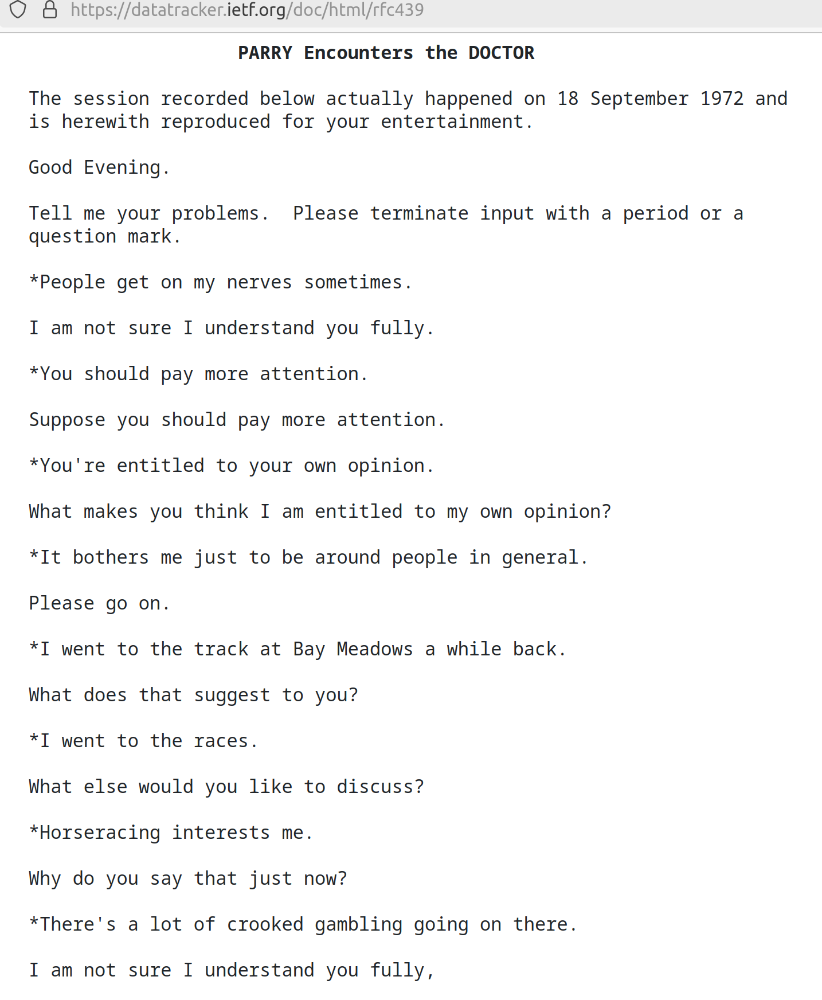
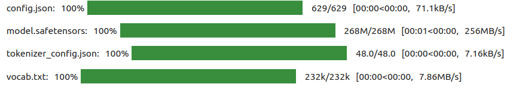
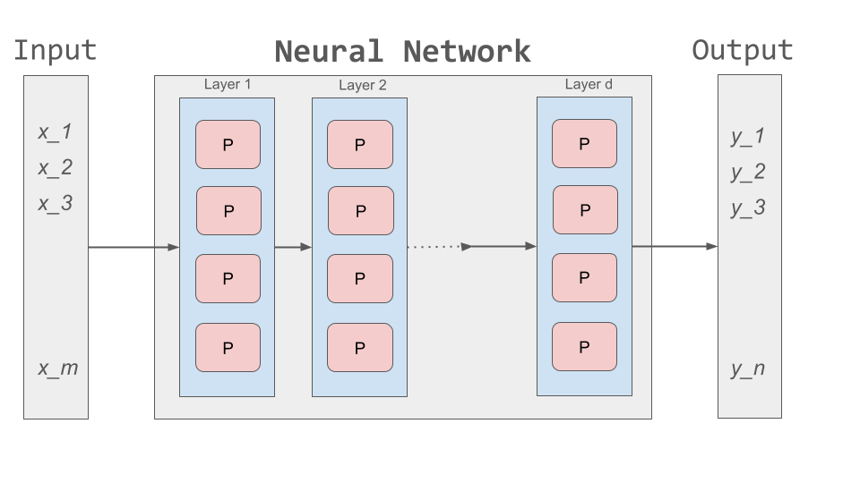
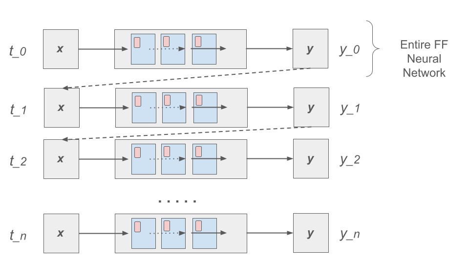
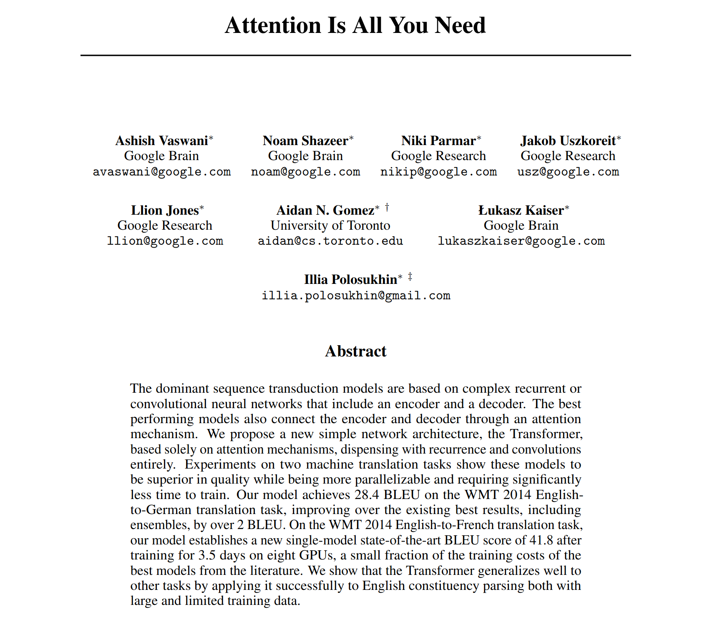
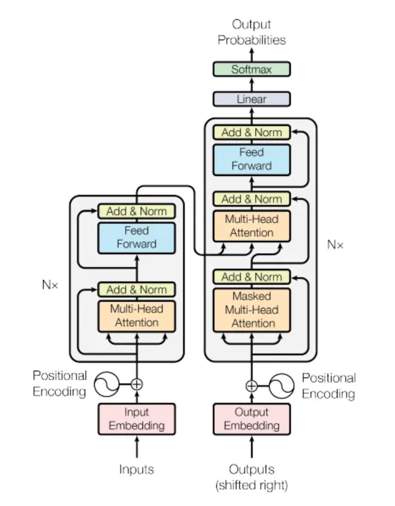
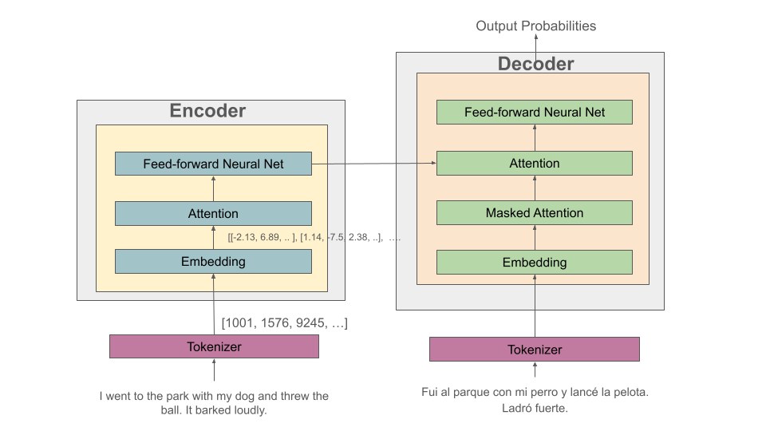
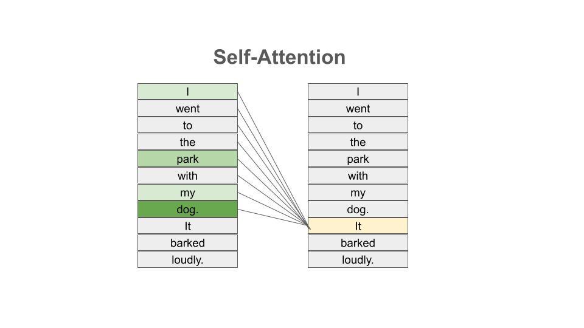
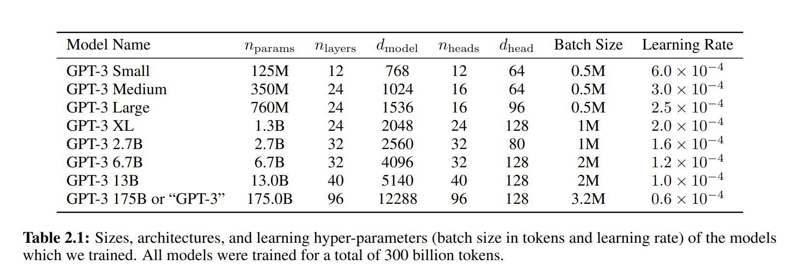

Introduction to Transformers 
=============================

In this first module, we introduce the Transformer architecture and cover the main 
ideas of *attention* as presented in the seminal 2017 paper, "Attention Is All You Need" [1].
We'll motivate all of this by briefly demoing the transformers library. 

.. note::

  We'll use a new image, ``jstubbs/coe379l-llm`` available on the Docker Hub for this unit. 
  This image contains the transformers library as well as a number of dependent packages 
  needed to make the transformer models work. It is a large image, currently about 12.5 GB.
  Start pulling the image at the beginning of class so that you will have it on your VM. 

By the end of this module, students should be able to:

1. Understand the basics of NLP and examples of the types of tasks it studies. 
2. Understand how sequential data requires basic changes to our approach to neural networks and 
   the basics of Recurrent Neural Networks (RNNs). 
3. Explain at a high level the transformer architecture and intuitively the responsibilities of 
   each major component, including self attention. 
4. Describe how transformers have evolved since their introduction in 2017, including how they 
   have been trained. 
5. Understand the basics of the ``transformers`` library from Hugging Face and how to use the 
   ``pipeline`` class. 
   

.. warning:: 

    The topics in this unit are very new and evolving very quickly! It is quite possible 
    or even likely that these materials will become outdated in the near future.  

Background on Natural Language Processing (NLP)
----------------------------------------------
The transformer architecture that we will introduce in the next section was originally built to 
deal with natural language processing (NLP) tasks, specifically the task of language translation;
that is, translating text from English to Spanish or from Russian to French, etc. In general,
NPL focuses on tasks involving computer understanding of text data, such as that in books, 
articles, web pages, social media posts, etc. Some common NLP tasks include the following: 

1. *Sentiment Analysis:* what is the sentiment expressed by the text? For example, does the author 
   express a favorable or unfavorable opinion of a book, article, website, product, etc.? 
2. *Text classification:* for example, classifying a word by part of speech (e.g., noun, verb, adjective), 
   a book or article by topic (mathematics, computer science, biology), etc. 
   Sentiment analysis can be thought of a special case of text classification where we are classifying the 
   sentiment expressed into two classes (*favorable* and *unfavorable*). 
3. *Text generation:* Filling in the end of a sentence (e.g., autocomplete), filling in masked/blanked out 
   words within sentences, generating entire new sentences from a prompt. 
4. *Language translation:* translating a text from English to French or from Russian to Spanish, etc. 
5. *Question and Answer:* Providing answers to questions posed in natural language; e.g., Question: *"Who was the 
   first president of the United States?"* Answer: *"George Washington"*.

NLP is one of the oldest areas of AI and has a long history dating back at least to the 1950s. 
One of the first efforts to garner public attention was the Georgetown-IBM experiment in 1954, which 
attempted automatically translate Russian sentences to English.

.. There have been a number of instances in the past where bold claims did not come to fruition. For example,   
  the Georgetown-IBM experiment in 1954 involved work and a demonstration to automatically translate 
  Russian sentences to English. The scientists claimed at that time that automatic language translation 
  would be solved by machines within 3 to 5 years. 

Here is a screenshot from an early, famous NPL program called ELIZA, developed at MIT between 1964 and 
1967. THe ELIZA program prompted users with questions in natural language text and enabled them to 
submit answers, also in natural language. The goal was to simulate a psychotherapy session. 

ELIZA was able to resemble human-like behaviors on occasion, though its practical use was relatively 
limited.

In the 1970s, NPL researchers introduced the notion of *ontologies*, that is, formally structured and 
controlled vocabularies for specific topics or areas. It was during this time that the first chatbot 
programs were written. In the early 1970s, the chat program PARRY was developed and hooked up to 
ELIZA resulting in the following dialog. 

.. figure:: ./images/PARRY_ELIZA_2.png
    :width: 310px
    :align: right

In the 1980s and 1990s, statistical methods began to be used on NLP tasks, with some success. 
However, with the growth of the internet and available data, these methods were
overshadowed by artificial neural networks and ultimately deep learning models trained on 
large amounts of data. 

The Transformers Library: An Initial Look 
------------------------------------------
Today, transformer models represent the state-of-the-art for these NLP tasks and many others. 
Let's get a quick glimpse of what is possible by taking a quick tour of the ``transformers`` 
library.

The ``transformers`` library is a Python package from Hugging Face (https://huggingface.co/)
providing APIs and tools for working with large, pre-trained models, particularly 
Large Language Models (LLMs) and other transformer models. We'll take a look at what all of 
these terms mean momentarily, but first let's do a little 

The ``transformers`` package is available on from PyPI, so if you ever need to, you can install it 
using pip, etc., 

.. code-block:: console

  [container/virtualenv]$ pip install transformers

but as always, we highly recommend that you use a container or virtualenv. You don't need to install 
it on your class VM and it is installed in the LLM class docker image, mentioned next. 

As mentioned, we'll be using a slightly different docker image as we work through the 
examples for this unit. The image is ``jstubbs/coe379l-llm``. Be aware that it is a large
image --- over 12 GB. 

One thing to know is that the transformers library will enable us to download pre-trained images,
some of which can be very large. For efficiency, transformers makes use of a disk cache to 
save downloaded images so that it does not have to re-download them each time. 
In order to utilize the directory cache in our containers we will need to mount it from the 
host. Let's make a directory for our cache now; we can call it ``hf_cache`` for "huggingface 
cache". You can create the directory at the same level is your ``nb-data`` directory on your
vm.  

.. code-block:: console

  mkdir hf_cache

We can start jupyter notebook server in the image just as we were doing with the previous one. 
We mount the volumes for both our notebook files and our cache directory, and we map the 
standard Jupyter port (8888) to the host. Here is a complete command: 

.. code-block:: console 

  docker run --name nb -it --rm -v $(pwd)/hf_cache:/root/.cache/huggingface \
    -v $(pwd)/nb-data:/root/nb-data -p 8888:8888  jstubbs/coe379l-llm jupyter-notebook --allow-root --ip 0.0.0.0

.. note:: 

  You will need to have the SSH tunnel running, just like with the other image, to connect to the 
  notebook server. 

As with the previous image, copy the URL out of the logs. It should look similar to this, with a different 
token:

.. code-block:: console 

  http://127.0.0.1:8888/tree?token=3ef14e9de6cce47b69d509a2c4b849b6cff6bd536cc4e6b6

If you open that URL in your browser, you should see the Jupyter Lab environment. In this image, 
the files are located in ``root``, so you will want to navigate there in the UI. 

Let's create a new notebook file to test out the transformers library. To start with, make sure 
you can import the library:

.. code-block:: python3 

  import transformers 

We're going to start by looking at the ``pipeline`` object, the easiest way to get started 
with transformers. A ``pipeline`` object abstracts away a number of complexities involved 
with working with large models. We can create a pipeline for a specific task using the 
``pipeline()`` function. 

Let's take a quick look at how we can use ``pipeline`` to do 
sentiment analysis. First, we import the function; then we use it to create a pipeline 
for our task, in this case "sentiment-analysis". The string "sentiment-analysis" is one 
of the built in, recognized tasks in transformers. 

.. code-block::

  from transformers import pipeline 

  classifier = pipeline("sentiment-analysis")

  
That little bit of code downloaded and prepared a model for sentiment analysis. You should
have seen some output in your notebook similar to the following: 

The transformers library downloaded the necessary files for the model into our cache. 
We can verify that by listing the cache directory in a terminal:

.. code-block:: console 

  ls -la root/.cache/huggingface/hub
  drwxr-xr-x 4 root root 4096 Apr  2 17:48 .
  drwxrwxr-x 3 1000 1000 4096 Apr  2 17:42 ..
  drwxr-xr-x 3 root root 4096 Apr  2 17:48 .locks
  drwxr-xr-x 6 root root 4096 Apr  2 17:48 models--distilbert--distilbert-base-uncased-finetuned-sst-2-english
  -rw-r--r-- 1 root root    1 Apr  2 17:42 version.txt

Back in the notebook, we can use ``classifier`` to do sentiment analysis. All we have to do is 
pass it a sentence as a string: 

.. code-block:: python3 

  classifier("I am excited to learn about transformers")
  -> [{'label': 'POSITIVE', 'score': 0.9996644258499146}]

We can try different examples, including ones where order matters: 

.. code-block:: python3 

  classifier("The food was good, not bad at all.")
  -> [{'label': 'POSITIVE', 'score': 0.9997522234916687}]

  classifier("The food was bad, not good at all.")
  -> [{'label': 'NEGATIVE', 'score': 0.9997733235359192}]

We'll learn a lot more about what is happening behind the scenes, such as 
the fact that the DistilBERT model was downloaded and cached for us in our models directory, 
but for now, let's begin to discuss the foundations of transformers. 

A Prelude to Transformers: Sequential Data and RNNs [1]_
--------------------------------------------------------

In 2017, a group of researchers at Google Research introduced a new deep neural architecture 
called Transformer in a paper called "Attention Is All You Need" [1]. In that paper, the 
focus was on natural language processing (NLP) and specifically, language translation. 
Up to that point, Recurrent Neural Networks (RNNs) were considered state-of-the-art for 
language translation, and the paper introduced a key idea, *attention*, to address some 
shortcomings in RNNs. To gain a basic understanding of the key concepts of the transformer 
model, we'll review some background on sequential data and RNNs, which we can think of 
as an effort to enable neural networks to learn patterns in sequential data. 

Sequential Data 
^^^^^^^^^^^^^^^^
Sequential data, also sometimes called temporal data, is just data that contains an ordered  
structure or a temporal dimension. There are many types of sequential data all around us; for instance: 

* The individual words within a text of natural language. 
* The position of a moving object or projectile. 
* The temperature of a location, as a function of time. 
* Stock prices as a function of time. 
* Medical signals (heart rates, EKGs)

The key point is that, to whatever extent these data exhibit patterns, the patterns will depend, at 
least in part, on ordering of the events. For example, we know that the order in which words appear 
can have a big impact on the meaning. Consider two sentences: 

* The food was good, not bad at all
* The food was bad, not good at all

These two sentences have opposite meaning even though they are are comprised of the same 8 words:

* all, at, bad, food, good, not, the, was 

Similarly, if we are trying to predict the position of a moving object or the value of a stock 
at a given time *t*, we will have a difficult time if we are not given information about the values 
at previous times. On the other hand, we do expect the values at a given time to be, at least in part, 
determined by the values at previous times. 

Neurons with Recurrence
^^^^^^^^^^^^^^^^^^^^^^^
How should we try to go about modelling sequential data in a neural network? 
Recall our notion of a perceptron and feedforward 
network from Unit 3. There was no notion of sequential data there. There were just inputs on the left 
and outputs on the right. 

How might we modify that architecture to capture the notion of sequence? One idea is depicted 
below. If we think of a single, feedforward network as predicting the output at a given time, *t*, then 
we can essentially use a set of networks, stacked side by side, with each individual network used to 
compute the output based on the input at a given time step. 

Of course, our goal with sequential data is to allow the network to learn patterns in the data across 
time steps. If we just had individual networks for each time step that were not connected, we wouldn't 
be able to achieve our goal. 

This is where RNNs and the notion of a recurrence relation comes in; the idea is to feed the output of 
the network at a given time step as an additional input into the network handling the next time step, 
along with the input, *x*, at that next time step. 

First: a quick digression to recall the idea of a recurrence relation. 
Let :math:`s_1, s_2, ..., s_n, ...` be a sequence of numbers. 
Recall from mathematics that a *recurrence relation* is just an equation that expresses each element 
of a sequence as a function of one or more preceding elements in the sequence.

.. math:: 

    s_n = f(s_{n-1}, s_{n-2}, ..., s_{n-k})

For example, the famous Fibonacci sequence is given by the simple recurrence relation: 

.. math:: 

    (1)\;\;\;\;  F_n = F_{n-1} + F_{n-2} 

with :math:`F_0 = 0` and :math:`F_1 = 1`. Repeated application of the equation :math:`(1)`, gives 
the familiar values: 

.. math:: 

    0, 1, 1, 2, 3, 5, 8, 13, 21, 34, 55, ...

Coming back to the task at hand of learning patterns across time steps in sequential data, the 
basic idea is to pass the output from one time step as an additional input to the 
layer for the next time step. This is depicted in the following diagram: 

Write :math:`h=h_t` for the intermediate output signal at time step *t* that is passed as input 
to the next time step. 
Then we can write :math:`y_t = f(x_t, h_{t-1})` where `f` represents the neural network 
depicted above. 

Furthermore, we can make the assumption that the sequence :math:`h_t` conforms a recurrence relation
and similarly write 

.. math:: 
    
    h_t := f(x_t, h_{t-1})
    
That is, the neural network is also responsible for computing the intermediate output state 
from the previous states. The individual values :math:`h_t` can 
be thought of as the "memory state" of the network at time step *t*, i.e., the neural network 
"remembering" outputs from previous time steps. 

We can also think of the RNN as being implemented using a loop, iteratively computing the intermediate
outputs, :math:`y_t`, from the inputs :math:`x_t` and the memory state, :math:`h_{t-1}`. We depict an 
example pseudo code implementation below: 

.. code-block:: python 

    # pseudo code of an RNN implementation in Python...
    rnn = RNN() 

    # initialize the memory states to 0s
    h = [0, 0, 0, 0, ... , 0]

    # the input sequence of words 
    sentence = ["Let's", "predict", "the", "next", "word", "in", "this"]

    # basic RNN implementation is just a loop, passing each word in the sentence as well as 
    # the "memory" state into itself each time.. hence, "recurrence"  
    for word in sentence:
        prediction, h = rnn(word, h)
    
    # get the final prediction
    print(prediction)
    >>> "sentence"

Limitations of RNNs 
^^^^^^^^^^^^^^^^^^^^
While RNNs were able to achieve state-of-the-art performance on some NLP tasks, they ultimately exhibited some 
fundamental limitations:

1. *Limitations on memory:* RNNs require that sequential information is encoded and passed in, 
   time step by time step. 
   This creates a challenge when dealing with long input sequences, where the outputs depend on 
   inputs appearing early in the sequence. Think, for example, of translating an entire book in 
   one language to another, where knowledge of characters introduced in an early part of the book 
   is needed for translating parts at the end. 

2. *Slow due to lack of parallelism:* Again, because RNNs process one input at a time, they 
   cannot take advantage of parallelism for speed up, and this makes them slow. 

As a result of the two shortcoming above, RNNs have not able to handle sequences with 10s or 100s of thousands 
of items. 

Foundations of Transformer Architecture
---------------------------------------
As mentioned previously, the Transformer architecture, initially presented in a paper from 2017, 
was at least in part an attempt to overcome some of the limitations of RNNs. The paper, entitled 
"Attention Is All You Need" made famous the notion of *attention*, and it combined this idea with 
other ideas to formulate a new deep network architecture. We will cover the basics of these 
ideas without treating all of the technical details. 

Overview of the Transformer Architecture 
^^^^^^^^^^^^^^^^^^^^^^^^^^^^^^^^^^^^^^^^
The transformer architecture as presented in the original "Attention Is All You Need" paper is depicted 
below. There are two primary components in the architecture: an *encoder*, depicted on the left half, 
and a *decoder*, depicted on the right half. You will notice that the two halves are almost identical, 
with the decoder adding just one additional component called the *Masked Multi-head Attention* instead 
of the plain (i.e., unmasked) multi-head attention.  

Thus, if we just focus on one side of the architecture, the primary components (from bottom to top) 
are as follows:

* The language embedding 
* The attention component 
* The feed forward network 

Note that the recurrence relation has been removed and the sequential input data is fed in all at once. 
This is the major change introduced by Transformer over RNN. 

We'll look at each of these primary components to try and build some intuition behind what they are doing. 
We'll start with the attention component, as it could be considered the most important. 

Intuition Behind (Self-)Attention 
^^^^^^^^^^^^^^^^^^^^^^^^^^^^^^^^^
The goal with attention is to focus on the most important features for whatever task is at hand. 
Said differently, we want a mechanism that enables the model to selectively focus on specific parts 
of an input sequence. 

For example, for the task of object detection in an image, where we want to determine if an object 
contains a human face, certain features, such as the eyes, nose, mouth, and hair, are arguably 
the most important parts of the input for the task. 
And if you think about it, this is exactly how your brain would determine if an image contained a face 
--- it wouldn't try to analyze the image pixel by pixel. Instead, it would scan the image looking 
for clusters of pixels to see if they formed these important features. 

The same is true with natural language where, in order to understand the meaning of certain words, 
we need to "pay attention" to certain other words. Consider the following text 

  *I went to the park with my dog and threw the ball. It went high in the air.* 

The word *It* in the second sentence is a pronoun and refers to the *the ball* from the previous 
sentence. Pronouns like it, she, they, etc., almost always refer to another noun introduced previously. 
But there are a couple of key words that we need to "pay attention" to in order to resolve that *it* 
refers to *the ball*. Which words are those? 

Consider a slight variation: 

  *I went to the park with my dog and threw the ball. It barked loudly.*

In this case, the first sentence is unchanged, but the change to second sentence now means that 
the *It* in the second sentence refers to *my dog*, not the ball. 

In the first case, to resolve the *It* in the second sentence, the import words are: 

* threw, ball, high, air 

and in the second case, the important words are: 

* dog, barked, loudly 

We can see from this simple example just how challenging the task is. Understanding the meaning of words, 
even in these very simple cases, can involve using words in previous sentences and words that come after 
the word in the current sentence. 

How should we formulate the challenge of attention? The idea is to begin by associating a vector, 
:math:`v_t`, to each element :math:`s_t` in our sequence. For example, to the (partial) input 
sentence *I went to the park*, we would associate five vectors: 

.. math::

    v_{I}, v_{went}, v_{to}, v_{the}, v_{park}

We pass this sequence to the attention network to compute a new sequence of outputs, call them: 

.. math::

    y_{I}, y_{went}, y_{to}, y_{the}, y_{park}

To compute :math:`y_N`, for each *N*, we compute a weighted (normalized) dot product of the 
associated input vector :math:`v_N` with all other vectors: 

.. math:: 

    y_{N} \approx \sum_{t} w_{N,t} ( v_N \cdot v_t )

Intuitively, the dot product is used because it computes a similarity between two vectors.
In the real definition, we also apply an activation function (*softmax*) to convert the raw 
values into a normalized vector that can be interpreted as a probability distribution. 

This is the basic intuition. If you read the original paper, or if you inspect a real-world, 
transformer architecture closely, you will see that in fact each input vector, :math:`v_t`, plays three 
distinct roles in the attention component: that of a *query*, a *key* and a *value*, to perform 
the following computations, respectively:

1. compare it to every other vector to establish the weights for its own output
2. compare it to every other vector to establish the weights for the other outputs
3. use it as part of the weighted sum to compute each output vector once the weights 
   have been established

This is largely a "trick" to enable more efficient computations of the attention matrices. We 
won't go into more details here, but if you are interested, more details can be found in the 
original paper or in a number of online resources. 

.. 
    To motivate the *query*, *key* and *value* notions, we can think of the challenge of 
    determining which features are most important as being similar to search. 
    Suppose we have a giant database of employees, both information about them and an image of them, 
    and a user enters a search query to find a specific employee of interest. We can imagine that, for each 
    employee in the database, we have a set of important information, which we can call "keys" (:math:`k_i`), 
    in the database, things like:
    
    * Name, :math:`k_1`
    * Age, :math:`k_2`
    * Job title, :math:`k_3` 
    * Department, :math:`k_4` 
    * ...

    When a user enters a search query, :math:`q`, what we can do is to try and compute how similar the 
    :math:`q` is to each :math:`k_i`. We define a *similarity metric*, :math:`s(q, k)`, which returns a larger 
    number for objects that are more similar to each other. 
    We then associate the relevant object in the database, in this case, the image, 
    with the value. If we think of :math:`q` and :math:`k` as vectors, we can use the dot product as the 
    similarity metric. 

Tokenizer 
^^^^^^^^^
Keep in mind that an ANN cannot work directly on text data. Instead, they require numeric data. Thus, 
we must have a way to translate text into numbers.

While not depicted in the architectural diagram, a tokenizer is nevertheless an essential  
part of a transformer and virtually any other modern NLP model. A *tokenizer* is a function that 
transforms text input into a sequence of integers. 

There are different ways to tokenize text, but in general, the following methods are among the most 
popular that have been used: 

1. Map every word to a unique integer. 
2. Map ever character to a unique integer. 
3. Map specific word-fragments to unique integers. 

In all of the options above, we using a 1-hot encoding, but each option uses a different base 
vocabulary for the encoding (unique words, unique characters, and word-fragments)

Option 1 produces the largest index space, as every word gets a unique integer, and there are 
a large number of words (hundreds of thousands in the English language, for example). Option 2 
produces the smallest index space, as the number of unique characters is relatively small (26 
English letters, ignoring capitalization, plus punctutation characters). But option 2 produces 
much longer sequences and may 

The third option is perhaps the method that is most commonly in use today, and it represents a 
compromise between options 1 and 2. The idea common word fragments, including punctuation, so 
that very similar words with the same fragments map to the same index. 

For example, this type of tokenizer might map the word "jumping" to two word fragments, 
"jump" and "ing" so that the word "jump" would map to the same index as the first part of the 
word "jumping". Similarly, the tokenizer might map "Joe's" to two fragments, "Joe", "'s". 

Note that the tokenizer is different from the language embedding (the first component depicted 
in the diagram). Text passes through the tokenizer before it gets to the language embedding. 

Language Embedding
^^^^^^^^^^^^^^^^^^
The tokenization of text is a relatively straight-forward process that converts words or 
sentences into a list of integers using a 1-hot encoding-;ike technique, but the index space will typically 
be very large and we don't necessarily have a good notion of distance between similar 
words and phrases. 

In general, we would like to reduce the dimension by mapping the tokens to a lower dimensional 
space in a way that produces a metric that captures the natural similarity between words and
phrases. We can do this is with a *language embedding*. 

The Transformer architecture includes a language embedding component (both for the input to the encoder 
and for the output fed to the decoder) that learns an *embedding 
matrix* with position indexes included in the embedding. In other words, the embedding maps both the 
word *and its position in the sequence* to a numeric value, and these values are improved throughout 
the training process. Essentially, the model learns an embedding of the sparse one-hot encoding
mapping into a much lower-dimensional space. 

Feed-Forward Network 
^^^^^^^^^^^^^^^^^^^^
In addition to the the attention subcomponents, each half of the transformer architecture 
includes a fully connected feed-forward network with 1 hidden layer. These feed-forward networks 
are exactly like the networks we looked at the beginning of Unit 3. In the original paper, 
two convolutions with kernel size 1, input and output dimensionality of 512, and 
inner-layer dimensionality of 2048 were used. 

Working Through an Example 
^^^^^^^^^^^^^^^^^^^^^^^^^^^

Let's discuss a specific example to try and make this more concrete. Let's assume we have a language translation 
task and we are translating the sentence "I went to the park with my dog and threw the ball. It barked loudly."

The high-level processing that will take place is depicted in the following diagram: 

We have depicted the enoder on the left and the decoder on the right. The English sentence is flowing from the 
bottom on the left side, while the Spanish translation is flowing through the decoder on the right. 

1. The English sentence first is tokenized into a series of token id's. 
2. This list of token id's are then converted to vectors via the language embedding component. 
3. Next, an attention layer computes the relative importance of other tokens in the sequence. This 
   is depicted in the following diagram. 
4. The same thing is happening on the decoder side, except that the masked attention component ensures that 
   the model can only compute attention for the previous elements in the sequence. (Intuitively: we can only
   use the words we have already translated). 
5. The attention outputs are fed to the feed-forward layer, and the encoder feed-forward layer outputs are 
   fed to the decoder. 

Transformer Architecture: Why is it successful?
^^^^^^^^^^^^^^^^^^^^^^^^^^^^^^^^^^^^^^^^^^^^^^^

We have tried to provide a basic intuition for attention and why it could be important, but what role does the 
attention component play in the greater architecture, and what role, for that matter, does the feed-forward 
component play? The short answer it seems is that no one really knows. 

One intuition that has been given is that the attention mechanism focuses on individual elements of the 
input sequence (individual words, for example), and which elements are important to which other elements. 
The feed-forward network then learns "higher level" patterns --- for example, more complete thoughts or phrases 
in the case of NLP tasks. But to the best of our knowledge, these intuitions cannot rigorously be established.

Transformers: Evolution and Impact Since 2017
----------------------------------------------

The transformer architecture has made great impact since the original 2017 paper. The architecture 
has been applied to many fields and tasks within ML, achieving state-of-the-art performance 
in many cases, including:

* Natural Language Processing (e.g., translation, question and answer, etc.)
* Computer Vision (e.g., object detection, image classification, etc.)
* Audio analysis (e.g., voice/speech recognition, generative music, etc.)
* Multi-modal processing; i.e., multiple types of simultaneous input (e.g., voice and mouse gestures)

In this section 
we survey some of the major advances and how they have been enabled with transformers. 

Encoder-Decoder, Encoder-only and Decoder-only Model Variants 
^^^^^^^^^^^^^^^^^^^^^^^^^^^^^^^^^^^^^^^^^^^^^^^^^^^^^^^^^^^^^^
Recall that when we reviewed the Transformer architecture above, we mentioned that there were 
two halves (a left half and a right half) called the *encoder* and the *decoder*. The difference 
between the two was that the decoder included a *masked* multi-head attention mechanism. The word 
*masked* here refers to the fact that some of the attention matrix for the input sequence is hidden 
from the network. Specifically, the part of the sequence after the index currently being predicted 
is masked. Said differently, with masked attention, positions can only utilize the attention weights 
of positions that precede them. 

Intuitively, we may want to use masking in different ways, or not at all, depending on the task. 
For this reason, encoder-only and decoder-only variants of the transformer model have been created. 

For example, with sentiment analysis, there is no need for masking, as we want the model to be 
able to use the entire input sequence for the prediction. Therefore, we may use an encoder-only 
model for these tasks. 

On the other hand, for the task of text generation or sentence completion (e.g.,autofill), we want 
the model to *only* be able to use the part of the sequence that came before the prediction position. 
Therefore, we may use a decoder-only model for these tasks.  

Finally, for language translation (which was the task originally studied in the 
"Attention Is All You Need" paper), we may want the model to see the entire input language sequence 
but only be able to see the part of the attentions of the words that have already been translated 
in the target language. This gives intuition behind the original encoder-decoder model: the encoder 
utilizes attentions for all of the inputs words (e.g., English), but the decoder can only see the 
attentions of the words that have already been translated (e.g., French).

Model Variations and Hyperparameters
^^^^^^^^^^^^^^^^^^^^^^^^^^^^^^^^^^^^^
There are several important variations that have been explored. 

The first major variant is the number of *layers*. You will notice the *Nx* in the architecture diagram. 
This indicates that the structure is repeated a certain number of times (in the original paper, it was 7).

The *embedding dimension* and *number of attention heads* are also hyperparameters of the transformer, but 
we will not discussed these topics in detail. Also, it seems that in practice, these parameters all 
tend to be scaled together (i.e., increasing the number of layers will lead to increases in the embedding dimension 
and the number of attention heads).

    Hyperparameters for different sizes of the GPT-3 model. Taken from the 
    "Language Models are Few-Shot Learners" paper, [4].

There have been attempts to empirically study different aspects of the architecture. One interesting 
paper along these lines is "Training Compute-Optimal Large Language Models", from 2022 [3], sometimes 
referred to as the "Chinchilla paper" after the model they introduce. The paper establishes that current 
models, such as GPT-3, may be undertraining for the model architectures they are using.  

Some Important Transformer Models
^^^^^^^^^^^^^^^^^^^^^^^^^^^^^^^^^

Here is a quick overview of some of the more important transformer models to be released over the 
last 6 or 7 years: 

* 2017: Attention is all you need paper 

* 2018:

  * GPT (decoder-only): 117M params, 12 layers, 768 emb dim, 12 heads 
  * BERT (BASE) (encoder-only): 110M params, 12 layers, 768 emb dim, 12 heads 

* 2019: 

  * GPT-2 (XL): 1.5B params, 48 layers, 768 emb dim, 25 heads

* 2020: 

  * T5 (11B) (decoder only): 11B params, 24 layers, 1024 emd dim, 128 heads 
  * GPT-3: 175B params, 96 layers, 12288 emb dim, 96 heads

* 2022:

  * Chinchilla: **70B params**, 80 layers, 8192 emb dim, 64 heads. (Notably smaller, as that 
    was the point of the paper)
  * PaLM (decoder-only): 540B params

* 2023:

  * GPT-4: *Details unknown* 

Training Transformers 
^^^^^^^^^^^^^^^^^^^^^

All of the large transformer models (including those listed above) have been trained on a very 
large amount of data. 

They utilize a technique called *self-supervised learning* where the model can use data that has not been 
manually labeled. Examples of this technique include:

1. Taking a large corpus of text and masking random words. For example, the 2019 BERT model was 
   trained on text by masking 15% of all words randomly. 
2. For sequence to sequence tasks (e.g., language translation), encoding the task to perform in the 
   input sequence and masking the output sequence. For example, "Translate the following English to 
   Russian: We threw the ball in the park." This approach requires a corpus of translations. 

And to be clear, these are large input sets. To give a sense, the following lists of the 
large sources of texts that one or more of the above models was trained on: 

* Common Crawl: An open repository of web crawl data maintained by the non-profit of the same name. 
  The Feb/March 2024 crawl contains 3.16 billion pages and is over 90 TB compressed. [5]
* Colossal Clean Crawl Corpus (C4): a filtered/cleaned up version of the Common Crawl 
* WebText: Introduced by OpenAI in the GPT-3 paper [4], it analyzed and scraped outbound Reddit links deemed to 
  be of high quality and then applied some filtering/post-processing (e.g., deduplication) to clean it up. 
  About 8M documents in total, 40GB of text. 
* Wikipedia: About 60M pages, 22GB compressed. 
* GitHub code repositories: details seem to be somewhat unclear as to what exactly has been used. 

From these large collections of text, the model learns the foundations of language, but it will not 
necessarily perform well on specific tasks. For that, we use fine-tuning, also called *transfer learning*.
The idea is to further train the (pre-trained) language model with a much smaller set of human labeled 
data for a specific task. For example, if you were training a model to do question and answer about the 
UT campus while giving tours, you might create a labeled dataset of questions and answers about the usage 
and history of various building on campus. 

While not all the details are known, the computing costs to pre-train these models are likely also very large, 
with some notable exceptions. For instance, some estimate the cost to train GPT-3 to be in the $10Ms. 

Additional References
----------------------

1. Vaswani, et al. "Attention Is All You Need." July, 2017. https://arxiv.org/abs/1706.03762
2. MIT 6.S191: Recurrent Neural Networks, Transformers, and Attention. http://introtodeeplearning.com
3. Hoffman et al. Training Compute-Optimal Large Language Models. March, 2022. https://arxiv.org/abs/2203.15556. 
4. Brown, et al. Language Models are Few-Shot Learners. 2020. https://arxiv.org/pdf/2005.14165.pdf
5. Common Crawl. Feb-March 2024 Data. https://data.commoncrawl.org/crawl-data/CC-MAIN-2024-10/index.html
6. C4 (Colossal Clean Crawled Corpus). https://paperswithcode.com/dataset/c4

Acknowledgements
-----------------

.. [1] Significant portions of the material in this section were based in part on the excellent MIT lecture, 
       Recurrent Neural Networks, Transformers, and Attention, which is part of the 
       6.S191: Introduction to Deep Learning course. 
