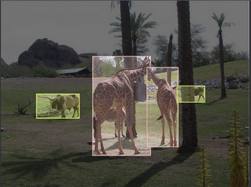
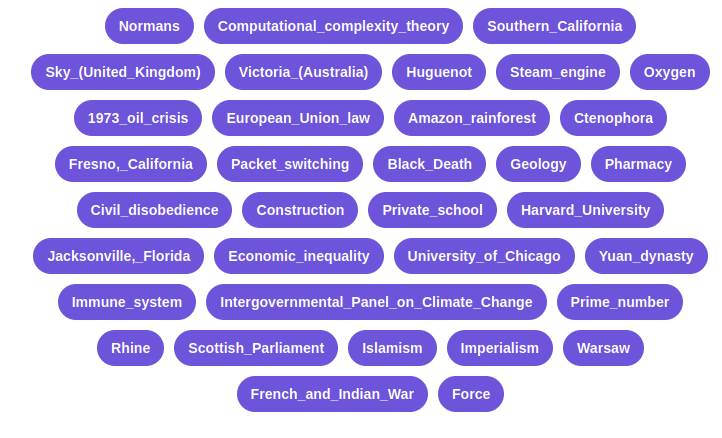

ML Benchmarks [1]_
==================

In this module, we introduce ML benchmarks, an important mechanism for evaluating modern ML models and 
related techniques, including architectures, training algorithms, deployment methods, etc.
In this module, we introduce the concept of benchmarks, describe the different types of benchmarks and 
several important benchmarks from each type, 

By the end of this module, students should be able to: 

1. Understand the basic concept and motivation behind each type of benchmark (micro, macro and end-to-end)
   and how to use them to evaluate an AI system. 
2. Become familiar with the key components of an AI benchmark, 
   including datasets, tasks, metrics, baselines, reproducibility rules, and more.
3. Write code in Python to utilize a benchmark to evaluate their own AI systems. 

Introduction
-------------

Benchmarks are used throughout virtually all fields of computing to evaluate the evolution of various aspects 
of computational systems over time; in the field of AI, they are used to assess the following: 

1. **Performance:** including accuracy and related metrics as well as speed/latency for tasks such as inference. 
2. **Resource Evaluation:** including CPU and memory utilization, as well as power consumption./ 
3. **Acceptance:** ensuring that the AI system adheres to its requirements and meets the desired specifications. 

Much like the rest of the field of computing, benchmarking has been evolving for many decades. Its origins date back as early 
as the 1960s and 1970s. One of the first benchmarks was the Whetstone Benchmark, first developed in 1972, for 
evaluating the floating point arithmetic performance of mainframe computers. In the 1980s, the first benchmarks for 
personal computers were introduced, including the Standard Performance Evaluation Corporation (SPEC) CPU Benchmark [2], 
computationally intensive test suites that stress the machine's processor and memory subsystems. 

New benchmarks were introduced in the 1990s to evaluate graphics cards like GPUs to meet the rising demand of graphical applications 
such as video games, and in the 2000s, a suite of benchmarks were created to assess mobile and cloud computing 
platform capabilities. In HPC, a number of popular benchmarks are used. Perhaps the most famous is the 
LINPACK benchmark, which evaluates the total FLOPs a system is capable of and is used to build the TOP500 list of 
most powerful supercomputers in the world [3]. 

For benchmarks to be successful, they must represent the priorities of a broad research community, including members 
of academia and industry. For successful benchmarks, this is a key part of their value: they can help generate 
a broad consensus and focus on what what aspects are most important to study and improve. 

AI Benchmarks 
^^^^^^^^^^^^^
Benchmarks for AI systems largely fall into three different types:

1. System Benchmarks: these benchmarks evaluate the hardware itself --- i.e., the CPUs, GPUs, TPUs and 
   different architectures --- for how well it will perform AI tasks. 
2. Model Benchmarks: these benchmarks assess various aspects of the ML model, including metrics like 
   accuracy as well as system resource utilization. 
3. Data Benchmarks: these benchmarks address various aspects of the data used to train and test 
   ML models, including quality, diversity and bias. They also provide standardized datasets to be used 
   for training and testing. 

Micro Benchmarks 
^^^^^^^^^^^^^^^^
Micro-benchmarks assess a low-level aspect of an ML system. They are focused, specialized measurements 
on individual tasks within the system. For example, a micro-benchmark may look at a specific layer 
within a network, such as a convolution layer, and assess its computational resource utilization. 
Micro benchmarks usually analyze one or more of the following task types:

* Tensor operations: For example, matrix multiplications or related tasks (e.g., convolutions)
* Activation functions: For example, computing the speed or resource utilization of functions such as 
ReLU, Sigmoid, Softmax, etc. 
* Layers: Evaluations of a single layer of a network, such as a convolution or pooling layer in a CNN. 

DeepBench [4] is a good example of a micro-benchmark. It consists of a set of basic operations 
(dense matrix multiplies, convolutions and communication) as well as some recurrent layer types that 
can be executed against an arbitrary framework or code base on different hardware platforms. The repository 
also include results for seven hardware platforms (six from NVIDIA and one from Intel): 

* NVIDIA: TitanX, M40, TitanX Pascal, TitanXp, 1080 Ti, P100
* Intel: Knights Landing. 

Macro Benchmarks 
^^^^^^^^^^^^^^^^

Macro-benchmarks evaluate an entire ML model instead of a specific aspect or task within a model like 
a micro-benchmark does. For example, a macro-benchmark may assess a model's ability to do classification 
on images for a specific classification tasks such as classifying the handwritten digits in the MNIST 
dataset that we have looked at. Metrics evaluated include the ones we have seen in class (accuracy, precision, 
AUC) as well as speed and resource utilization. 

The MLPerf [5] benchmark suite, which is part of the MLCommons project [],  is an industry standard 
suite of macro-benchmarks. From the 2020 paper: "MLPerf prescribes a set of rules and best practices to ensure comparability 
across systems with wildly differing architectures. The first call for submissions garnered more than 
600 reproducible inference-performance measurements from 14 organizations, representing over 30 
systems that showcase a wide range of capabilities."

End-to-end Benchmarks 
^^^^^^^^^^^^^^^^^^^^^^
Instead of focusing on just the AI model, an end-to-end benchmark focuses on the entire process of 
developing the model, from data preprocessing, to training and post-processing. With an end-to-end 
benchmark, each phase of such a pipeline is assessed to ensure it is not a bottleneck for the entire 
process. 

No industry-wide consensus on an end-to-end benchmark suite; these are usually performed in-house 
and private to specific companies/organizations, although MLPerf probably comes the closest. 

Benchmark Components
^^^^^^^^^^^^^^^^^^^^^
Benchmarks are typically comprised of the following components: 

* Datasets: Most benchmarks provide a specific set of data on which the performance of tasks/functions will be 
  measured. 

* Tasks: The heart of the benchmark is the actual task that will be performed, such as matrix multiplication 
  or image classification. The benchmark should include precise descriptions of how to execute the 
  tasks to be measured. 

* Metrics: Along with the tasks should be a well-defined set of metrics to be measured. For example, speed 
  for matrix multiplication or accuracy for image classification. 

* Baselines: Often times, benchmarks will include some baseline measurements providing a starting point 
  or a minimum performance floor. Any new project to be measured can be assessed relative to these baselines. 

* Hardware and software specification: Naturally, the benchmark should make clear what types of hardware 
  the tasks should be run on, and similarly, in many cases, for software. For the matrix multiplication example, 
  in addition to the hardware specified, the software library or framework should also be noted. In the case 
  of DeepBench, for instance, different libraries were used, including cuDNN, OpenMPI, etc. 

* Environmental Conditions: The environmantal conditions within which a benchmark assessment is performed can 
  have a big factor in the result. For example, power consumption measurements of ML model inference can be 
  significantly impacted by the ambient temperature. 

* Reproducibility Rules: A good benchmark should make precise the exact steps and protocols to be used when 
  measuring to ensure results can be reproduced. For example, MLPerf specifies the exact make and model of 
  power meter (the Yokogawa power analyzer). FOr an example, see the rules documentation 
  `here <https://github.com/mlcommons/inference_policies/blob/master/power_measurement.adoc>`_. 
  
* Guidelines for Interpreting Results: often times, a benchmark will provide guidance for how to interpret 
  the raw measurement values, even drawing conclusions from them. For example, given two models, one with 
  better accuracy but another with more efficient power consumption, the benchmark may conclude that the 
  former is better for applications that must have the best accuracy while the latter might be better 
  when energy efficiency is the most important (e.g., mobile devices or other edge-computing scenarios). 

Model Benchmarks 
-----------------

Datasets 
^^^^^^^^
In this section we look at a few of the most important datasets for benchmarking. 

**MNIST (1998).** The MNIST handwritten digits dataset, which we have looked at previously in Unit 3, 
consists of 70,000 labeled 28x28 grey-scale images of handwritten digits (0-9). It has been widely 
used for benchmarking image classification algorithms and computer vision models. It represents the 
first major landmark for ML datasets for benchmarking. 

**ImageNet (2009).** ImageNet [6] is an image dataset consisting of millions of images with associated 
labels from the WordNet taxonomy. WordNet consists of over 100,000 concepts, each described with a word 
or phrase, referred to as a "synonym set" (or "synset" for short). The vast majority of synsets in WordNet 
consist of nouns (about 80,000), and the goal of ImageNet is to provide about 1,000 images for each synset.
Note that ImageNet does not own copyrights for the images, it merely compiles the list and metadata. However, 
it does make the dataset available for research and educational purposes under certain conditions (see [7]).
Large subsets of the dataset are also available via other means; for example, through 
`Tensorflow <https://www.tensorflow.org/datasets/catalog/imagenet2012>`_
and 
`Kaggle <https://www.kaggle.com/c/imagenet-object-localization-challenge/overview/description>`_. 

**COCO: Common Objects in Context (2014).** The COCO dataset consists of images with even richer metadata 
associated with them. The images contain objects within a larger scene or context, such as an animal in its 
natural habitat, and the metadata includes *bounding boxes*, that is, geometric borders that enclose specific 
objects, *segmentation masks* that isolate a particular object from the rest of the image, as well as 
full captions.  

In the above pictures, we see examples from the COCO dataset of bounding boxes (left) and 
segmentation masks (right) (image `source <https://blog.roboflow.com/coco-dataset/#what-is-the-coco-dataset-used-for>`_). 

More recently, there have been 

**SQuAD: Stanford Question Answering Dataset (2016).** This datasets consists of over 
100,000 question and answer pairs with the goal of assessing a model's reading 
comprehension ability. The question-answer pairs were created based on over 500 
articles from Wikipedia. SQuAD 2.0 then combined the 100,000 questions of the first 
version with an additional 50,000 unanswerable questions. To do well, models must identify 
questions which cannot be answered and abstain from answering in such cases. 

    Source: https://rajpurkar.github.io/SQuAD-explorer/explore/v2.0/dev/

**GLUE: General Language Understanding Evaluation (2018) and SuperGLUE (2020).** 
The General Language Understanding Evaluation benchmark dataset is a collection of tools 
created with the goal of assessing a model's general understanding of language instead of 
concentrating on a specific task, such as question and answering. It is designed to encourage 
and favor models that share common linguistic knowledge across a set of tasks, including 
textual entailment, that is, determining whether a relationship holds between two text 
fragments, as well as sentiment analysis and question answering. GLUE is really an 
amalgamation of existing datasets as apposed to datasets created specifically for GLUE. 
For models to be evaluated on GLUE, they only need to be able to handle single sentence inputs 
and sentence-pair inputs. Models are scored separately for each task and then an average 
of the scores is computed to determine the final evaluation. Humans have also been 
evaluated on the benchmark, providing a baseline score of 87.1. Within the first year of 
the GLUE release, models surpassed human performance, with the current best score being 90.6 
as of the time of this writing. Subsequently a benchmark called SuperGLUE, styled after GLUE 
but aiming to be more difficult, was released.

TruthfulQA: An LLM Benchmark 
----------------------------

In this section, we introduce a relatively new benchmark called TruthfulQA, a question and 
answer benchmark engineered for LLMs. 

Additional References
----------------------
1. Whetstone Benchmark. https://en.wikipedia.org/wiki/Whetstone_(benchmark) 
2. SPEC CPU Benchmark. https://www.spec.org/cpu/
3. TOP500. https://www.top500.org/
4. DeepBench. https://github.com/baidu-research/DeepBench
5. MLPerf Inference Benchmarks. https://github.com/mlcommons/inference
6. ImageNet. https://www.image-net.org/
7. ImageNet: Download and Terms and Conditions. https://www.image-net.org/download 

Acknowledgement
---------------

.. [1] Significant portions of these materials were based on the excellent text book, 
       Machine Learning Systems with TinyML, specifically, Chapter 12: Benchmarking AI.
       Available online at: 
       https://harvard-edge.github.io/cs249r_book/contents/benchmarking/benchmarking.html
